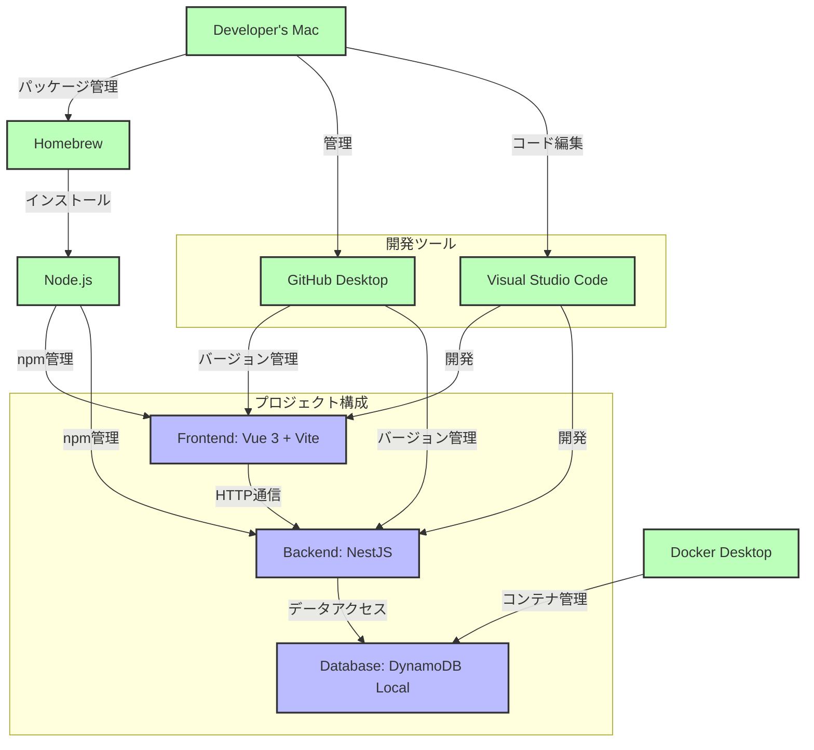

---

# 【Mac向け】NestJS + Vue 3 + DynamoDB Local プロジェクト構築手順

---



## ■ 0. **Homebrew のインストール（Macのパッケージ管理ツール）**

ターミナルを開いて、以下のコマンドを1行ずつコピー＆貼り付けて実行：

```bash
/bin/bash -c "$(curl -fsSL https://raw.githubusercontent.com/Homebrew/install/HEAD/install.sh)"
```

> 終了後に以下を実行して `brew` コマンドが使えることを確認：

```bash
brew --version
```

---

## ■ 1. **Node.js のインストール（Homebrew経由）**

```bash
brew install node
```

> 終了後に以下で確認：

```bash
node -v
npm -v
```

---

## ■ 2. **Visual Studio Code (VSCode)**

- ダウンロード: [https://code.visualstudio.com/](https://code.visualstudio.com/)
- インストール後、起動してください。：

### VSCodeの使い方（最小限）

- `File > Open...` でフォルダを開く
- 左上のアイコンで：
  - ファイル一覧（Explorer）
  - ソース管理（Git）
  - ターミナル（`Terminal > New Terminal`）
- 編集はタブ形式。保存は `Cmd + S`

---

## ■ 3. **GitHub Desktop**

- ダウンロード: [https://desktop.github.com/](https://desktop.github.com/)
- GitHub アカウントでログイン
- 初期画面で：
  - `Add Local Repository` → プロジェクトフォルダを選択
  - `Commit to main` で変更を保存
  - `Push origin` でGitHubにアップロード
- `.gitignore` はGitHub Desktopで編集も可能（`node_modules`, `.env` など除外）

---

## ■ 4. **Docker Desktop**

- ダウンロード: [https://www.docker.com/products/docker-desktop](https://www.docker.com/products/docker-desktop/)
- インストール後、アプリを起動しておく
- **メニューバー右上にクジラアイコンが表示**
  - 緑色になっていれば「Running」
- `docker --version` でCLIが使えるか確認

---

## ■ 全体を通しての確認ポイント

| 項目 | 確認方法 |
|------|----------|
| Homebrew | `brew --version` |
| Node.js / npm | `node -v`, `npm -v` |
| Docker | `docker --version`, メニューバーのクジラが🟢緑色 |
| VSCode | 起動してターミナルが開けること |
| GitHub Desktop | プロジェクトのコミット／Pushができること |

---

**Vue + NestJS + DynamoDB の構築**に進む準備が出来ました！


## ■ ステップ 1：プロジェクト構成を把握する

```
プロジェクト/
├── backend/         ← NestJS (API)
├── frontend/        ← Vue 3 + Vite (UI)
├── docker-compose.yml          ← DynamoDB Local 用 docker-compose
└── README.md
```

---

## ■ ステップ 2：DynamoDB Local のセットアップ（Docker使用）

### 1. `docker-compose.yml` を作成（ルートに）

```yaml
version: '3.8'

services:
  dynamodb-local:
    image: amazon/dynamodb-local
    container_name: dynamodb-local
    ports:
      - "8000:8000"
    command: "-jar DynamoDBLocal.jar -inMemory -sharedDb"
```

### 2. ターミナルで以下を実行（VSCodeからでもOK）

```bash
＃ 事前に Docker Desktop を起動すること
docker-compose up -d    # コンテナを起動(作業開始時)
docker-compose down     # コンテナを停止(作業終了時)
```

---

## ■ ステップ 3：Vue 3 + Vite（フロントエンド）セットアップ

```bash
cd frontend
npm install
npm run dev
```

→ ブラウザで `http://localhost:5173` にアクセス

---

## ■ ステップ 4：NestJS（バックエンド）セットアップ

```bash
cd backend
npm run start:dev
```

→ APIが `http://localhost:3000` で起動

---

## ■ ステップ 5：GitHub Desktopで管理する

1. 慣れている方は、gitコマンドでも、OKです。

---

## ■ 起動と停止（まとめ）

| 項目 | コマンド or 操作 |
|------|------------------|
| **DynamoDB Local 起動** | `docker-compose up -d` |
| **DynamoDB Local 停止** | `docker-compose down` |
| **NestJS 起動** | `cd backend && npm run start:dev` |
| **Vue 起動** | `cd frontend && npm run dev` |
| **ブラウザ確認** | [http://localhost:5173](http://localhost:5173)（Vue）<br>[http://localhost:3000](http://localhost:3000)（API） |

---

## ■ 現在の状況

- [x] 環境構築
- [ ] 運営者ログイン・ログアウト：途中
- [ ] 研修生ログイン・ログアウト：途中
- [ ] 管理者管理：未着手
- [ ] 研修生管理：未着手

---
