# システム構成図と、用語を図で補強

全体の構成図をまず示し、そのあと**分かりにくい言葉を1つずつ小さな図で**補強する。
一覧は [worker-vs-web](worker-vs-web.md)、用語は [glossary](glossary.md)。

---

## システム構成図（全体）

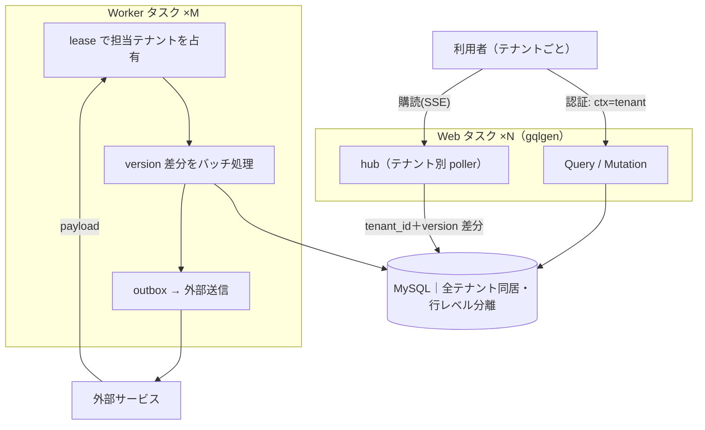

- **Web** は利用者に面し、テナントを**認証 ctx**から得る。読み書きは gqlgen、ライブ配信は hub（SSE）。
- **Worker** は外部サービスと常時つながり、**lease**で担当テナントを占有し、状態を DB に同期、外部送信は outbox。
- **MySQL** は全テナントが同居（行レベル分離）。境界は `tenant_id` 列＋スコープ強制で守る。
- 詳しくは各関心の記事: [security](concern-security.md)/[lifecycle](concern-lifecycle.md)/[performance](concern-performance.md)/[migration](concern-migration.md)。

---

## 1. 「lease 境界」って？

**lease（リース）** = 「この Worker が tenant X を担当」という**期限つきの割当**（`worker_lease` の行）。
**lease 境界** = その Worker が**触ってよいのは lease で持っているテナントだけ**、という線引き。
lease に無いテナントは掴まない——これが越境を防ぐ最初の壁（[fencing](fencing.md)）。

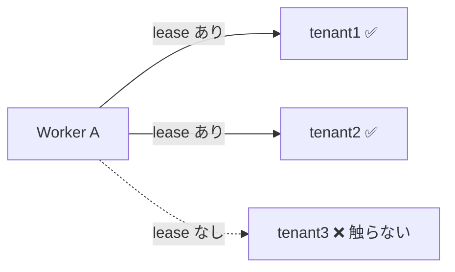

## 2. hub はコンテナ毎？テナント単位？→ **両方**

hub は**各 Web コンテナのメモリの中に1つ**ある（＝コンテナ毎）。その hub の**中がテナント単位に
分かれている**（テナントごとに poller と配信チャネル）。だから正確には「**コンテナ毎、かつ中はテナント単位**」。
他テナントのデータは、そのテナントのチャネルにしか流れない（混線ゼロ・[EXP-42](sse-fan-in.md)）。

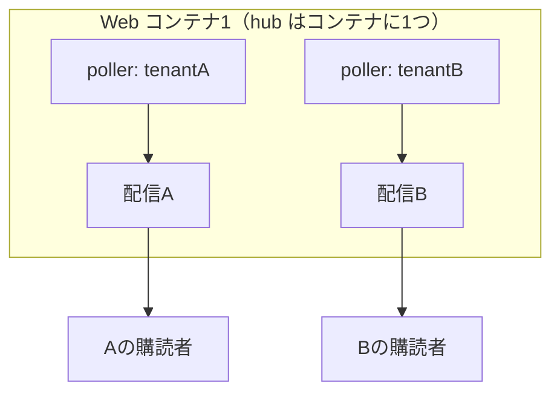

> 同じテナントの購読者が**複数コンテナ**に散る場合は、各コンテナの hub が独立に poll する（または
> プロセスを跨ぐなら pub/sub で配る・[EXP-43](sse-fan-in.md)）。「outbox・hub に他テナントのデータを
> 載せない」= この**テナント別チャネルを絶対に混ぜない**ということ。

## 3. 「最小権限＋テナント群ごとに分離＋ローテーション」の図

DB の資格情報（ユーザー/パスワード）を**①必要な操作だけに絞り（最小権限）②テナント群ごとに別々にし
③定期的に入れ替える（ローテーション）**。狙いは「**もし1つ漏れても、被害を絞る**」こと。

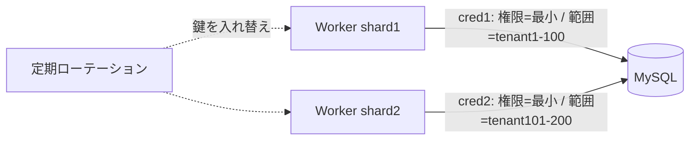

- **最小権限**: 必要な表への SELECT/INSERT/UPDATE だけ。DROP や他DBへの権限は与えない。
- **テナント群ごとに分離**: cred1 が漏れても被害は tenant1-100 だけ（cred2 の範囲は無事）。
- **ローテーション**: 漏れても**期限が来れば無効**になる（[EXP-13](credential-rotation.md)）。
- 効果: 漏洩の被害 = 「**その権限 × その範囲 × その期間**」に限定される。

## 4. 「外部接続の秘密をテナント分離・期限つき」→ Secret Manager で言うと？

各テナントが外部サービスに繋ぐための **API キー/トークン**を、**テナントごとに別の secret**として保管し、
**有効期限＋自動ローテーション**をかける。AWS Secrets Manager 等で表すと:

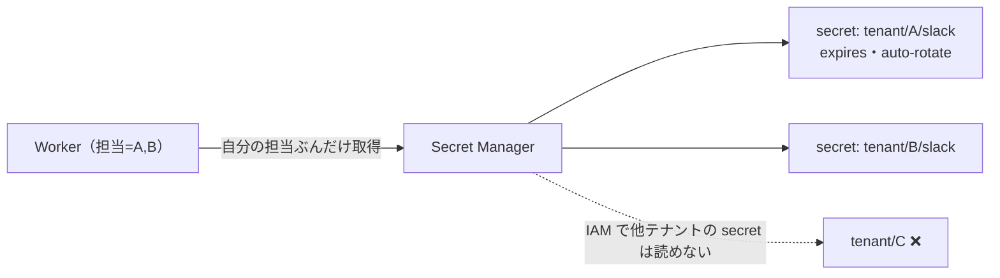

- **secret 名をテナントで分ける**（`tenant/{id}/{provider}`）。
- **アクセスは IAM でテナント単位に絞る**（Worker は担当テナントの secret だけ読める）。
- **期限＋自動ローテーション**を有効化。**DB に平文で持たない**（[secrets](secrets.md)）。

## 5. 「外部 payload を検証・重複排除（`UNIQUE(tenant_id, external_id)`）」って？

外部から届くイベント/メッセージは、再送・並行配送で**同じものが2回届く**。提供元の ID（external_id）を
**`tenant_id` と組で UNIQUE**にすると、**2回目の INSERT が弾かれて（1062）重複取り込みを防ぐ**。

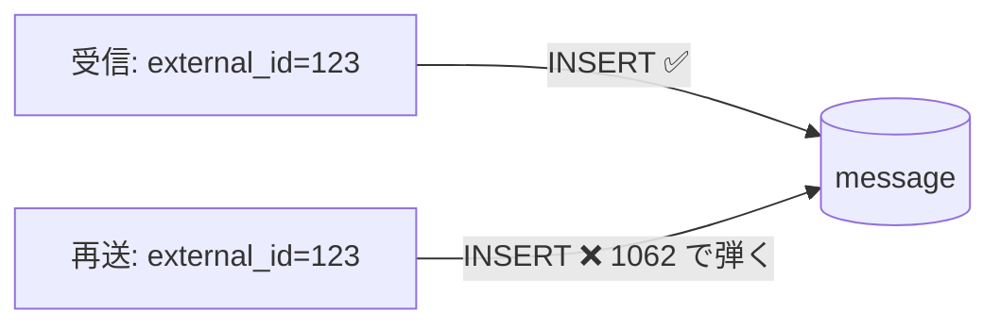

- **なぜ `tenant_id` と組か**: external_id は「提供元の中で一意」なだけ。テナントを跨ぐと**衝突しうる**ので、
  **テナント内一意**にする（[domain-themes](domain-themes.md)）。
- **検証**: payload の形と**所有者**を確認（他テナントの external_id を詐称して混ぜられないように）。
- 効果: スキーマだけで**冪等受信**を担保（[EXP-47](event-ordering.md) の考えをテーブルで実現）。

## 6. 「ブラスト半径」と「高感度テナントは専用ワーカー＋専用資格情報」

**ブラスト半径（blast radius）** = 爆発の半径 = **事故が起きたとき被害が及ぶ範囲**。
共有ワーカーでコードミスや資格情報漏れが起きると、被害は**全テナント（半径・大）**。
高感度テナントだけ**専用プロセス＋専用資格情報**にすると、そのテナントの事故は他に及ばず、
他の事故もそのテナントに及ばない（**半径 = 1テナント**）。

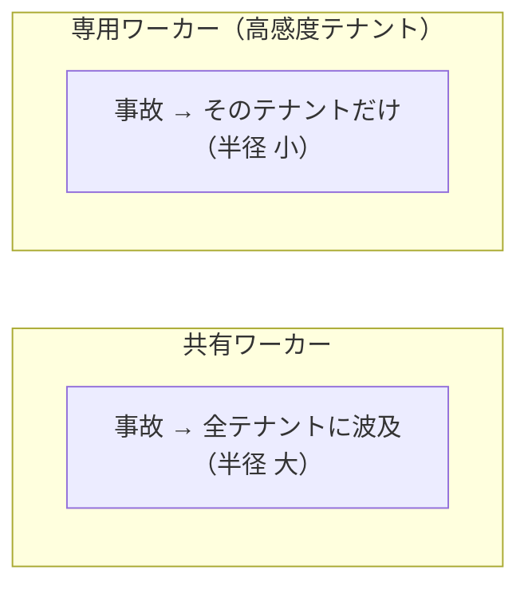

- 専用はコストが高い（プロセス基準メモリ ~300MB × 数・[worked-examples](worked-examples.md)）ので、
  **全テナントには使えない**。だから**高感度・大口・規制対象だけ**（[worker-tenancy](worker-tenancy.md)）。

## 7. 「version 差分をバッチで（per-row 禁止・coalesce）」

- **per-row（ダメ）**: 1台ずつ DB に問い合わせる → 1,000台×4表 = **40,000 クエリ/秒**で飽和。
- **version 差分バッチ**: 「前回の version より新しい行だけ」を**1クエリでまとめて**取る。
- **coalesce**: 同じ対象が何度変わっても、**最新を1回に畳む**。

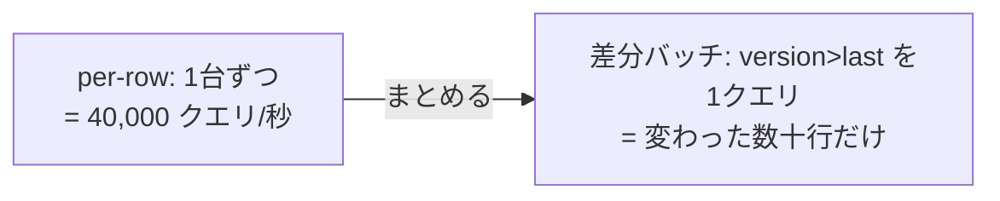

```sql
-- 差分バッチの実体
SELECT * FROM device
WHERE tenant_id=? AND version > :last   -- 前回の続きから
ORDER BY version LIMIT 500;             -- まとめて
```

（[fanout](fanout.md)/[subscription-design](subscription-design.md)。差分は実測 400x 削減）

## 8. 「multi-row＋1 tx（往復・コミットを減らす）」

- **単発×N（ダメ）**: `INSERT` を N 回 → **N 回の往復＋N 回のコミット（fsync）**。
- **multi-row＋1 tx**: **1文に複数行**をまとめ、**1回でコミット**。

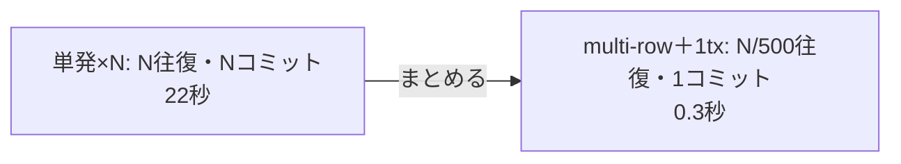

```sql
INSERT INTO t (tenant_id, ...) VALUES (?,...),(?,...),(?,...);  -- 複数行を1文で
```

（[bulk-insert](bulk-insert.md)(EXP-56) で実測 70x）

## 9. 「テナントをシャードして横に」＆「履歴は日パーティション保持」

**シャード（shard）** = テナントを複数の Worker に**分けて割り当てる**。1台を大きくする（縦＝vCPU/メモリ増）
より、**台数を増やす（横）**方が、GC 停止・障害影響・接続予算のどれも有利（[redundancy](redundancy.md)）。

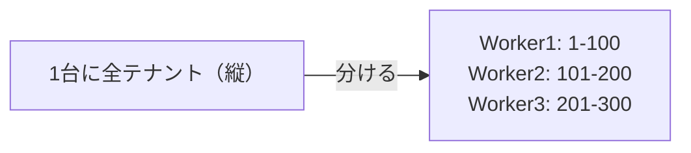

**履歴を書く側（Worker）**は行が増え続けるので、**最初から日パーティションにして保持期間で DROP**する
前提でスキーマを作る（後から入れるのは大変・[EXP-48](retention.md)）。

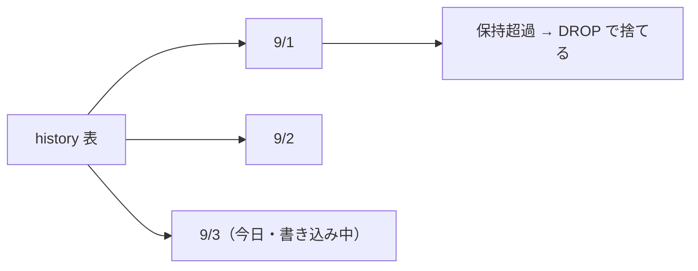

## 10. 「expand/contract で常に前後互換」

スキーマ変更を**一度に1ステップ**ずつ進め、**どの瞬間も旧コードと新コードの両方が動く**ようにする。
列を1つ足して置き換える例:

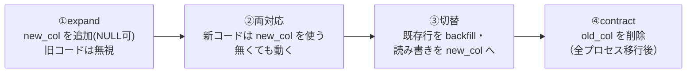

- **前後互換** = 変更の**前も最中も後も**、動いているどのバージョンのコードも壊れない。
- **一気に変えない**（列追加と即必須化を同時にやると、まだ動いている旧コードが壊れる）。
- **列削除（contract）は最後**、全プロセスが新スキーマに移りきってから（[EXP-32](zero-downtime-migration.md)）。

---

> 図をもっと細かく・別の言葉を足したい場合は言ってください。この doc に追記します。
