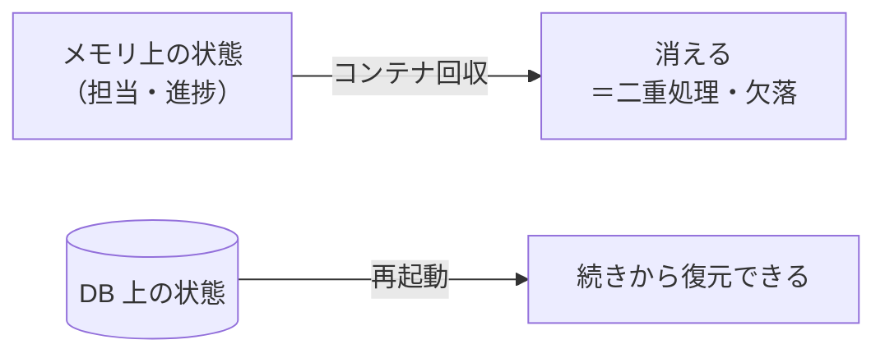
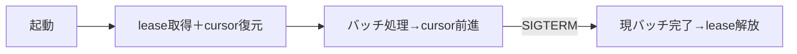
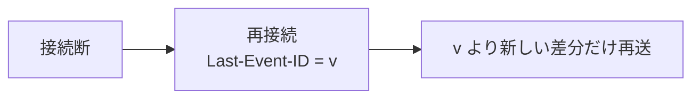

# 関心の詳細：長く継続する・コンテナの生き死に（lifecycle）

> Worker と Web に分けた詳細記事。一覧は [worker-vs-web](worker-vs-web.md)。

## 大きな目的

プロセスやコンテナが**いつ落ちても・再起動しても・デプロイで入れ替わっても**、
データが壊れず・二重に処理されず・利用者の体験が途切れない。これが「**常時稼働**」を名乗るための土台。
「動いている間だけ正しい」では不十分で、**落ちる前提**で設計する。

## 前提（この構成だと何が起きるか）

コンテナは **ephemeral（使い捨て）**。この実行環境自身も「非アクティブになると回収される」と明記している
とおり、**ローカルディスクとメモリの状態はいつでも消える**。だから——

**「生きている間だけのメモリ」に重要な状態を置くと、落ちた瞬間に失う**。真実は必ず DB に置く。
さらに Worker は「長時間の担当（テナントを持ち続ける）」、Web は「長時間の接続（SSE を張り続ける）」を
持つ。どちらも**途切れ（切断・再起動・入れ替え）への設計**が要るが、持っているものが違うので対策も違う。

---

## Worker での対応

### 目的（Worker 視点）
落ちても**「続きから」再開**し、入れ替わっても**二重に処理しない**。

### 対応内容
1. **起動時**：lease を取得し、**cursor（どこまで処理したか）を DB から復元**、外部接続を張る。
2. **常駐中**：**heartbeat で lease を延長**、切断は検知して張り直し（[EXP-33](db-resilience.md)）。
3. **クラッシュ時**：外部作用の途中は **`OUTCOME_UNKNOWN`** として後で照合・冪等再実行。
   **fence トークン**で「復活したゾンビの書き込み」を弾く（[EXP-1](crash-effects.md)/[EXP-2](fencing.md)）。
4. **graceful shutdown**：受付停止 → **現バッチ完了 → lease 解放**（[EXP-3](shutdown.md)）。
5. **重要状態（lease・cursor）は DB に**。メモリに持たない。

### 意味と効果
cursor と lease を DB に置くから、**どこで落ちても「続きから・べき等に」再開**できる。そして
**fence が効くのは「停止していた担当が復活したとき」**——lease だけでは、確認と書き込みの間に担当が
変わると古い書き込みが通ってしまう（[EXP-2](fencing.md) 実測：fence なし 1件事故、fence あり 0件）。
`GET_LOCK` では接続が切れた瞬間に黙って外れて二重稼働になるので、この用途では使わない
（[deep-dives](deep-dives.md) §4）。

---

## Web での対応

### 目的（Web 視点）
落ちても利用者は**再接続で継続**でき、書き込みは**二重にならない**。

### 対応内容
1. **起動時**：プール準備・hub 起動・ヘルスチェック公開。
2. **常駐中**：SSE は **heartbeat＋idle timeout** で死んだ接続を掃除（[EXP-39](sse-fan-in.md)）。
3. **スケールイン／デプロイ**：LB から外す → in-flight 完了 → **SSE に close を通知**して再接続を促す。
4. **再購読**：クライアントが**最後に見た version（Last-Event-ID）から差分だけ再送**（[EXP-52](subscription-design.md)）。
5. **mutation は冪等キー**で再送・二重送信を弾く（[EXP-27](graphql.md)）。

### 意味と効果
Web の接続（hub のスナップショット）は**揮発でよい**——真実は DB の version 列にある。だから接続が
切れても、**利用者が最後に見た version から再購読すれば、欠落なく続き**を受け取れる。書き込みは、
利用者がリロードや二重クリックで再送しても、**冪等キーで二度目が弾かれる**から安全。

---

## まとめ（Worker と Web の違いを一言）

- **Worker**: 担当と進捗（**lease・cursor**）を DB に置き、**落ちても続きから・fence で二重稼働なし**。
- **Web**: 接続は**揮発でよい**、切れたら **version から再購読**、書き込みは**冪等で二重なし**。
- **共通の大前提**: コンテナは ephemeral。**重要状態はメモリでなく DB に**置く。

裏づけ: [fencing](fencing.md)(EXP-2) / [shutdown](shutdown.md)(EXP-3) / [db-resilience](db-resilience.md)(EXP-33) / [subscription-design](subscription-design.md)(EXP-52)。
