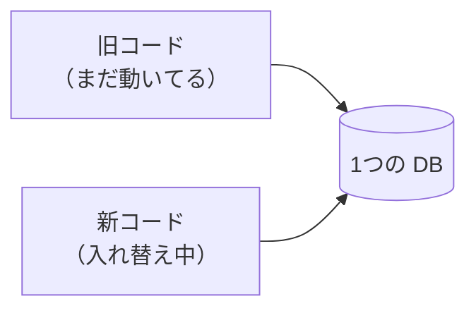
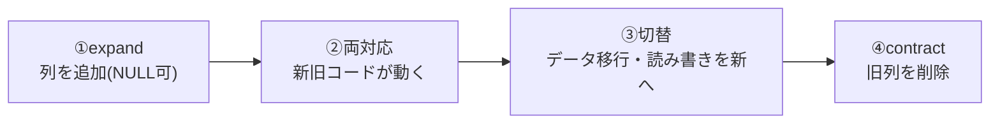

# 関心の詳細：マイグレーション（スキーマ変更）

> Worker と Web に分けた詳細記事。一覧は [worker-vs-web](worker-vs-web.md)。

## 大きな目的

**サービスを止めずにスキーマを変える**。テーブルに列を足す・消す・型を変える、といった変更を、
利用者にも Worker にも影響を出さずに適用する。目的は「変更できること」ではなく
「**変更の最中も、その前も後も、システムが壊れないこと**」。

## 前提（この構成だと何が起きるか）

Worker も Web も**複数レプリカ**で常時動いていて、デプロイは**ローリング**（少しずつ入れ替え）。
つまり**新旧のコードが数分〜しばらく同時に動く**。この間、DB スキーマは**新旧どちらのコードとも
互換**でなければならない。

だから**スキーマを一気に変えてはいけない**。「列を追加して即コードで必須にする」と、まだ動いている
旧コードが新列を知らずに壊れる。**一度に1つの互換ステップだけ**進める——これが expand/contract。

### expand / contract（4段階・小さく）

**列の削除（contract）は、全プロセスが新スキーマに移りきってから**。順番を守れば、どの瞬間に
落ちても・どのレプリカが新旧どちらでも、壊れない（[EXP-32](zero-downtime-migration.md)）。

---

## Worker での対応

### 目的（Worker 視点）
デプロイ中に**旧 Worker が新列を知らなくても壊れない**。マイグレーション自体も安全に1回だけ流す。

### 対応内容
1. **起動時にマイグレーションを流さない**（別の init/job で1回）。複数レプリカが同時起動して競合する
   ため（[EXP-6](migration-crash.md)/[locking](locking.md)）。
2. **排他は `GET_LOCK`（接続固定）か insert-first**（先に記録した1つだけが流す・[locking](locking.md)）。
3. **マイグレーションは冪等・再実行可能に**（途中クラッシュに耐える・[EXP-6](migration-crash.md)）。
4. **大表の DDL はロック時間に注意**（INSTANT/INPLACE、pt-osc/gh-ost）。
5. **パーティション保持の DDL は暗黙コミット**。日次ジョブでロールフォワード（[EXP-48](retention.md)）。

### 意味と効果
起動時マイグレーションは「常時稼働×複数レプリカ」と相性が悪い（同時に流して失敗が続く）。
別ジョブで1回に分けるのが最も効く。expand/contract を守れば、**旧 Worker が新列を無視して動き続けても
壊れない**ので、デプロイの順序に神経を使わなくて済む。

---

## Web での対応

### 目的（Web 視点）
デプロイ中に**旧 Web が新列を返さなくても・新 Web が旧スキーマでも壊れない**。API も後方互換に保つ。

### 対応内容
1. **起動時に流さない**（Worker と同じ。どちらの起動でも走らせない）。
2. **GraphQL スキーマは後方互換**：フィールド**追加**は安全、**削除・型変更は段階的**に（まず deprecated、
   クライアントが移ってから削除）。
3. **DB の expand/contract と API の互換ステップを合わせる**。
4. 古いクライアントが残る前提で、**返さないフィールドがあっても壊れない**設計。

### 意味と効果
Web は DB だけでなく**クライアント（ブラウザ・アプリ）も新旧が混在**する。DB の expand/contract に加えて
**API の後方互換**を守ることで、サーバもクライアントも段階的に移行できる。列削除・フィールド削除を
焦って同時にやると、移行中のクライアントが壊れる。

---

## まとめ（Worker と Web の違いを一言）

- **共通の原則**: **起動時に流さない**・**expand/contract で常に前後互換**・**Worker と Web の切替を合わせる**。
  列削除（contract）は全プロセスが新スキーマに移ってから、が鉄則。
- **Worker 固有**: マイグレーションを冪等に・保持のパーティション DDL は日次ジョブで。
- **Web 固有**: API（GraphQL スキーマ）も後方互換に。クライアントの新旧混在も考慮。

裏づけ: [zero-downtime-migration](zero-downtime-migration.md)(EXP-32) / [migration-crash](migration-crash.md)(EXP-6) / [locking](locking.md) / [retention](retention.md)(EXP-48)。
