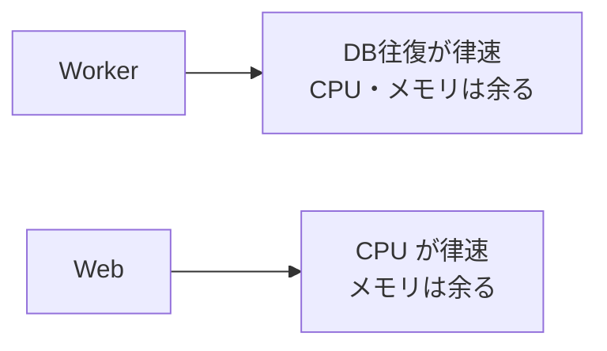
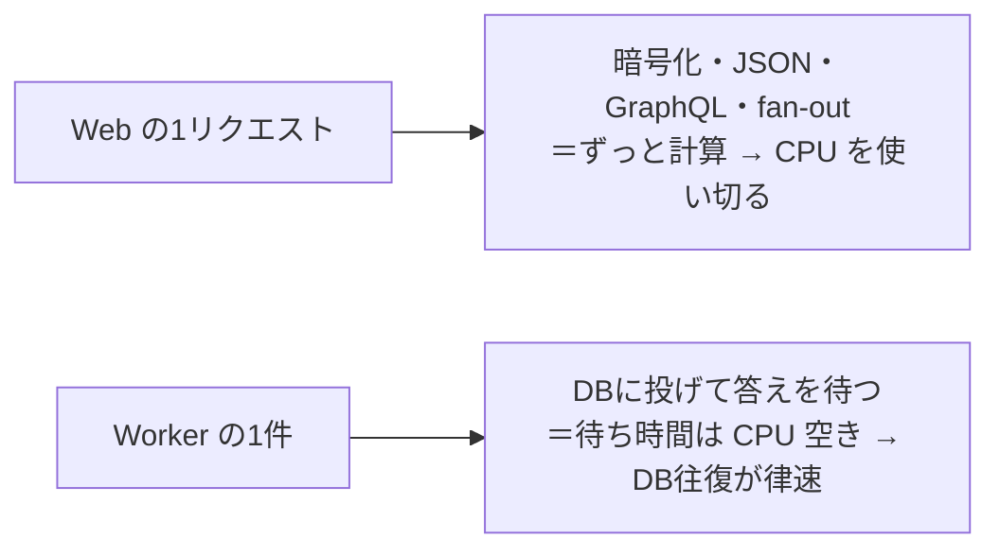
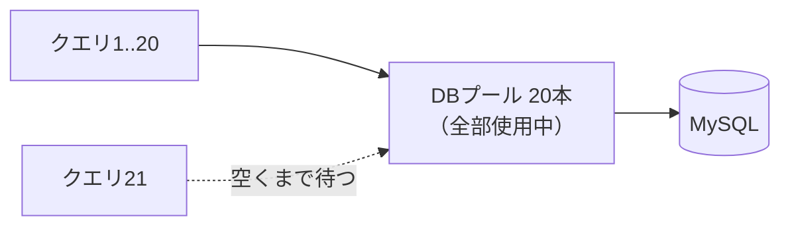

# 関心の詳細：パフォーマンス

> Worker と Web に分けた詳細記事。一覧は [worker-vs-web](worker-vs-web.md)。

## 大きな目的

台数・利用者・データが増えても、**応答（レイテンシ）と処理量（スループット）を保つ**。そして
1タスク（1 vCPU / 2GB）で無理になったら、**素直に横に割れる形**にしておく。「速くする」だけでなく
「**どこが先に詰まるかを知って、そこだけ手を打つ**」のが目的。

## 前提（この構成だと何が起きるか）

**律速（先に埋まる資源）が Worker と Web で逆**になる（[EXP-31](capacity.md) / [worked-examples](worked-examples.md) で実測）：



ここを取り違えると努力が無駄になる：**DB 待ちの Worker に CPU を足しても速くならない**し、
**CPU 待ちの Web にメモリを足しても捌けない**。だから「まずどこが先に埋まるか」を掴んでから手を打つ。

## なぜ Web=CPU・Worker=DB なのか

**仕事の中身が「計算」か「待ち」か**の違い。1 vCPU は「1秒に 1,000ms ぶんの計算枠」。

- **Web の仕事は計算（CPU を使う・待たない）**：TLS 暗号化/復号・JSON の組み立て/解析・GraphQL の
  パース/検証/resolve・SSE の fan-out（変更 × 購読者を直列化）。どれも外部の返事を待たない**純計算**なので
  CPU 枠を食い尽くす。一方メモリは接続が安く（1本 ~34KB・[EXP-59](concern-subscription-capacity.md)）**余る**。
- **Worker の仕事は待ち（CPU を使わない）**：DB にクエリを投げて**答えを待つ**のが中心。
  **待っている間 CPU は空く（I/O 待ち）**ので、CPU もメモリも余り、律速は **DB 往復**になる。



Web の CPU 家計（[worked-examples](worked-examples.md) の 1vCPU 例）：

```
Query 100rps × ~5ms  = 500 ms/s
SSE fan-out          = 240 ms/s
Mutation 20rps × 3ms =  60 ms/s
------------------------------
合計 ≒ 800 ms/s ＝ 1 vCPU の 80%   ← メモリ(23%)より先に一杯
```

> ひとことで：**Web は 1 vCPU を計算で使い切る／Worker は 1 vCPU をほとんど使わず DB の返事待ちで過ごす**。
> 同じ 1 vCPU でも、Web は使う・Worker は使わない。

### 「DB が埋まる」とは（プール飽和）

Web が「CPU（＋DB プール）」律速と言うときの **DB プール**の話。アプリは DB 接続を**プール（例：20本）**で
使い回す。同時に走るクエリが 20 を超えると、**21本目は空きが出るまで待たされる**（キューに並ぶ）。
これが「**DB が埋まる**」＝プール飽和（[EXP-5](pool-saturation.md) の「膝」）。



- **プールが埋まる**（アプリ側）：接続が全部使用中 → 新しいクエリが待つ。**同時実行数がプール本数で頭打ち**。
- **DB 自体が埋まる**（サーバ側）：MySQL の CPU・ディスク IO・ロックが飽和し、1クエリが遅くなる。
  これは**全プロセスの合計接続**が DB の天井を超えたとき（[poolbudget](../internal/poolbudget)・[redundancy](redundancy.md)）。
- **なぜ Web で効くか**：プールが埋まると、CPU が空いていても**クエリ待ちで応答が遅くなる**。だから
  Web の同時実行は「**CPU** と **DB プール**の**小さい方**」で頭打ちになる。
- **打ち手**：遅いクエリを速くする（索引・射影・[query-timeout](query-timeout.md) で長居を切る）／プールを
  適正化（大きすぎると DB を殺す・[EXP-5](pool-saturation.md)）／読みをレプリカへ逃がす（[read-replica](read-replica.md)）。

### プールは何本にすべきか

**「DB が耐えられる数」でなく「増やしても伸びなくなる数」で決める**（[EXP-5](pool-saturation.md) の実測）。

| MaxOpen | ops/s | p99 |
| --- | --- | --- |
| 8 | 24,300 | 4.94ms |
| **16** | **27,404（+12.8%）** | 3.78ms |
| 32 | 27,676（+1.0%） | 4.15ms |

- **ある点でスループットが頭打ち**になり、その先は**接続を増やしても遅延が伸びるだけ**（待ち行列を
  DB 側へ移すだけ）。この機械（4 CPU）では **16 で頭打ち**。目安は **DB の CPU コア数〜その数倍**、
  最後は実機で「ops/s が伸びなくなる点」を測って決める。
- **小さすぎ**＝待ちが増える、**大きすぎ**＝DB を殺す（コンテキストスイッチ・メモリ・ロック競合）。
- **合計を予算内に**：Web レプリカ数×プール ＋ Worker 数×プール の**合計**が DB の上限を超えないこと
  （[poolbudget](../internal/poolbudget)・[redundancy](redundancy.md)）。1台ぶんでなく**全プロセスの和**で見る。
- **監視**：`db.Stats().WaitCount` / `WaitDuration` が 0 でなければ**すでに飽和**（この2つを出しておく）。

### RDS Proxy でも同じか → **基本は同じ**（天井は上がらない）

**DB の同時処理能力の上限は RDS Proxy でも変わらない**。Proxy は「接続の集約・再利用・フェイルオーバ」を
助けるが、**DB の仕事量の天井は上げない**。変わるのは「**どこで待つか**」（詳細・手順は [rds-proxy](rds-proxy.md)）。

| | 直結 | RDS Proxy |
| --- | --- | --- |
| 埋まる場所 | アプリのプール待ち | **Proxy の借用(borrow)待ち**／DB 飽和 |
| 多数インスタンス/Lambda | 各自が DB 接続を持つ→接続爆発 | **少数の DB 接続へ多重化**（接続 churn に強い） |
| DB の CPU/IO/ロック飽和 | クエリが遅くなる | **同じく遅くなる**（Proxy は無関係） |

- **効くところ**：アプリのインスタンスが多い・Lambda で接続 churn が激しい・フェイルオーバを滑らかにしたい。
- **落とし穴（session pinning）**：トランザクション保持・`SET @var`・一時表・prepared statement・`GET_LOCK`
  は**接続に状態を持つ**ので、Proxy が多重化できず**接続が 1:1 に張り付く**（集約の利点が消える）。
  とくに `GET_LOCK` は接続に紐づくため、集約・再利用で**取得と解放が別接続になりうる**（[locking](locking.md)）——
  Proxy 下では避けるか厳重に確認する。
- **結論**：ボトルネックが「アプリのプール」から「**Proxy の borrow／DB の飽和**」へ**移るだけ**で、
  「DB の同時実行には上限がある」という話は同じ。※この repo では AWS が無く未実測（[rds-proxy](rds-proxy.md) に手順）。

---

## Worker での対応

### 目的（Worker 視点）
**DB 往復を減らして**、少ないプールで多くを捌く（CPU・メモリは余っているので、そこは触らない）。

### 対応内容
1. **version 差分をバッチで取得**（`WHERE tenant_id=? AND version>:last LIMIT N`）。**1台ずつ引かない**。
2. **まとめ書きは multi-row＋1トランザクション**（往復とコミットを減らす・[EXP-56](bulk-insert.md)）。
3. **coalesce**：同じテナントの変化をまとめて1回で（[EXP-14](fanout.md)）。
4. **プールは小さく**、合計接続を予算内に（[EXP-5](pool-saturation.md)）。

### 意味と効果
1台ずつのポーリングは 1,000台×4表 = **40,000 クエリ/秒**で DB を飽和させる（[why-necessary](why-necessary.md)）。
差分バッチと multi-row にすると往復が**桁で減る**（[EXP-56](bulk-insert.md) の bulk は同ホストで 70x、
[EXP-52](subscription-design.md) の差分は 400x）。CPU が余っているので、増強は**縦（vCPU増）でなく
横（テナントをシャードして Worker を増やす）**。


---

## Web での対応

### 目的（Web 視点）
**1リクエストの CPU を減らし**、購読者が増えても fan-out コストを線形に増やさない。

### 対応内容
1. **keyset ページング・必要列だけ射影・N+1 は DataLoader**（[EXP-18/21/23](graphql.md)）。
2. **SSE は hub で差分配信・遅い購読者は drop**（[EXP-38/52](sse-fan-in.md)）。
3. **キャッシュ**：TTL＋イベント失効・stampede は singleflight（[EXP-46](cache.md)）。
4. **SSE に DB 接続を 1:1 で持たせない**（数千接続で DB が枯れる・[EXP-38](sse-fan-in.md)）。

### 意味と効果
N+1（一覧＋各行に1回）は 50+50×4 = **250 往復**、DataLoader で **5 往復**に落ちる（[EXP-23](graphql.md)）。
一覧の `SELECT *` で太い列を取ると 170ms、必要列だけの射影なら軽い（[EXP-21](column-projection.md)）。
hub にすると購読者が S 人いても **DB は poller 1本**（[EXP-38](sse-fan-in.md)）。CPU が天井なら
**5,000 SSE × 複数タスク**に横割り（[EXP-40](capacity.md)）。


---

## まとめ（Worker と Web の違いを一言）

- **Worker**: **往復を減らす**（version 差分・バッチ・multi-row）。CPU/メモリは余るので横に割る。
- **Web**: **CPU を減らす**（射影・N+1回避・fan-out を hub に集約）。メモリは余るので横に割る。
- **共通**: まず律速を知る → そこだけ手を打つ → 足りなければ**縦より横**。

裏づけ: [capacity](capacity.md)(EXP-31) / [worked-examples](worked-examples.md) / [bulk-insert](bulk-insert.md)(EXP-56) / [subscription-design](subscription-design.md)(EXP-52)。
