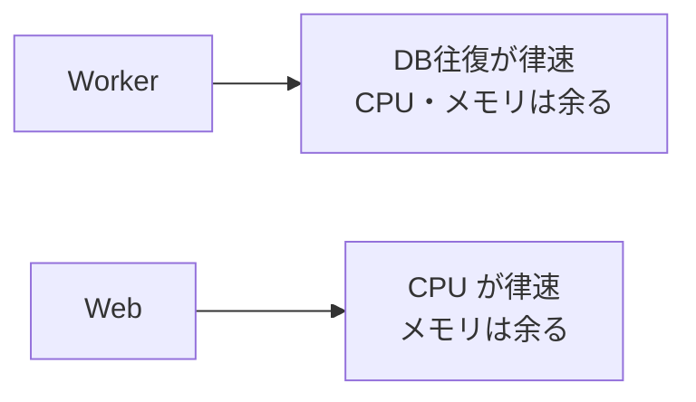

# 関心の詳細：パフォーマンス

> Worker と Web に分けた詳細記事。一覧は [worker-vs-web](worker-vs-web.md)。

## 大きな目的

台数・利用者・データが増えても、**応答（レイテンシ）と処理量（スループット）を保つ**。そして
1タスク（1 vCPU / 2GB）で無理になったら、**素直に横に割れる形**にしておく。「速くする」だけでなく
「**どこが先に詰まるかを知って、そこだけ手を打つ**」のが目的。

## 前提（この構成だと何が起きるか）

**律速（先に埋まる資源）が Worker と Web で逆**になる（[EXP-31](capacity.md) / [worked-examples](worked-examples.md) で実測）：

ここを取り違えると努力が無駄になる：**DB 待ちの Worker に CPU を足しても速くならない**し、
**CPU 待ちの Web にメモリを足しても捌けない**。だから「まずどこが先に埋まるか」を掴んでから手を打つ。

---

## Worker での対応

### 目的（Worker 視点）
**DB 往復を減らして**、少ないプールで多くを捌く（CPU・メモリは余っているので、そこは触らない）。

### 対応内容
1. **version 差分をバッチで取得**（`WHERE tenant_id=? AND version>:last LIMIT N`）。**1台ずつ引かない**。
2. **まとめ書きは multi-row＋1トランザクション**（往復とコミットを減らす・[EXP-56](bulk-insert.md)）。
3. **coalesce**：同じテナントの変化をまとめて1回で（[EXP-14](fanout.md)）。
4. **プールは小さく**、合計接続を予算内に（[EXP-5](pool-saturation.md)）。

### 意味と効果
1台ずつのポーリングは 1,000台×4表 = **40,000 クエリ/秒**で DB を飽和させる（[why-necessary](why-necessary.md)）。
差分バッチと multi-row にすると往復が**桁で減る**（[EXP-56](bulk-insert.md) の bulk は同ホストで 70x、
[EXP-52](subscription-design.md) の差分は 400x）。CPU が余っているので、増強は**縦（vCPU増）でなく
横（テナントをシャードして Worker を増やす）**。

---

## Web での対応

### 目的（Web 視点）
**1リクエストの CPU を減らし**、購読者が増えても fan-out コストを線形に増やさない。

### 対応内容
1. **keyset ページング・必要列だけ射影・N+1 は DataLoader**（[EXP-18/21/23](graphql.md)）。
2. **SSE は hub で差分配信・遅い購読者は drop**（[EXP-38/52](sse-fan-in.md)）。
3. **キャッシュ**：TTL＋イベント失効・stampede は singleflight（[EXP-46](cache.md)）。
4. **SSE に DB 接続を 1:1 で持たせない**（数千接続で DB が枯れる・[EXP-38](sse-fan-in.md)）。

### 意味と効果
N+1（一覧＋各行に1回）は 50+50×4 = **250 往復**、DataLoader で **5 往復**に落ちる（[EXP-23](graphql.md)）。
一覧の `SELECT *` で太い列を取ると 170ms、必要列だけの射影なら軽い（[EXP-21](column-projection.md)）。
hub にすると購読者が S 人いても **DB は poller 1本**（[EXP-38](sse-fan-in.md)）。CPU が天井なら
**5,000 SSE × 複数タスク**に横割り（[EXP-40](capacity.md)）。

---

## まとめ（Worker と Web の違いを一言）

- **Worker**: **往復を減らす**（version 差分・バッチ・multi-row）。CPU/メモリは余るので横に割る。
- **Web**: **CPU を減らす**（射影・N+1回避・fan-out を hub に集約）。メモリは余るので横に割る。
- **共通**: まず律速を知る → そこだけ手を打つ → 足りなければ**縦より横**。

裏づけ: [capacity](capacity.md)(EXP-31) / [worked-examples](worked-examples.md) / [bulk-insert](bulk-insert.md)(EXP-56) / [subscription-design](subscription-design.md)(EXP-52)。
