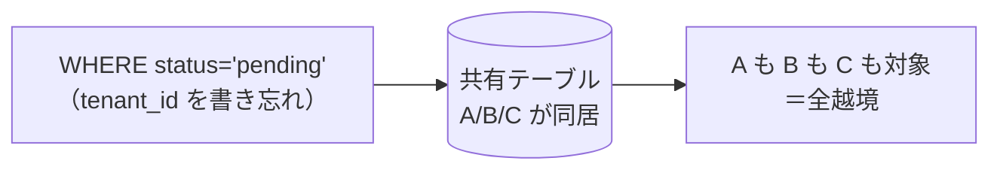
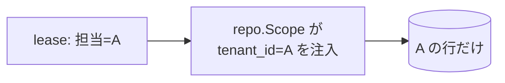
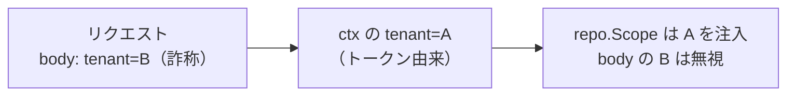

# 関心の詳細：セキュリティ（マルチテナント越境禁止）

> Worker と Web に分けた詳細記事。一覧は [worker-vs-web](worker-vs-web.md)。

## 大きな目的

**あるテナントのデータが、別のテナントに絶対に漏れない・触られない**——これを保証することが唯一にして
最大の目的。マルチテナント SaaS では、越境は一度起きれば「他社の情報が見えた」という**信頼の致命傷**に
なる。機能が多少足りないのは許されても、越境は許されない。だからここは「なるべく」ではなく
**不変条件（invariant）**として設計する。

## 前提（この構成だと何が起きるか）

全テナントのデータは、**同じ MySQL・同じテーブルに同居**している（行レベル分離）。テナントの境界は、
テーブルの中の **`tenant_id` という1つの列でしか表現されていない**。つまり——

クエリが `tenant_id` を1本落とすだけで、同居する**全テナントが対象**になる。[EXP-58](tenant-scope.md) の
実測どおり「**越境は 0 か 全部か**」で中間がない。しかも Worker と Web は**信頼境界が違う**：
Worker は内部で動き「人間の認可」という概念がない、Web は利用者から **untrusted な入力**を受ける。
だから同じ「越境を防ぐ」でも、**テナントの出所**と**守り方**が変わる。

---

## Worker での対応

### 目的（Worker 視点）
**担当しているテナントだけ**を処理し、それ以外の行を読みも書きもしない。Worker には利用者の
ログインが無いので、境界は「担当割当（lease）＋クエリのスコープ」で完全に決まる。

### 対応内容
1. **テナントの出所は lease と処理対象行の `tenant_id`**（内部で決まる。外部入力に依存しない）。
2. **全クエリに `WHERE tenant_id=?` を `repo.Scope` で強制**。バッチ取得も例外なし。
3. **外部からの payload は検証し、`UNIQUE(tenant_id, external_id)` で取り込む**（他テナントの ID を
   偽装したデータを混入させない・[EXP-47](event-ordering.md)）。
4. **outbox・hub に他テナントのデータを載せない**（[EXP-42](sse-fan-in.md)）。
5. **DB 資格情報は最小権限、テナント群ごとに分離、定期ローテーション**（[EXP-13](credential-rotation.md)）。

### 意味と効果
Worker には「この人はこれを見てよいか」という認可が無い代わりに、**lease 境界が「触ってよいテナント」
を定義**する。lease で担当していないテナントを掴まない＋全クエリ `tenant_id` 強制、の2つで越境は 0 になる。
そして**書き忘れは人間が気をつけるのでなく、`repo.Scope` の自動注入＋`sqllint` の生 SQL 禁止で
機械的に潰す**（[static-analysis](static-analysis.md)）。これが「なるべく」を「不変条件」に変える肝。

---

## Web での対応

### 目的（Web 視点）
**ログイン中の利用者が属するテナントのデータだけ**を返し、他は絶対に見せない。かつ、
**入力でテナントを偽装させない**。

### 対応内容
1. **テナントは認証 ctx から取る**。リクエストに入っている `tenant_id` を**信じない**（偽装対策）。
2. **全 resolver が `repo.Scope` 経由**。生 SQL は lint で禁止（Worker と同じ機械強制）。
3. **フィールド／行レベルの認可**（`@auth`・canOperate）。テナント内でもロール・対象で見え方が違う
   （[EXP-25/28](security-layers.md)）。
4. **SSE の topic はテナント単位**（配信の混線ゼロ・[EXP-42](sse-fan-in.md)）。
5. **DoS 対策**：複雑度上限・永続化クエリ allowlist・レート制限（[EXP-24/26](graphql.md)）。
6. **エラー秘匿・本番は introspection off**（内部構造を漏らさない）。

### 意味と効果
Web の入力は untrusted。攻撃者は「リクエストボディに `tenant_id: 他社` を入れて叩く」。だから
**テナントを ctx（検証済みトークン）から取るのが必須**——ここを入力から取ると即・越境になる。
さらにテナント内でも認可は分かれる（一般ユーザーが管理者用フィールドを見られてはいけない）ので、
`@auth` と行レベル認可で二段に守る。

---

## まとめ（Worker と Web の違いを一言）

- **Worker**: テナントは**内部の担当（lease）**から。越境は lease 境界＋スコープ強制で防ぐ。
- **Web**: テナントは**認証 ctx**から（入力は不信）。越境はスコープ強制＋認可で防ぐ。
- **共通の生命線**: 全クエリの `tenant_id` 強制＋生 SQL 禁止。これだけは人手に頼らず機械で担保する。

裏づけ: [tenant-scope](tenant-scope.md)(EXP-58) / [security-layers](security-layers.md) / [worker-tenancy](worker-tenancy.md)。
