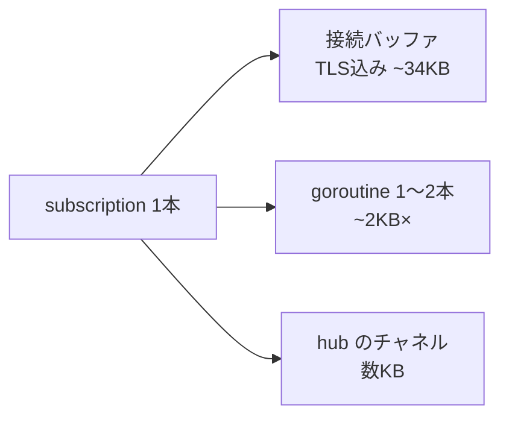
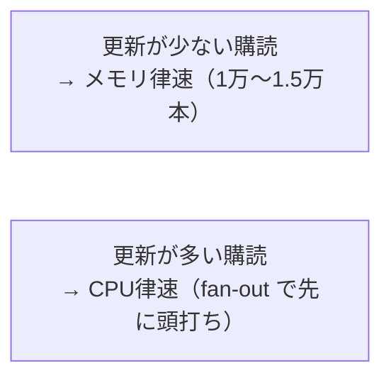
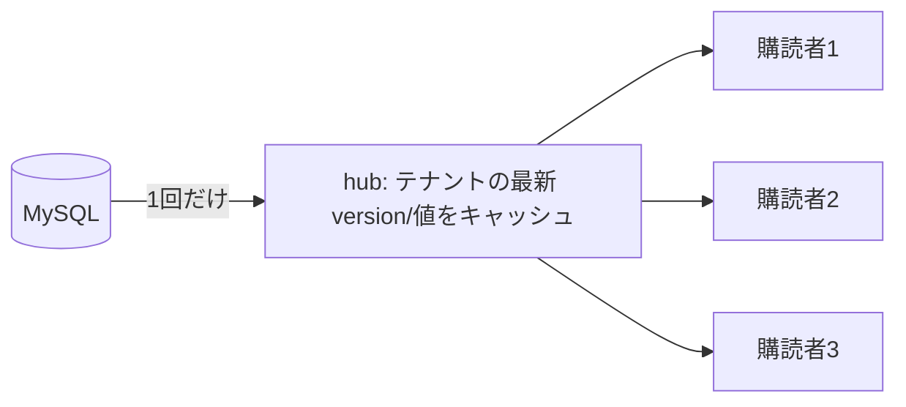
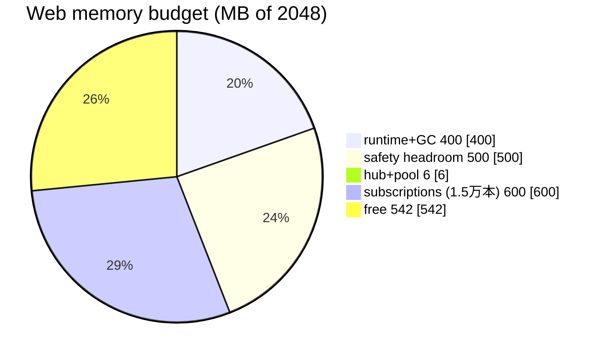
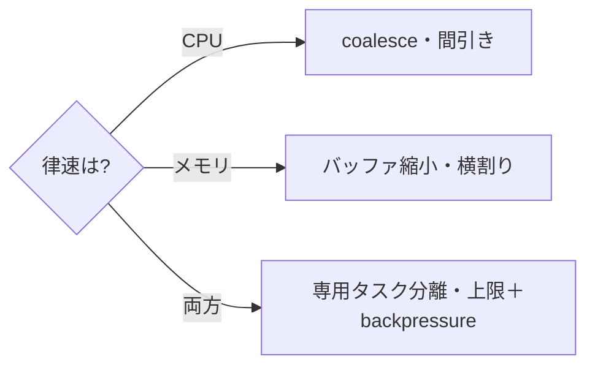

# 関心の詳細：gqlgen subscription は何本提供できるか

> concern 系の詳細記事。容量の前提は [capacity](capacity.md)(EXP-31)、単価は [reference-numbers](reference-numbers.md)、
> Web サンプルは [worked-examples](worked-examples.md)。

## 大きな目的

1 vCPU / 2GB の Web タスク1つで、**gqlgen の subscription（ライブ配信）を何本まで安定して提供できるか**
を、当てずっぽうでなく**単価の足し算**で見積もる。そして「**先に何が枯れるか（CPU かメモリか）**」を
掴んで、限界が近いときに**何をすればいいか**まで決める。

## 前提：subscription 1本が食うもの

gqlgen の subscription は WebSocket（または SSE）の**張りっぱなし接続**で、1本ごとに次を消費する：



- **接続バッファ（TLS 込み）** が主役：1本 ~34KB（[EXP-31](capacity.md)）。
- **goroutine**：接続読み取り＋購読で 1〜2本、1本 ~2KB（[EXP-50](reference-numbers.md)）。
- **hub のチャネル**：購読者ごとの受け口、数KB。
- 合わせて **1本 ≒ 約 40KB** と見積もる（gqlgen の goroutine/チャネルぶんを載せた保守値）。

---

## ① いくつ提供できるか（メモリ計算）

**2GB のうち接続に使える枠 ≒ 1.2GB**（残りはランタイム・GC・アプリ・DB プール・hub）。

```
本数 ≒ 接続枠 ÷ 1本あたり
理論上限:  1.2GB ÷ 40KB ≒ 3万本
実運用:    その 1/2〜1/3（GC 余白・突発確保）→ 1万〜1.5万本
```

→ **1タスクあたり 1万〜1.5万本**が安全な上限（[EXP-40](capacity.md) と一致）。**idle（更新が少ない）購読は
メモリ律速**なので、この本数まで抱えられる。

## ② ボトルネックは CPU？メモリ？→ **更新頻度で変わる**

**idle なら メモリ律速、更新が多いと CPU（fan-out）が先に律速**になる。ここが肝。



fan-out の CPU は **変更数 × 配信人数 × 直列化コスト**。例（[worked-examples](worked-examples.md) の Web）：

```
1.5万本 / 50テナント = 300本/テナント、200変更/秒なら
  200 × 300 = 60,000 push/秒 × ~0.03ms ≒ 1,800 ms/秒 > 1,000ms（1vCPU）→ CPU 飽和
```

つまり**メモリ的には 1.5万本入っても、更新が活発だと CPU が先に潰れて配信が遅延する**。
だから「何本つなげるか」は**更新頻度とセット**で決める。低頻度なら 1万〜1.5万、高頻度なら CPU で頭打ち。

## ③ hub でキャッシュは要る？→ **要る（それが hub の本体）**

要る。hub の役割そのものが**「テナントごとに DB を1回だけ読み、その最新値を全購読者で共有する」**
＝キャッシュ＋fan-out。これが無いと**購読者ごとに DB を引いて往復が爆発**する（[EXP-38](sse-fan-in.md)）。



**何をキャッシュするか**：テナントごとの **最新 version と最新スナップショット（小さい）**。
購読者ごとにキャッシュしない（それはメモリの無駄）。期限切れ一斉読みは singleflight で1回に畳む
（[EXP-46](cache.md)）。差分は version で配る（[EXP-52](subscription-design.md)）。

## ④ hub のサイズはどれくらい？→ **接続に比べれば誤差（MB オーダー）**

hub 自体は小さい。**「アクティブなテナント数」で決まり、購読者数では増えない**（購読者ぶんは接続側）。

```
hub ≒ アクティブテナント数 × (poller goroutine ~2KB ＋ 最新スナップショット 数KB)
例) 50テナント × ~10KB ≒ 0.5MB
    1000テナント × ~10KB ≒ 10MB
```

→ **hub は数 MB。メモリを食っているのは hub でなく「接続そのもの」**（1.5万本 × 40KB ≒ 600MB）。
「hub のサイズが心配」より「**接続の本数**」を見るのが正しい。

---

## ⑤ 資材の家計簿（もともと幾つ使い、残りいくつ）

2048MB を実際に割り振ると：

| 使い道 | 量 | 何か |
| --- | --- | --- |
| Go ランタイム＋GC 余白 | ~400 MB | プロセスの土台（ほぼ固定） |
| DB プール（20）＋雑多 | ~5 MB | Query/Mutation 用 |
| **hub**（50テナント） | **~0.5 MB** | テナントの最新値キャッシュ |
| **subscription 接続** | **可変** | ここが本命 |
| GC 突発・安全余白 | ~400〜600 MB | 空けておく |
| **接続に使える実枠** | **≒ 1.2 GB** | → **/40KB ≒ 3万（理論）→ 実運用 1万〜1.5万** |



→ **もともと使うのは ~400MB（土台）＋ hub/pool 数 MB。残り ~1.5GB のうち安全余白を引いた ~1.2GB が
接続用**。そこに 1万〜1.5万本（~600MB）で、まだ余白がある——**メモリ的には余裕、律速は②の CPU 次第**。

## ⑥ 足りなくなったら何をする

限界が近いとき、**律速がどちらか**で打ち手が変わる：

| 律速 | やること |
| --- | --- |
| **CPU（更新が活発）** | **coalesce**：中間更新を捨てて最新だけ配る（fan-out 回数を減らす・[EXP-14](fanout.md)/[EXP-46](cache.md)）。高頻度テレメトリは間引く |
| **メモリ（本数）** | **接続バッファを小さく**（write buffer 縮小）／**横に割る**（5,000本 × 複数タスク・[EXP-30](redundancy.md)） |
| どちらも | **subscription 専用タスクを分離**（Query/Mutation と資源プロファイルが違う・[web-worker-split](web-worker-split.md)）／接続数上限＋backpressure（超過は 429/別タスクへ）／**必ず実機で p95 と RSS を測る** |



---

## まとめ

- **何本**：1 vCPU/2GB で **1万〜1.5万本**（idle 前提・メモリ律速）。
- **律速**：**idle=メモリ、更新が活発=CPU（fan-out）**。本数は更新頻度とセットで決める。
- **hub キャッシュ**：要る。テナントの**最新 version/値**を共有（購読者ごとに持たない）。hub 自体は**数 MB**。
- **家計簿**：土台 ~400MB＋hub/pool 数 MB、接続用 ~1.2GB。1.5万本で ~600MB＝まだ余白。
- **足りなければ**：CPU なら coalesce、メモリなら横割り、共通して専用タスク分離＋上限＋実機計測。

裏づけ: [capacity](capacity.md)(EXP-31) / [sse-fan-in](sse-fan-in.md)(EXP-38/40) / [subscription-design](subscription-design.md)(EXP-52) /
[reference-numbers](reference-numbers.md)(EXP-50) / [worked-examples](worked-examples.md)。

> 注: 1本あたり ~40KB は接続コスト実測（EXP-31/50）に gqlgen の goroutine/チャネルを載せた**見積り**。
> gqlgen 固有の per-subscription メモリは未実測なので、**本番相当の実機で測って置き換える**こと。
