# 月予算での優先順位：タスクスペック↑ / タスク数↑ / Aurora↑（EXP-61）

月の予算上限のもとで、増強の**優先順位**をどう決めるか。**AWS を触らず、公式料金（入力）＋実測した
単位容量（EXP-31/59/60）＋判断モデル**で決める。原則はひとつ——**律速に合う lever に金を使う**。

実装は [internal/costlab](../internal/costlab)、receipt は
[docs/results/exp-61](results/exp-61/exp-61-cost-scaling-priority.md)。接続律速は [EXP-60](connection-budget.md)、
容量は [capacity](capacity.md)(EXP-31)、律速の見分けは [concern-performance](concern-performance.md)。

## 大原則：律速に合わせる（合わない lever に金を使わない）

```mermaid
flowchart TD
  Q1{"まず $0：クエリ修正・N+1・pool 適正化で直る?"}
  Q1 -- はい --> FIX["それをやる（一番安い）"]
  Q1 -- いいえ --> Q2{"律速は?"}
  Q2 -- 接続(タスク×pool>max_conn) --> AUR["Aurora↑ or RDS Proxy<br/>（タスク増は無駄・EXP-60）"]
  Q2 -- CPU(接続に余裕・rps不足) --> APP["タスク数↑ / スペック↑<br/>（Aurora↑は効かない）"]
  Q2 -- DBスループット(クエリ遅い/DB CPU) --> DB["読みはレプリカ→Aurora↑"]
```

## モデルが出した優先順位（EXP-61・純 Go の判断）

| シナリオ | 律速 | タスク増は効く？ | **第一優先** |
| --- | --- | --- | --- |
| 12台希望・小Aurora(max_conn=90)/pool10 → 9台で頭打ち | **接続** | **無駄**（使えるタスクが増えない） | **Aurora↑**（or Proxy） |
| 8台・大Aurora(接続余裕)・rps 不足 | **CPU** | 効く | **タスク数↑**（Aurora↑は web rps を増やさない） |
| — | Fargate 線形 | — | 横/縦は 1kRPS あたり同単価（$180.20 同士）→ **横を既定** |

- **接続律速のとき Aurora が第一**：max_connections を上げないとタスクを増やせない（[EXP-60](connection-budget.md) で
  実測——超過分は 1040 で拒否）。ここでタスクスペックを上げても rps は増えるが**接続の頭打ちは解けない**。
- **CPU 律速のとき タスクが第一**：接続に余裕があるので、Aurora を上げても web rps は増えない（律速でない）。
- **Fargate は線形料金**なので「タスク数↑」と「スペック↑」は **1rps あたり同程度**→ **GC 停止・障害影響・
  接続予算のどれも有利な横（タスク数）を既定**に（[redundancy](redundancy.md)）。

## 官（公式）の構造：各 lever が「何を買うか」

> 具体的な金額は**変動する**。AWS の **Fargate 料金** / **Aurora 料金** の現在値を入れて使う
> （リージョン差・Savings Plans/Reserved・Graviton も効く）。ここでは**構造**を押さえる。

| lever | 買うもの | 料金の効き方 | 上限・注意 |
| --- | --- | --- | --- |
| **タスクスペック↑（縦）** | 1タスクの vCPU/メモリ | vCPU-秒＋GB-秒で**ほぼ線形** | 1タスクが大きいと GC 停止・障害影響が大 |
| **タスク数↑（横）** | 台数（＝合計 vCPU/メモリ） | 台数に**線形** | **合計接続 = 台数×pool が Aurora の max_connections を超えると 1040**（EXP-60） |
| **Aurora↑** | max_connections・DB の CPU/IO | クラス/ACU で段階的（**接続数と処理能力が上がる**） | 接続が律速でないなら web rps は増えない |
| **（第4）RDS Proxy** | 接続の**多重化** | 時間課金＋ACU 課金 | 接続律速を緩める。ただし pinning を起こす操作では効かない（[rds-proxy](rds-proxy.md)） |

- **Aurora のスケール**：プロビジョンドはインスタンスクラスを上げると **vCPU/メモリ/max_connections が上がる**
  （max_connections はメモリに比例する式で決まる）。Serverless v2 は **ACU** を増やすと同様に上がる。
  → **「接続が足りない」問題には Aurora↑（or Proxy）が効く**。
- **Fargate のスケール**：vCPU と GB の**線形課金**。だから縦でも横でも $/rps はほぼ同じ——**選ぶ基準は
  コストでなく「障害影響・GC・接続予算」**になり、横が有利。

## 使い方（あなたの数字で）

1. **単位容量を実機で測る**：1 vCPU あたり rps（[EXP-31](capacity.md)）、1タスクの接続本数、SSE/GiB（[EXP-59](concern-subscription-capacity.md)）。
2. **公式料金を入れる**：Fargate の vCPU-hr / GB-hr、Aurora クラス（or ACU）の $/hr。
3. **律速を判定**：`タスク×pool > Aurora.max_connections` なら接続律速、そうでなく rps 不足なら CPU 律速。
4. **モデルに載せる**：`costlab.Bottleneck` → `Evaluate` → `Recommend` で第一優先が出る。
5. **$0 を先に**：クエリ修正・N+1・pool 適正化で律速が消えるなら、増強より先にそれ（[concern-performance](concern-performance.md)）。

## まとめ（優先順位の既定）

1. **$0**：クエリ/N+1/pool 適正化（[concern-performance](concern-performance.md)/[EXP-23](graphql.md)）。
2. **律速に合わせる**：接続律速 → **Aurora↑（or Proxy）**、CPU 律速 → **タスク数↑**。
3. **縦 vs 横**：Fargate 線形なので同単価 → **横（タスク数）を既定**（[redundancy](redundancy.md)）。
4. **横を増やすなら接続予算**：`Guard` で合計接続 ≤ Aurora の予算を担保（[EXP-60](connection-budget.md)）。増やせないなら Aurora も一緒に上げる。

## 保証しない範囲・未検証

- 単位容量（RPSPerVCPU・pool・SSE/GiB）は実機で測って入れる。1リクエストの重さで大きく動く。
- 料金は変動・リージョン差・割引がある。AWS 公式料金ページから現在値を入れる（このモデルは**判断の向き**を出すもの）。
- RDS Proxy の多重化・pinning はこの repo では未実測（[rds-proxy](rds-proxy.md) に手順）。
- DB スループット律速（DB 自体の CPU/IO 飽和）は接続律速と別軸。まずクエリ修正→レプリカ→Aurora↑。
