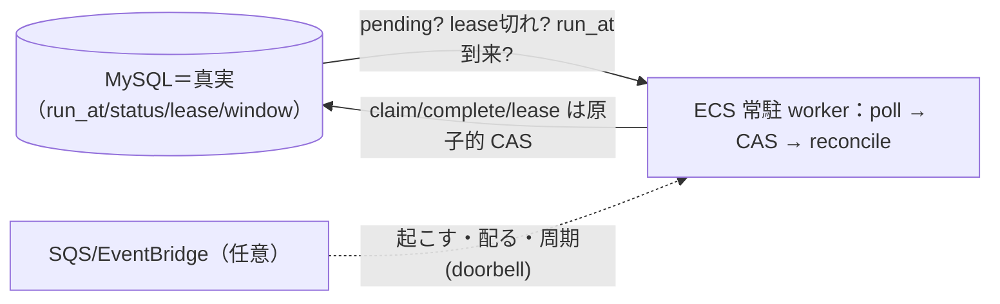

# DB＋ECS で完結するモデル（SQS/EventBridge は最適化・正しさは DB）

**DB を真実（authority）、ECS の常駐プロセスが floor（poll / reconcile / CAS）を回す**——これで
スケジュール・ライフサイクル・命令・メンテ・外部通知まで**完結できる**。SQS/EventBridge/Redis は
「起こす・配る・周期」の**最適化（doorbell）**であって、**正しさには要らない**。

裏づけ：[EXP-2](fencing.md)（lease/fence）/[EXP-44](outbox.md)（outbox）/[EXP-47](event-ordering.md)（順序・version）/
[EXP-62](event-driven-worker.md)（doorbell＋floor・完了 CAS・reconcile）/[EXP-60](connection-budget.md)（接続予算）。

## 完結する骨組み

- **状態・時刻の真実は DB**（`status` / `run_at` / `lease_expires` / メンテ窓 `from,to`）。
- **ECS 常駐プロセスが floor**：poll で「pending あるか／lease 切れたか／run_at 来たか」を見て、CAS で進め、
  reconcile で止まりを戻す。
- **SQS/EventBridge は任意の doorbell**（tight poll を減らす）。無くても完結する。

---

## 1. SQS/EventBridge が向く / 向かない

**向く**：起こす（doorbell）・配る（fan-out/ジョブ配布）・周期（cron tick）。
**向かない**（＝DB 側に残す）：

| 向かないケース | 欠く性質 | 代わりに |
| --- | --- | --- |
| 完了・課金・カウントの exactly-once | 重複配信で二重実行 | DB CAS（`WHERE done=0`・[EXP-62](event-driven-worker.md)②） |
| crash 回収・lease 失効・stuck 検出 | 死ぬとイベントが来ない（不在を検知できない） | DB 時計 lease＋reconcile（[EXP-62](event-driven-worker.md)③/[EXP-2](fencing.md)） |
| 厳密な順序で適用 | 順序保証なし | version で単調適用（[EXP-47](event-ordering.md)） |
| 「今の状態は何か」 | イベントは通知であって状態でない | DB から読む／窓から派生 |
| DB 書込と同時に発火 | 書込 AND publish を原子化できない | transactional outbox（[EXP-44](outbox.md)） |
| 時刻ちょうどに必ず | Scheduler は近似発火・落ちうる | DB `run_at<=NOW()` が authority、event は hint |
| 鮮度が命の判定（lease 有効か） | 古い値で判断＝clock skew の穴 | DB 時計で毎回判定（キャッシュしない） |
| 特定の生 WS 接続へ push | EventBridge は AWS ターゲット向け・SQS は work queue | 自前 hub / pub-sub（[EXP-38](sse-fan-in.md)/[EXP-43](sse-fan-in.md)） |
| データ本体を運ぶ | メッセージ 256KB・データストアでない | 参照(id/version)だけ送り、本体は DB から読む |
| 監査・履歴・replay | 最大14日で消える | DB（日パーティション保持・[EXP-48](retention.md)） |
| 既に常駐 worker がある小規模 | 正しさに寄与せず複雑さ増だけ | DB poll＋doorbell+backoff で十分 |

> 判定基準：**「これが重複したら／落ちたら／順序が入れ替わったら壊れる？」→ 壊れるなら DB 側に置く。**
> EventBridge と SQS を**別々に機構分解**した深掘りは [sqs-eventbridge-limits](sqs-eventbridge-limits.md)（苦手は別物）。

## 2. キャッシュの当て所（1秒ポーリングを消す前に）

- **まず測る**：小表への indexed 1文はほぼ無コスト。「重い」の真犯人は大抵 worker N 本の掛け算・
  埋め込み全件処理（[concern-performance](concern-performance.md)/[EXP-5](pool-saturation.md)）。
- **鮮度が命の問い（pending あるか／lease 切れたか）はキャッシュしない**。TTL で古い値を掴むと
  lease 判定を古い時刻で下す＝skew の穴（[EXP-2](fencing.md)）。
- ポーリングを軽くする正しい手：**doorbell＋adaptive backoff** か **「次の run_at まで sleep」**
  （[EXP-62](event-driven-worker.md)：接触 61→13）。**キャッシュ ≠ ポーリング廃止**。
- **キャッシュしていいのは不変・低頻度だけ**：robot→tenant registry・frozen contract・descriptor
  （[cache](cache.md)/[architecture](architecture.md)）。
- **フロント側キャッシュも同じ原則**（速く見せる道具で正しさの根拠でない・順番は後ろ）：[frontend-cache](frontend-cache.md)。

## 3. ライフサイクルの「触れない」は原子的 CAS で（制約＋reconcile）

- **「さわれない」＝アプリの事前 if でなく DB の原子操作**で強制：
  - 状態遷移＝**CAS の WHERE 節**（`... WHERE status='pending'`。状態が違えば 0 行＝no-op）
  - 冪等＝`UNIQUE(tenant_id, idem_key)`、lease＝`WHERE lease_expires<NOW(3)`、不正値＝ENUM/CHECK/FK
  - 事前 SELECT→if→UPDATE は競合する（[EXP-62](event-driven-worker.md)：50 並行が二重完了）。
- **制約だけでは足りない1点**：**crash で `in_progress` のまま止まった行・時刻で起きる遷移（run_at 到来）**は
  制約では動かない → **reconcile（poll）が動かす**。制約は「悪い遷移を防ぐ」、reconcile は「誰も動かず
  止まった」を戻す。両輪。

## 4. これで完結する例（このセッションの相談）

| やりたいこと | DB＋ECS での実現 |
| --- | --- |
| スケジュール命令（pending/locked/in_progress/completed＋開始時刻） | `run_at` 列＋poll、claim/complete は CAS、crash は lease 失効＋reconcile |
| メンテ中か | DB 窓（from/to）から**派生**（`NOW BETWEEN from AND to`）。走らせる物が無く取りこぼし0 |
| メンテを外部通信でロボットへ | 状態は派生、通知は **outbox→relay→push（at-least-once）**、robot は version で冪等、
  再接続で派生を読む（floor）、届かねば dead-letter |
| robot→tenant 解決 | admin マスタ→同期→registry(MySQL)→接続時1回＋キャッシュ（不変なので可） |
| テナント振り分け | ヘッダ＝ルーティング（client 申告可）、認可は署名済み ID 由来（[tenant-header-routing-vs-auth](tenant-header-routing-vs-auth.md)） |

## まとめ

- **DB が真実・ECS が floor（poll/reconcile/CAS）を回す → 完結する。** SQS/EventBridge/Redis は最適化。
- **キャッシュは不変データだけ。鮮度が命は poll/doorbell。1秒ポーリングは消す前に測る。**
- **「触れない」は原子的 CAS/一意/CHECK で。ただし crash・時刻遷移は reconcile が別途要る。**
- 合言葉：**起こす・配る・周期は event に渡してよい。決める・覚える・順序・不在検知・時刻は DB に残す。**

## 保証しない範囲・未検証

- 跨プロセスの"起こす"は MySQL に LISTEN/NOTIFY が無いので poll か外部バス（SQS/EventBridge）。poll で足りる。
- 実 SQS/EventBridge の failover 跨ぎ fence 単調性・重複配信下の exactly-once は LIVE_ENV_REQUIRED（未実測）。
- キャッシュの TTL・reconcile 周期・lease ttl はワークロード依存（実測で決める・[EXP-5](pool-saturation.md)/[EXP-2](fencing.md)）。
