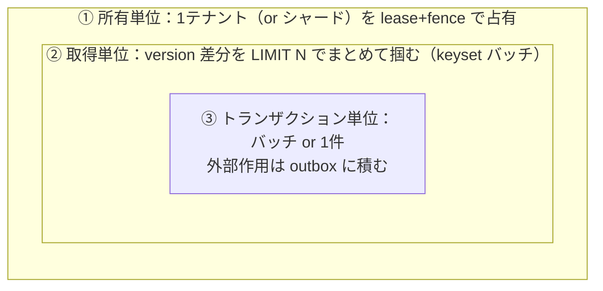
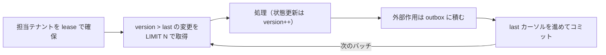
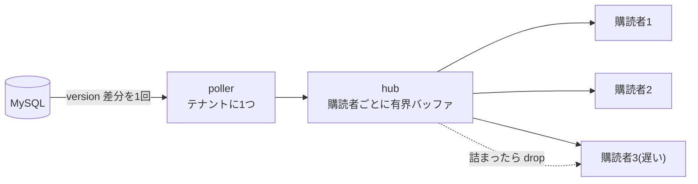
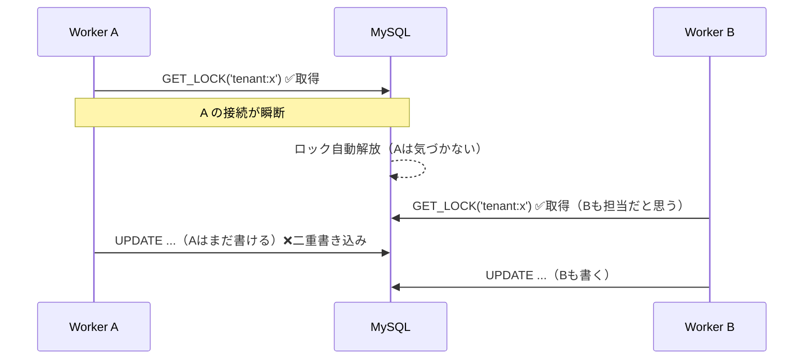
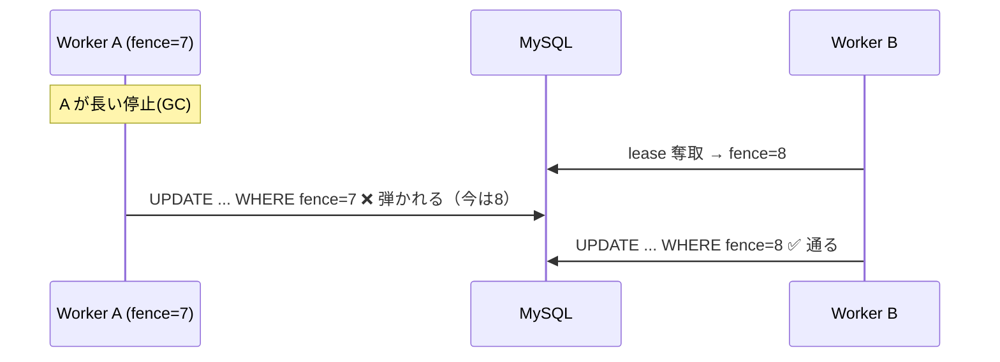

# 深掘り：図で理解する4つの疑問

「索引の先頭 tenant_id って？」「ワーカーはどの単位で動かす？」「サブスクの性能維持は？」
「lease じゃなく GET_LOCK じゃダメ？」——を図とたとえで膨らませる。
用語は [glossary](glossary.md)、スキーマ雛形は [domain-themes](domain-themes.md)。

---

## 1. 「索引の先頭を `tenant_id`」ってどういうこと？

索引（B-tree）は **指定した列の順に並んだ台帳**。`KEY (tenant_id, version)` は
**まず tenant_id 順、その中で version 順**に並ぶ。並びを絵にすると:

```
KEY (tenant_id, version) の並び:
  (A,100) (A,101) (A,102) (A,103) │ (B,100) (B,101) │ (C,100) (C,101) (C,102) ...
   └──────── テナントAの塊 ───────┘  └─ Bの塊 ─┘   └──── Cの塊 ────┘
```

テナント A のクエリ `WHERE tenant_id='A' AND version > 101` は、**A の塊の中の連続した一部**
（`(A,102) (A,103)`）を読むだけ。**1回の seek ＋ 短いスキャン**で終わる。


### もし先頭が tenant_id でなかったら（`KEY (version, tenant_id)`）

```
  (100,A) (100,B) (100,C) │ (101,A) (101,B) │ (102,A) (102,C) ...
   └── version=100 に全テナントが混在 ──┘
```

テナント A の行が**あちこちに散らばる**。A だけ取りたくても台帳全体を舐めることになる。

### 「左端プレフィックスの規則」（これが肝）

複合索引は **左の列から連続して条件に含めたときだけ**使える:

| クエリ | `(tenant_id, version)` を使える？ |
| --- | --- |
| `WHERE tenant_id=? AND version>?` | ✅ 使える（先頭から連続） |
| `WHERE tenant_id=?` | ✅ 使える（先頭だけでも可） |
| `WHERE version>?`（tenant_id 無し） | ❌ 使えない（先頭を飛ばした）→ 全表スキャン |

- **越境禁止のこの構成では、全クエリが必ず `tenant_id=?` を含む**（[EXP-58](tenant-scope.md)）。
  だから **`tenant_id` を先頭にすれば、すべてのクエリが「自テナントの塊」への一発 seek** になる。
- おまけの安全性: **`tenant_id` を書き忘れたクエリは索引が効かず全表スキャン＝遅い**ので、
  レビュー・スロークエリで気づける（設計が越境を炙り出す）。

> **たとえ**: 図書館の棚を「会社ごと → その中で日付順」に並べる。ある会社の資料はひと棚に固まる。
> 「日付順 → 会社」に並べると、各日付の棚に全社が混ざり、1社ぶん集めるのに館内を歩き回る。

根拠: 走査は索引レンジで決まる [EXP-18](date-search.md)、差分ポーリング [EXP-52](subscription-design.md)。

---

## 2. ワーカーは「どの単位」でデータを動かす？

**3つの入れ子の単位**で考える。粗い順に:



| 単位 | 何を | なぜその粒度 | 根拠 |
| --- | --- | --- | --- |
| ① 所有 | 1テナント（or テナント群）を1ワーカーが占有 | 二重処理を防ぐ。fence で古い担当の書き込みを弾く | [fencing](fencing.md)(EXP-2) |
| ② 取得 | `WHERE tenant_id=? AND version>:last ORDER BY version LIMIT N` | 変わった分だけ・まとめて（往復を減らす） | [fanout](fanout.md)/[subscription-design](subscription-design.md)(EXP-14/52) |
| ③ tx | バッチ単位の小さい tx。外部送信は outbox 経由 | 巨大 tx はロック長期保持・undo 肥大 | [outbox](outbox.md)/[bulk-insert](bulk-insert.md)(EXP-44/56) |

処理ループの実体:



**やってはいけない単位**:
- **1行ずつ（per-row）**: 1,000台×4表 = 40,000 クエリ/秒で DB 飽和（[why-necessary](why-necessary.md)）。
- **全テナントを1クエリで**: テナント境界が消える（越境）＋1テナントの暴走が全体を巻き込む（[tenant-fairness](tenant-fairness.md)）。
- **巨大な単一トランザクション**: ロックを長く握り、undo が膨らみ、他を止める（[isolation](isolation.md)）。

> 要は **「テナント単位で所有し、version 差分をバッチで掴み、小さい tx で回す」**。
> 外部への副作用だけは outbox に逃がして exactly-once にする。

---

## 3. サブスクリプションの性能を維持するには？

**購読者を増やしても DB と CPU が線形に増えない形**にするのが核心。効く順に:



| やること | なぜ効く | 根拠 |
| --- | --- | --- |
| **poller はテナントに1つ**（購読者ごとに DB を引かない） | 購読者 S 人でも DB 負荷は1本ぶん | [sse-fan-in](sse-fan-in.md)(EXP-38) |
| **version 差分を配る**（丸ごとスナップショットを毎回作らない） | 台数比例の無駄を消す（実測400x） | [subscription-design](subscription-design.md)(EXP-52) |
| **高頻度は coalesce**（最新だけ配る・毎ティック送らない） | テレメトリでイベントが埋もれない | [fanout](fanout.md)/[cache](cache.md)(EXP-14/46) |
| **期限切れ一斉読みは singleflight** | stampede を1回に畳む | [cache](cache.md)(EXP-46) |
| **遅い購読者は drop**（有界バッファ・非ブロッキング配信） | 1人の詰まりが全員を止めない | [sse-fan-in](sse-fan-in.md)(EXP-38) |
| **heartbeat＋idle timeout で死んだ接続を掃除** | 幽霊接続がメモリ・fd を食わない | [sse-fan-in](sse-fan-in.md)(EXP-39) |
| **接続に DB 接続を1:1で持たせない** | 数千接続で DB が枯れる | [tenant-scope](tenant-scope.md)/[capacity](capacity.md) |
| **1タスク 1万〜1.5万本で頭打ち → 横に割る** | メモリ・fd・CPU の律速（[worked-examples](worked-examples.md)） | [capacity](capacity.md)(EXP-40) |

**性能を殺すアンチパターン**: 購読ごとに DB を引く／差分でなく全件を毎回配る／高頻度テレメトリを
間引かず全部流す／遅い購読者を待ってブロックする／接続を掃除せず溜める。

> ひとことで: **「DB は poller が1回、hub が version 差分を有界バッファで配り、遅い奴は捨てる」**。
> 具体的な CPU/メモリの埋まり方は [worked-examples](worked-examples.md) の Web サンプル参照。

---

## 4. ワーカー占有、`GET_LOCK` じゃダメなの？

**用途による**。この repo は実験して結論を出している（[locking](locking.md)/[fencing](fencing.md)）:

| やりたいこと | 使うもの | 理由 |
| --- | --- | --- |
| マイグレーションを1つだけ・数秒〜数分の処理 | **`GET_LOCK`（接続固定）** | 短時間・DDL をまたげる。テストの直列化もこれ |
| **ワーカーがテナントを長時間占有** | **期限つき lease＋fence** | GET_LOCK は接続を占有し続け、期限が無い |

### GET_LOCK が長時間占有に向かない理由

**① 接続を握りっぱなしにする**: GET_LOCK は**その接続が生きている間だけ**有効。20テナントを
占有するなら接続20本を占有し続け、**プールが枯渇**した（[locking](locking.md) の実測）。

**② 接続が切れると黙って外れる**: ネットワーク瞬断・プール再生成・フェイルオーバーで接続が切れると
**ロックが自動解放**され、別ワーカーが掴む。だが元のワーカーは「まだ自分が担当」と思って書き続ける
→ **二重稼働**。しかも**古い書き込みを弾く番号(fence)が無い**。



**③ 状態が見えない**: 誰がいつから持っているか・期限はいつか、をクエリで観測できない。
lease は `worker_lease` の行（`heartbeat_at`/`expires_at`/`fence_token`）として**見える・アラートできる**。

### lease＋fence なら

lease 行に**単調増加する fence トークン**を持ち、**書き込み条件に fence を入れる**。担当が変わると
fence が上がるので、**古い担当の遅れた書き込みは条件に負けて弾かれる**（[EXP-2](fencing.md) で実測: 事故0件）。



> **まとめ**: `GET_LOCK` は「短時間・1接続で完結・DDL をまたぐ」場面（マイグレーション・テスト直列化）
> には最適。**「テナントを分単位〜時間単位で占有する」ワーカーには、接続占有・無期限・fence 無しが
> 効いてくるので lease＋fence**。中間（数秒〜数分）は GET_LOCK でも可、というのが実測の線引き。

---

> もっと具体が欲しい図があれば言ってください（例: 索引 seek の B-tree 断面、hub の内部キュー、
> lease 期限切れのタイムライン）。この doc に足していきます。
