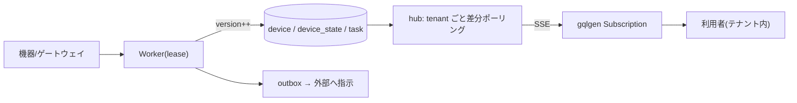

# 適用テーマとテーブル設計（Worker＋Web＋SSE＋MySQL＋gqlgen・マルチテナント）

この構成が最も活きる「型」は——**Worker が外部と常時つながって状態を MySQL に同期し、
変化を SSE/GraphQL subscription でライブ配信し、Web(gqlgen) で読み書きする。全部マルチテナントで
越境は絶対に許さない。** その型に当てはまるテーマ候補と、**そのまま使える具体テーブル**を示す。

裏づけ: 越境防止 [tenant-scope](tenant-scope.md)(EXP-58)、主キー [primary-key](primary-key.md)(EXP-54)、
version 配信 [event-ordering](event-ordering.md)(EXP-47)/[subscription-design](subscription-design.md)(EXP-52)、
外部作用 [outbox](outbox.md)(EXP-44)、二重稼働 [fencing](fencing.md)(EXP-2)、保持 [retention](retention.md)(EXP-48)。

---

## 1. テーマ候補（この型に当てはまるもの）

| テーマ | Worker の仕事（常時接続の相手） | 保存する状態 | SSE/Sub で配るもの | 越境の勘所 |
| --- | --- | --- | --- | --- |
| **IoT/ロボット/機器フリート** | 各機器/ゲートウェイと接続・テレメトリ受信 | 機器の状態・タスク | 機器の稼働状況・タスク進捗 | 機器はテナント専有。他社の機器が見えたら致命 |
| **メッセージング統合**（Slack/LINE/WhatsApp bot 基盤） | 各テナントの外部アカウントへ WebSocket 常時接続 | 会話・メッセージ | 受信メッセージ・送信状態 | 他社の会話が漏れたら重大インシデント |
| **決済/取引モニタ**（PSP・取引所連携） | プロバイダの WebSocket/Webhook を購読 | 取引・残高・約定 | 約定・入出金の即時通知 | 金額・残高。越境は金融事故 |
| **ジョブ/CI 実行基盤** | ランナーやビルドを起動・ログ収集 | パイプライン・ジョブ・ログ | ジョブ状態・ライブログ | 他社のログ/成果物/秘密が見えたら重大 |
| **配送/フィールドサービス** | ドライバー端末から位置・状態受信 | 配送・位置・イベント | 配送状況・地図上の現在地 | 他社の顧客住所・位置は個人情報 |
| **メール/カレンダー同期**（SaaS 連携） | 各テナントのメールボックス(IMAP/Graph)を同期 | スレッド・予定 | 新着・更新 | 他社のメール本文。最も厳しい越境禁止 |
| **監視/アップタイム基盤** | 監視対象へ定期プローブ | チェック・インシデント | インシデント発生/復旧 | 他社の監視対象URL・障害情報 |

> どれも同じ骨格: **接続を保つ worker（+lease で二重稼働防止）→ 状態を version つきで DB へ →
> hub が version 差分を SSE で配る → gqlgen で Query/Mutation/Subscription**。テーマが変わるのは
> 「外部の相手」と「業務テーブルの中身」だけ。土台の規約とインフラ表は共通。

以降、まず**全テーマ共通の規約とインフラ表**を決め、そのうえで代表テーマの**業務テーブル**を具体化する。

---

## 2. 全テーブル共通の規約（越境を作り込みで防ぐ）

1. **業務テーブルは必ず `tenant_id VARCHAR(32) NOT NULL`**。テナントは行の中の列でしか表現されない
   （[EXP-58](tenant-scope.md): 境界を1本外すと全越境）。
2. **全二次索引の先頭を `tenant_id` に**（`KEY (tenant_id, ...)`）。テナント絞りが常に索引で効く（[EXP-18](date-search.md)）。
3. **主キーは `id BIGINT AUTO_INCREMENT`**（追記で密・[EXP-54](primary-key.md)）。外部公開する ID が要るなら
   `public_id BINARY(16)`（時刻順 UUID）を別列に。※`AUTO_INCREMENT` は索引の先頭列である必要があるため
   `PRIMARY KEY (id)` ＋ `KEY (tenant_id, id)` の形にする。
4. **`version BIGINT NOT NULL`** を持ち、更新ごとに単調増加。`KEY (tenant_id, version)` で
   **差分ポーリング**（[EXP-52](subscription-design.md)）と**順序・冪等消費**（[EXP-47](event-ordering.md)）に使う。
5. **時刻は `DATETIME(3)` を UTC で**（[EXP-35](timezone.md)）。`created_at` / `updated_at`。
6. **履歴・イベント・ログ表は日パーティション**（保持期間を DROP で適用・[EXP-48](retention.md)）。
7. **太い列（JSON payload・本文）は別表 or off-page**（一覧の舐めから外す・[EXP-19](table-split.md)/[EXP-21](column-projection.md)）。
8. **物理削除しない**。`status` で論理状態を持ち、物理削除は保持ジョブに任せる。
9. **テナントを跨ぐ JOIN 禁止**。共有マスタ（読み取り専用の国コード等）だけ例外で `tenant_id` を持たない。
10. **gqlgen ではテナントを ctx から**取り、`repo.Scope` が全クエリに `tenant_id=?` を注入。生 SQL は
    `sqllint` で禁止（[EXP-58](tenant-scope.md)/[static-analysis](static-analysis.md)）。

---

## 3. 共通インフラ表（どのテーマでも要る）

```sql
-- テナント本体（マスタ。tenant_id の親）
CREATE TABLE tenant (
  id          VARCHAR(32)  NOT NULL,            -- テナント識別子（全業務表の tenant_id）
  name        VARCHAR(200) NOT NULL,
  status      VARCHAR(16)  NOT NULL DEFAULT 'active',  -- active/suspended
  plan        VARCHAR(32)  NOT NULL DEFAULT 'standard',
  created_at  DATETIME(3)  NOT NULL,
  PRIMARY KEY (id)
) ENGINE=InnoDB;

-- APIキー/資格情報（最小権限・期限つき・ローテーション: EXP-13/secrets）
CREATE TABLE api_key (
  id          BIGINT       NOT NULL AUTO_INCREMENT,
  tenant_id   VARCHAR(32)  NOT NULL,
  key_hash    CHAR(64)     NOT NULL,            -- 平文は保存しない（sha256）
  scopes      VARCHAR(255) NOT NULL,            -- 付与スコープ
  expires_at  DATETIME(3)  NULL,
  created_at  DATETIME(3)  NOT NULL,
  PRIMARY KEY (id),
  UNIQUE KEY uq_hash (key_hash),
  KEY k_tenant (tenant_id)
) ENGINE=InnoDB;

-- 利用者と権限（フィールド/行レベル認可: EXP-25/28）
CREATE TABLE app_user (
  id          BIGINT       NOT NULL AUTO_INCREMENT,
  tenant_id   VARCHAR(32)  NOT NULL,
  email       VARCHAR(255) NOT NULL,
  role        VARCHAR(32)  NOT NULL DEFAULT 'member',  -- admin/member/viewer
  created_at  DATETIME(3)  NOT NULL,
  PRIMARY KEY (id),
  UNIQUE KEY uq_tenant_email (tenant_id, email),        -- テナント内で一意
  KEY k_tenant (tenant_id)
) ENGINE=InnoDB;

-- ワーカーのリース（二重稼働防止・フェンストークン: EXP-2/30）
CREATE TABLE worker_lease (
  tenant_id     VARCHAR(32) NOT NULL,           -- 「このテナントの担当は誰か」
  worker_id     VARCHAR(64) NOT NULL,           -- 現在の持ち主
  fence_token   BIGINT      NOT NULL,           -- 単調増加。古い持ち主の書き込みを弾く
  heartbeat_at  DATETIME(3) NOT NULL,
  expires_at    DATETIME(3) NOT NULL,
  PRIMARY KEY (tenant_id)
) ENGINE=InnoDB;

-- 外部作用の outbox（exactly-once の外部送信: EXP-44）＋ dead-letter(EXP-45)＋分類(EXP-49)
CREATE TABLE outbox (
  id            BIGINT       NOT NULL AUTO_INCREMENT,
  tenant_id     VARCHAR(32)  NOT NULL,
  topic         VARCHAR(64)  NOT NULL,          -- 送信先種別
  payload       JSON         NOT NULL,
  state         VARCHAR(16)  NOT NULL DEFAULT 'pending', -- pending/sent/dead
  attempts      INT          NOT NULL DEFAULT 0,
  next_attempt_at DATETIME(3) NOT NULL,
  created_at    DATETIME(3)  NOT NULL,
  PRIMARY KEY (id),
  KEY k_claim (tenant_id, state, next_attempt_at)  -- 送信対象を掴む
) ENGINE=InnoDB;

-- 冪等キー（mutation の二重実行防止: EXP-27）
CREATE TABLE idempotency (
  tenant_id   VARCHAR(32)  NOT NULL,
  idem_key    VARCHAR(80)  NOT NULL,            -- クライアント発行
  result_ref  VARCHAR(120) NULL,               -- 一度目の結果への参照
  created_at  DATETIME(3)  NOT NULL,
  PRIMARY KEY (tenant_id, idem_key)             -- テナント内で一意 → 二度目を弾く
) ENGINE=InnoDB;

-- 監査ログ（誰が何をしたか。日パーティションで保持: EXP-48）
CREATE TABLE audit_log (
  tenant_id   VARCHAR(32)  NOT NULL,
  at          DATETIME(3)  NOT NULL,
  actor       VARCHAR(120) NOT NULL,           -- user:xxx / worker:xxx
  action      VARCHAR(64)  NOT NULL,
  target      VARCHAR(120) NOT NULL,
  d           DATE         NOT NULL,           -- パーティションキー
  PRIMARY KEY (tenant_id, at, actor, action, target, d)
) ENGINE=InnoDB
PARTITION BY RANGE COLUMNS(d) (
  PARTITION p_start VALUES LESS THAN ('2026-01-01'),
  PARTITION pmax    VALUES LESS THAN (MAXVALUE)   -- 毎日ロールフォワード(EXP-48)
);
```

> hub の配信元は「業務テーブルの version 更新」を直接見る（[EXP-52](subscription-design.md) の差分ポーリング）ので、
> 別途 change_event 表を持たなくてよい。跨プロセスで配るなら pub/sub を足す（[EXP-43](sse-fan-in.md)）。

---

## 4. 代表テーマの業務テーブル（具体）

### テーマ A：IoT/ロボット機器フリート（この repo の実行例に一番近い）

```sql
-- 機器（テナント専有）
CREATE TABLE device (
  id          BIGINT       NOT NULL AUTO_INCREMENT,
  tenant_id   VARCHAR(32)  NOT NULL,
  external_id VARCHAR(80)  NOT NULL,            -- 外部システム上のID
  name        VARCHAR(120) NOT NULL,
  status      VARCHAR(16)  NOT NULL DEFAULT 'offline', -- online/offline/error
  version     BIGINT       NOT NULL DEFAULT 0,  -- SSE 差分用（EXP-47/52）
  last_seen_at DATETIME(3) NULL,
  created_at  DATETIME(3)  NOT NULL,
  updated_at  DATETIME(3)  NOT NULL,
  PRIMARY KEY (id),
  UNIQUE KEY uq_ext (tenant_id, external_id),   -- テナント内で外部IDが一意
  KEY k_ver (tenant_id, version),               -- 差分ポーリング（hub）
  KEY k_status (tenant_id, status)
) ENGINE=InnoDB;

-- 現在の状態スナップショット（テレメトリ。太い/高頻度なら分離: EXP-21）
CREATE TABLE device_state (
  tenant_id   VARCHAR(32)  NOT NULL,
  device_id   BIGINT       NOT NULL,
  battery     TINYINT      NULL,
  lat         DECIMAL(9,6) NULL,
  lng         DECIMAL(9,6) NULL,
  version     BIGINT       NOT NULL DEFAULT 0,
  updated_at  DATETIME(3)  NOT NULL,
  PRIMARY KEY (tenant_id, device_id),           -- 1機器1行（最新のみ）
  KEY k_ver (tenant_id, version)
) ENGINE=InnoDB;

-- 状態履歴（増え続ける → 日パーティションで保持: EXP-48）
CREATE TABLE device_state_history (
  tenant_id   VARCHAR(32)  NOT NULL,
  device_id   BIGINT       NOT NULL,
  at          DATETIME(3)  NOT NULL,
  battery     TINYINT      NULL,
  lat         DECIMAL(9,6) NULL,
  lng         DECIMAL(9,6) NULL,
  d           DATE         NOT NULL,
  PRIMARY KEY (tenant_id, device_id, at, d)
) ENGINE=InnoDB
PARTITION BY RANGE COLUMNS(d) ( PARTITION pmax VALUES LESS THAN (MAXVALUE) );

-- タスク（機器への指示。冪等・状態遷移）
CREATE TABLE task (
  id          BIGINT       NOT NULL AUTO_INCREMENT,
  tenant_id   VARCHAR(32)  NOT NULL,
  device_id   BIGINT       NOT NULL,
  type        VARCHAR(32)  NOT NULL,
  status      VARCHAR(16)  NOT NULL DEFAULT 'queued',  -- queued/running/done/failed
  idem_key    VARCHAR(80)  NOT NULL,            -- 二重発行防止（EXP-27）
  version     BIGINT       NOT NULL DEFAULT 0,
  created_at  DATETIME(3)  NOT NULL,
  updated_at  DATETIME(3)  NOT NULL,
  PRIMARY KEY (id),
  UNIQUE KEY uq_idem (tenant_id, idem_key),
  KEY k_ver (tenant_id, version),
  KEY k_dev_status (tenant_id, device_id, status)
) ENGINE=InnoDB;
```

**gqlgen 対応**（型は `tenant_id` を出さない・テナントは ctx）:

```graphql
type Device { id: ID!  name: String!  status: DeviceStatus!  state: DeviceState  version: Int! }
type Task   { id: ID!  device: Device!  type: String!  status: TaskStatus!  version: Int! }

type Query        { devices(after: ID, limit: Int): [Device!]!  device(id: ID!): Device }
type Mutation     { enqueueTask(deviceId: ID!, type: String!, idemKey: String!): Task! }  # 冪等
type Subscription { fleet: FleetEvent! }        # 1本で device/task を型つき配信（EXP-41/47）
union FleetEvent = Device | Task
```



### テーマ B：メッセージング統合（Slack/LINE bot 基盤）— 越境が最も怖い型

```sql
-- テナントが繋ぐ外部アカウントへの接続（worker が常時保つ）
CREATE TABLE connection (
  id           BIGINT      NOT NULL AUTO_INCREMENT,
  tenant_id    VARCHAR(32) NOT NULL,
  provider     VARCHAR(24) NOT NULL,            -- slack/line/whatsapp
  external_acc VARCHAR(120) NOT NULL,           -- 外部の workspace/bot id
  status       VARCHAR(16) NOT NULL DEFAULT 'disconnected',
  cursor       VARCHAR(120) NULL,               -- 再開位置（受信の続き）
  version      BIGINT      NOT NULL DEFAULT 0,
  PRIMARY KEY (id),
  UNIQUE KEY uq_acc (tenant_id, provider, external_acc),
  KEY k_ver (tenant_id, version)
) ENGINE=InnoDB;

-- 会話
CREATE TABLE conversation (
  id          BIGINT      NOT NULL AUTO_INCREMENT,
  tenant_id   VARCHAR(32) NOT NULL,
  external_id VARCHAR(120) NOT NULL,
  title       VARCHAR(200) NULL,
  version     BIGINT      NOT NULL DEFAULT 0,
  PRIMARY KEY (id),
  UNIQUE KEY uq_ext (tenant_id, external_id),
  KEY k_ver (tenant_id, version)
) ENGINE=InnoDB;

-- メッセージ（受信の重複排除・順序: EXP-47。本文は別列/別表も検討: EXP-21）
CREATE TABLE message (
  id             BIGINT      NOT NULL AUTO_INCREMENT,
  tenant_id      VARCHAR(32) NOT NULL,
  conversation_id BIGINT     NOT NULL,
  direction      VARCHAR(8)  NOT NULL,          -- in/out
  external_msg_id VARCHAR(120) NOT NULL,        -- provider のメッセージID
  body           TEXT        NOT NULL,
  version        BIGINT      NOT NULL DEFAULT 0,
  created_at     DATETIME(3) NOT NULL,
  PRIMARY KEY (id),
  UNIQUE KEY uq_dedup (tenant_id, external_msg_id),   -- 再送を弾く（冪等受信）
  KEY k_conv (tenant_id, conversation_id, id),
  KEY k_ver (tenant_id, version)
) ENGINE=InnoDB;
-- 送信は outbox（共通表）に積む → worker が外部APIへ（EXP-44）。二重送信を防ぐ
```

> ここでは **`uq_dedup (tenant_id, external_msg_id)`** が肝。外部から同じメッセージが再送されても
> テナント内で一意化して二重取り込みを防ぐ（[EXP-47](event-ordering.md) の冪等消費をスキーマで担保）。

### テーマ C：ジョブ/CI 実行基盤（ライブログ配信）

```sql
CREATE TABLE job (
  id          BIGINT      NOT NULL AUTO_INCREMENT,
  tenant_id   VARCHAR(32) NOT NULL,
  name        VARCHAR(120) NOT NULL,
  status      VARCHAR(16) NOT NULL DEFAULT 'queued', -- queued/running/passed/failed
  version     BIGINT      NOT NULL DEFAULT 0,
  created_at  DATETIME(3) NOT NULL,
  PRIMARY KEY (id),
  KEY k_ver (tenant_id, version),
  KEY k_status (tenant_id, status)
) ENGINE=InnoDB;

-- ライブログ（追記のみ・順序保証・日パーティションで保持）
CREATE TABLE job_log (
  tenant_id   VARCHAR(32) NOT NULL,
  job_id      BIGINT      NOT NULL,
  seq         BIGINT      NOT NULL,             -- ジョブ内の行番号（順序・EXP-47）
  line        TEXT        NOT NULL,
  at          DATETIME(3) NOT NULL,
  d           DATE        NOT NULL,
  PRIMARY KEY (tenant_id, job_id, seq, d)
) ENGINE=InnoDB
PARTITION BY RANGE COLUMNS(d) ( PARTITION pmax VALUES LESS THAN (MAXVALUE) );
-- SSE は job.status と job_log の seq 差分を配る（tail -f 相当）
```

---

## 5. マルチテナント越境を「スキーマで」防ぐ要点（まとめ）

| 仕掛け | どうする | 効く場面 | 根拠 |
| --- | --- | --- | --- |
| 全表に `tenant_id` | 業務表に必須。共有マスタだけ例外 | そもそも境界を表現 | [EXP-58](tenant-scope.md) |
| 索引の先頭を `tenant_id` | `KEY (tenant_id, ...)` | テナント絞りが索引で効く／越境スキャンを防ぐ | [EXP-18](date-search.md) |
| 一意制約はテナント内 | `UNIQUE (tenant_id, external_id)` 等 | 外部IDの衝突・再送重複をテナント内で解決 | [EXP-47](event-ordering.md) |
| `version` 列 | 更新ごとに単調増加＋`(tenant_id, version)` 索引 | SSE 差分・順序・冪等消費 | [EXP-52](subscription-design.md)/[EXP-47](event-ordering.md) |
| SSE topic = テナント | hub/poller をテナント単位に | 配信の混線ゼロ | [EXP-42](sse-fan-in.md) |
| outbox / 冪等 / lease | 共通インフラ表で | 外部送信・二重実行・二重稼働 | [EXP-44](outbox.md)/[EXP-27](graphql.md)/[EXP-2](fencing.md) |
| 履歴は日パーティション | `PARTITION BY RANGE COLUMNS(d)` | 保持期間を DROP で適用 | [EXP-48](retention.md) |
| ctx からテナント＋lint | `repo.Scope` 注入・生SQL禁止 | 境界の書き忘れを機械的に潰す | [EXP-58](tenant-scope.md)/[static-analysis](static-analysis.md) |

- **やってはいけない**: テナントをまたぐ JOIN／外部IDをグローバル一意にする（テナント内一意にする）／
  version 無しで差分配信する（全件ポーリングに落ちる・[EXP-52](subscription-design.md)）／本文などの太い列を一覧表に同居させる（[EXP-21](column-projection.md)）。
- **最初の一手**: 共通インフラ表（tenant/api_key/app_user/worker_lease/outbox/idempotency/audit_log）を先に作り、
  テーマ固有の業務表を §2 の規約に沿って足す。gqlgen はテナントを ctx から取り `repo.Scope` で強制。

## 保証しない範囲・未検証

- DDL は設計の雛形（このホストで CREATE は検証していない。索引・型は要件で調整）。
- パーティションキー `d` は全ユニークキーに含める必要がある（[EXP-48](retention.md) の注意）。
- schema-per-tenant / DB-per-tenant（物理分離）は別方針。ここは行レベル分離＋スコープ強制が主軸
  （高感度テナントの物理分離は [worker-tenancy](worker-tenancy.md)）。
