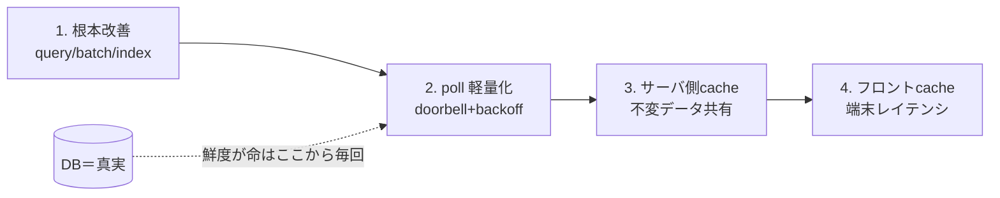

# フロントエンドのキャッシュは「最後の一押し」（真実は DB・鮮度と認可は載せない）

結論：**フロントキャッシュ＝端末レイテンシ/リクエスト削減の道具で、順番的には後ろ**。
「最後の手段」というより **別の問題を解く道具**——DB 負荷やクエリの遅さそのものは直さない。
だから **根本改善 → ポーリング軽量化 → サーバ側キャッシュ → フロントキャッシュ** の順で効かせる。
載せてよいのは **不変・非鮮度・非認可** のデータだけ。

裏づけ：[cache](cache.md)(EXP-46 stampede→1)/[db-ecs-complete](db-ecs-complete.md)（キャッシュ節）/
[fencing](fencing.md)(EXP-2 lease)/[tenant-scope](tenant-scope.md)(EXP-58 越境)/
[tenant-header-routing-vs-auth](tenant-header-routing-vs-auth.md)/[concern-performance](concern-performance.md)/[pool-saturation](pool-saturation.md)(EXP-5)。

## なぜ後ろか（何を解いているかが違う）

フロントキャッシュは **「同じ読み取りを何度もサーバに投げない」＝レイテンシ/リクエスト削減**の道具。
**DB の負荷やクエリの遅さそのものは直さない**。真犯人が worker N 本の掛け算・埋め込み全件処理なら、
フロントで隠しても DB 側は同じだけ回る（[concern-performance](concern-performance.md)/[EXP-5](pool-saturation.md)）。
だから原因を潰す手（サーバ側）が先で、フロントは最後に効かせる順番になる。

```
1. 根本を直す         … クエリをシンプル/indexed 1文・batch・coalesce（EXP-14/EXP-56）
2. ポーリングを軽く   … doorbell + adaptive backoff / 次の run_at まで sleep（EXP-62：接触 61→13）
3. サーバ側キャッシュ … 不変データを共有キャッシュへ（全クライアント1回・EXP-46 stampede 300→1）
4. フロントキャッシュ … ここでやっと。端末ごと・不変/非鮮度・非認可に限る
```



## フロントに置いていい / 絶対ダメ

| 置いていい（不変・低頻度・非機密） | 絶対ダメ（鮮度が命・認可の根拠） |
| --- | --- |
| frozen contract / descriptor / i18n / マスタ表示名 | **pending / lease 有効か / status** ＝現在状態（古値で lease 判定＝skew の穴・[EXP-2](fencing.md)） |
| 署名済みトークン内のテナント（本人の申告として保持は可・[tenant-header-routing-vs-auth](tenant-header-routing-vs-auth.md)） | **認可の真実としての tenant→data**（越境・[EXP-58](tenant-scope.md)。フロント値を信じて権限判定は禁止） |
| 変わらない一覧の初期表示（あとで revalidate） | 「今の残高/在庫/完了したか」など**判断の根拠になる現在状態** |

要点：**フロントキャッシュは UX（速く見える）であって、正しさの根拠にしてはいけない。**
サーバ側キャッシュと同じ原則（真実は DB、キャッシュは不変だけ・[db-ecs-complete](db-ecs-complete.md)）を
端末側でも守るだけ。

## 例外（前で使ってよい・キャッシュではない）

- **鮮度が要らない読み取りが主**なら後回しにする必要はなく、普通に前段で使ってよい（静的マスタ・ヘルプ・descriptor）。
- **書き込み後の楽観更新**は「キャッシュ」ではなく UI 予測。サーバ確定（DB CAS・[EXP-62](event-driven-worker.md)）で
  必ず上書きする前提なら OK。ズレたら DB が勝つ。

## 判定チェックリスト

- [ ] これは**不変 / 低頻度**か？（変わるならキャッシュしない、するなら短 TTL＋revalidate）
- [ ] これで**認可を決めていないか**？（tenant→data の可否をフロント値で判断＝禁止・[EXP-58](tenant-scope.md)）
- [ ] **古い値を掴んだら壊れる**か？（pending/lease/status なら壊れる → 載せない・[EXP-2](fencing.md)）
- [ ] そもそも**根本（query/poll/サーバ側）で片付く**のに、フロントで隠していないか？

## まとめ

- **フロントキャッシュ＝端末レイテンシの最後の一押し。** DB 負荷とクエリの遅さは前段
  （根本改善→ポーリング軽量化→サーバ側キャッシュ）で片す。
- **載せるのは不変・非鮮度・非認可だけ。** 現在状態（pending/lease/status）と認可の根拠（tenant→data）は
  必ず DB から毎回。
- 合言葉：**速く見せるのはフロント、正しさは DB。キャッシュは真実の代役にならない。**

## 保証しない範囲・未検証

- TTL・revalidate 周期はワークロード依存（実測で決める・[EXP-5](pool-saturation.md)）。
- ここはクライアント側方針の整理（設計 choice）で、DB 越境の実証は [EXP-58](tenant-scope.md)、
  stampede collapse の実証は [EXP-46](cache.md) を参照。フロント実機のヒット率は未計測。
