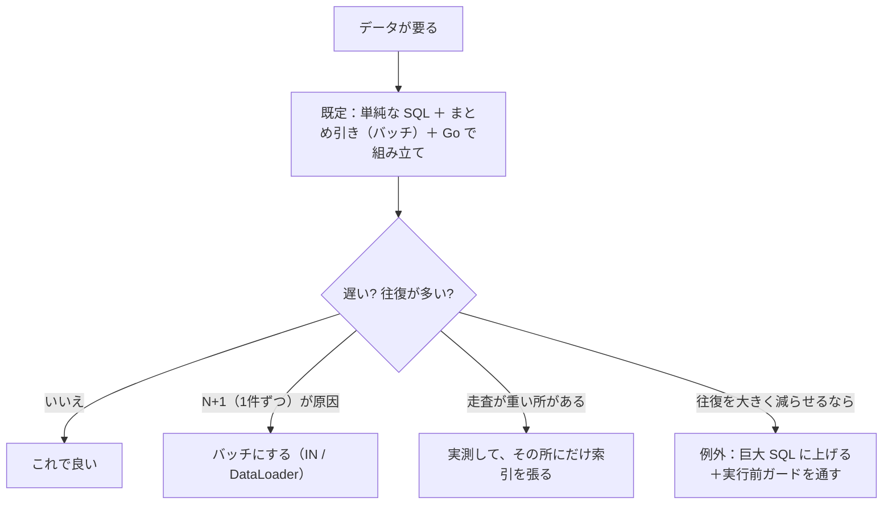
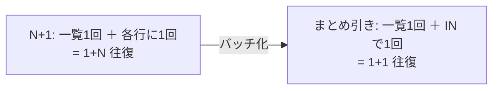

# クエリ方針：単純＋バッチを既定に、巨大 SQL は例外で「ガード付き」

「クエリを速くする」の中身を、この repo の実測に沿って方針化する。ひとことで——
**既定は「単純な SQL をバッチで引き、Go で組み立てる」。索引は実測で遅い所にだけ狙って張る。
巨大 SQL は往復を大きく減らせる例外だけ、実行前ガードを通して使う。**

用語は [glossary](glossary.md)、律速の考え方は [concern-performance](concern-performance.md)。

## 判断ルール（これだけ）



---

## 1. 既定：単純な SQL ＋ バッチ ＋ Go で組み立て

- **巨大 JOIN を最初から書かない**。単純な SELECT で取り、関連は Go 側で組み立てる（テスト・差し替えが楽・
  実行計画が読みやすい）。
- ただし **「単純」＝「1件ずつ」ではない**。1件ずつ引くと **N+1** で往復が爆発する
  （[EXP-23](graphql.md): 一覧＋関連を1件ずつ = 250 往復）。
- **正解は「単純なクエリを、まとめて引く」**：関連は `WHERE id IN (...)` / DataLoader で**バッチ**にする。
  → 単純・往復少・組み立ては Go、の三拍子。



## 2. 索引：無闇に張らない（実測で狙って張る）

索引はタダではない：

| コスト | 中身 |
| --- | --- |
| 書き込みが重くなる | 更新のたびに B-tree を保守 |
| 索引が肥大 | 二次索引は**主キーを内包**（太い主キーだと全索引が膨らむ・[EXP-54](primary-key.md)） |
| メモリを食う | buffer pool を占有 |

**ポリシー**：
- **推測で張らない**。**EXPLAIN の走査行数が多い実測の遅いクエリ**にだけ張る（[EXP-18](date-search.md)）。
- 形は **`tenant_id` 先頭の複合索引**、できれば **covering**（表本体を読まない・[deep-dives](deep-dives.md)）。
- **使われていない索引は消す**（書き込みコストと肥大だけ残る）。

## 3. 例外：巨大 SQL に上げるとき（その時だけガードする）

巨大 SQL（大きな JOIN / 集計）が勝つのは、**往復を大きく減らせる**とき（往復はコストの支配項・[EXP-31](capacity.md)）。
だが risk がある：走査行数の爆発（[EXP-18](date-search.md)）、太い列を舐める（[EXP-21](column-projection.md)）、
実行計画の偏り（[EXP-7](query-plan-skew.md)）。

**昇格の条件（すべて満たすとき）**：
- 往復が明確に減る（N 往復 → 1）。
- 走査行数が**有界**（`LIMIT` ＋ 索引レンジで頭打ち）。
- 太い列を舐めない（射影）。
- 実行計画が安定（テナントで極端に変わらない）。

**「その時だけビジネス層でチェック」＝実行前ガード**（このクエリだけ厳しくする）：

| ガード | 何を | 根拠 |
| --- | --- | --- |
| `LIMIT` 必須 | 暴走スキャンを止める | [repository-layer](repository-layer.md) |
| 走査見込みで弾く | `EXPLAIN` の rows がしきい値超なら実行前に拒否（`GuardedQuery`/`ErrTooCostly`） | [EXP-7](query-cost-gate.md) |
| 射影 | 太い列を取らない（`SELECT *` 禁止） | [EXP-21](column-projection.md) |
| タイムアウト | 長居を切る（context で kill） | [EXP-36](query-timeout.md) |

## まとめ

```
既定：単純な SQL ＋ まとめ引き（バッチ）＋ Go で組み立て
  └ 索引は「実測で遅い所」にだけ、tenant_id 先頭・covering で。使わない索引は消す
例外：往復を大きく減らせるなら巨大 SQL に昇格
  └ そのクエリだけ実行前ガード（LIMIT＋走査見込み＋射影＋timeout）を通す
```

- **「シンプル＝1件ずつ」ではなく「シンプル＝単純 SQL をバッチで」**。
- **「例外チェック＝実行前のコストゲート」**。事故（暴走スキャン・越境）はスロークエリログに出る頃には手遅れ。
- 迷ったら既定（単純＋バッチ）。巨大 SQL は「測って勝つと分かった所」だけ、ガード付きで。

## 保証しない範囲・未検証

- しきい値（走査行数の上限・LIMIT の値）はワークロード依存。実測で決める。
- 集計・レポートのような本質的に重いクエリは、事前集計テーブル/マテビュー化も選択肢（本方針の外）。
- 全文検索（FULLTEXT）・JSON/生成列の索引は別途（未実験・[design-principles](design-principles.md) の候補）。
