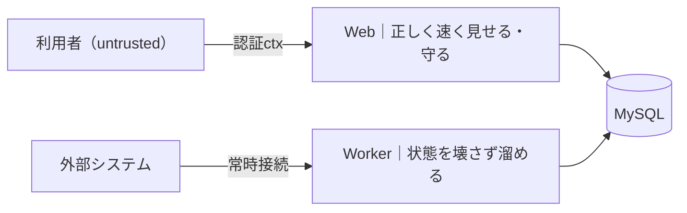

# Web と Worker に求められること（責務の入口）

この構成（Web＋Worker＋SSE＋MySQL＋gqlgen・マルチテナント越境禁止）で、**Web と Worker が
それぞれ何を満たすべきか**を1枚に。新メンバーの入口・設計レビューの冒頭に使う。
詳細は各リンク先（[worker-vs-web](worker-vs-web.md) の対応表、concern-* の詳細記事、[checklist](checklist.md)）。

---

## Web に求められること

> **一言：利用者に、正しく・速く見せて、越境と攻撃から守る。**

| # | 求められること | どうやって | 詳細 |
| --- | --- | --- | --- |
| 1 | 低レイテンシで応答（律速は CPU） | 射影・N+1回避(DataLoader)・keyset で CPU を減らす | [concern-performance](concern-performance.md) |
| 2 | マルチテナント越境ゼロ | テナントは**認証 ctx から**・全クエリ `tenant_id` 強制・フィールド/行認可 | [concern-security](concern-security.md)/[tenant-scope](tenant-scope.md) |
| 3 | 入力は untrusted 前提で守る | 複雑度上限・allowlist・レート制限・エラー秘匿・内観 off | [graphql](graphql.md)(EXP-24/26) |
| 4 | リアルタイム配信を効率よく | hub で差分 fan-out・遅い購読者 drop・接続掃除・DB を 1:1 で持たせない | [subscription-design](subscription-design.md)/[concern-subscription-capacity](concern-subscription-capacity.md) |
| 5 | 書き込みは冪等 | mutation は冪等キーで再送・二重クリックを弾く | [graphql](graphql.md)(EXP-27) |
| 6 | 途切れに強い（接続は揮発でよい） | 切れたら **version から再購読**・graceful shutdown | [concern-lifecycle](concern-lifecycle.md) |
| 7 | 横に割れる | CPU が天井なら 5,000本 × 複数タスク | [capacity](capacity.md)(EXP-40) |

## Worker に求められること

> **一言：外部と繋ぎ続けて、状態を壊さず・二重にせず DB に溜める。**

| # | 求められること | どうやって | 詳細 |
| --- | --- | --- | --- |
| 1 | 常時接続を保つ | 切れたら張り直し・**1プロセスで多重化**して密度を上げる | [worker-connection-model](worker-connection-model.md) |
| 2 | 状態を正しく DB へ同期 | `version++`・**冪等受信**(`UNIQUE(tenant_id, external_id)`)・逆順/重複に強い | [event-ordering](event-ordering.md)(EXP-47) |
| 3 | 二重稼働しない | **lease＋fence** で担当を1つに・古い書き込みを弾く | [fencing](fencing.md)(EXP-2) |
| 4 | 落ちても続きから | 進捗(**lease・cursor**)を DB に・`OUTCOME_UNKNOWN`・再起動で復元 | [concern-lifecycle](concern-lifecycle.md)/[crash-effects](crash-effects.md) |
| 5 | 外部作用は exactly-once | **outbox** で DB 更新と送信を原子化・dead-letter・retry 分類 | [outbox](outbox.md)/[dead-letter](dead-letter.md)/[retry](retry.md) |
| 6 | DB 負荷を抑える（律速は DB 往復） | version 差分バッチ・coalesce・multi-row・**per-row 禁止** | [concern-performance](concern-performance.md)/[fanout](fanout.md) |
| 7 | マルチテナント越境ゼロ | **lease 境界＋スコープ強制**・最小権限＋テナント群ごとの資格情報 | [tenant-scope](tenant-scope.md)/[worker-tenancy](worker-tenancy.md) |
| 8 | 履歴を溜めっぱなしにしない | 日パーティションで保持期間 DROP | [retention](retention.md)(EXP-48) |
| 9 | 横に割れる | テナントをシャードして Worker を増やす | [redundancy](redundancy.md)(EXP-30) |

---

## 対比（本質）

| | Web | Worker |
| --- | --- | --- |
| 誰に向く | **利用者**（untrusted） | **外部システム**（接続相手） |
| 主目的 | 正しく速く見せる・守る | 状態を壊さず溜める |
| テナントの出所 | **認証 ctx** | **lease**（担当割当） |
| 律速 | **CPU** | **DB 往復** |
| 落ちたとき | version から**再購読** | cursor＋lease で**続きから** |
| 二重防止 | 冪等 mutation | lease＋fence＋冪等受信 |
| 外部作用 | （基本なし） | outbox で exactly-once |

## 両方に共通で必須（生命線）

1. **越境ゼロ**：全クエリ `tenant_id` 強制＋**生 SQL は lint で禁止**（人手に頼らない・[tenant-scope](tenant-scope.md)）。
2. **重要状態は DB に**：コンテナは ephemeral。メモリの状態はいつでも消える（[concern-lifecycle](concern-lifecycle.md)）。
3. **縦より横**：1台を大きくするより台数を増やす（GC 停止・障害影響・接続予算が有利・[redundancy](redundancy.md)）。
4. **前後互換**：スキーマ変更は expand/contract、Web と Worker の切替を合わせる（[concern-migration](concern-migration.md)）。

---

> 作る/レビューの手順は [checklist](checklist.md)、全体像は [design-principles](design-principles.md)、
> 構成図は [architecture](architecture.md)、数字は [reference-numbers](reference-numbers.md)。
