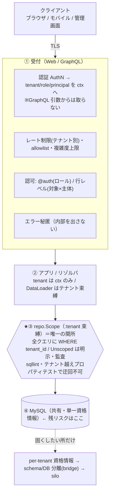
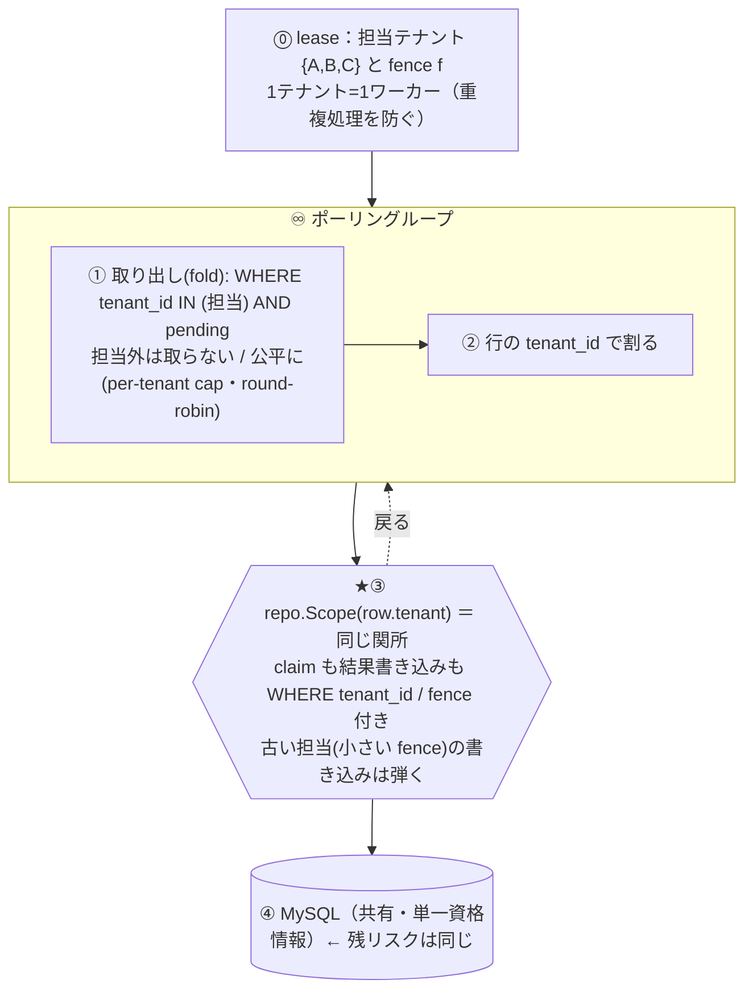
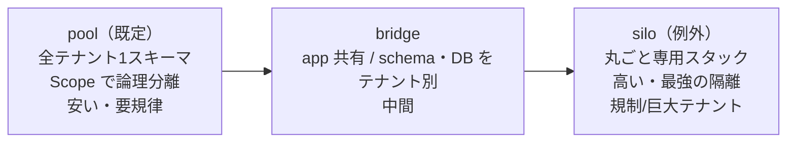

# セキュリティの多層防御（Web / Worker）とテナント分離

テナント分離を「気をつける」でなく**構造で強制する**ための層と、その関所（`repo.Scope`）を図に
する。Web（リクエスト駆動）と Worker（♾️ 常駐・データ駆動）で入口が違い、関所と DB の残リスクは
同じ。各項目は実証した実験（EXP-xx）へリンクする。

## Web（リクエスト駆動）

## Worker（♾️ 常駐・データ駆動）

外部リクエストが無い。テナントは **lease の担当 ＋ 掴んだ行の `tenant_id`** から来る。認可は
「命令が作られた時（ingress）」に済ませ、Worker は queue を信頼して実行しつつ Scope に閉じる。

**Web との違い**: テナントの出所が「認証済みリクエスト」でなく「lease＋行」。Worker 特有の敵は
「担当外テナントを畳む」（→ lease で IN を限定）と「古い担当が生き返って書く」（→ fence）。

## 共有 → 分離のスペクトル（既定は pool、silo は例外）

- ①②③は**すべてアプリ内**の防御。プロセス侵害・ガードのバグ・SQLi は貫通しうる。
  それを止められるのは **④の DB 側分離**（テナント別資格情報 / bridge / silo）だけ。
- だから「既定は pool＋多層防御、足りない所だけ④に寄せる」。

---

# Web のセキュリティはどうあるべきか

層ごとのチェックリスト。**[EXP-xx] は本リポジトリで実測済み**、印の無いものは一般的な必須項目。

## 1. 通信（Transport）
- [ ] **TLS 必須**（HTTP は 301 で HTTPS へ）。HSTS。内部 LB→アプリ間も可能なら TLS。
- [ ] DB 接続も TLS（資格情報が平文で流れない）。

## 2. 認証（AuthN）— テナント/ロール/主体を「主体から」決める
- [ ] 検証済みの **tenant / role / principal を context に載せる**。**GraphQL 引数・URL・ヘッダの
      自己申告からテナントを取らない**（詐称防止）[EXP-24]。
- [ ] トークンは短命＋更新（失効を効かせる）。資格情報のローテは [EXP-13](credential-rotation.md)。

## 3. 認可（AuthZ）— 3段
- [ ] **テナント境界**: 全 DB を `repo.Scope`（:tenant 束縛）に通す。書き忘れを型で防ぐ [EXP-24]。
- [ ] **フィールド単位ロール**: `@auth(requires:)`（機微フィールドは上位ロールだけ）[EXP-25]。
- [ ] **行レベル**: この主体がこの対象を操作してよいか（対象×主体・リゾルバ判定）[EXP-28]。

## 4. 入力（Input）
- [ ] **DB に触れる前に検証**し、不正はクライアント起因エラーで返す（内部 500 にしない）[EXP-27]。
- [ ] **パラメータ化クエリ**のみ（SQL 文字列連結を静的解析で禁止）[EXP-8]。
- [ ] **一覧は first 必須＋上限**（無制限一覧を作らせない）[EXP-23]。
- [ ] 索引で絞れない検索は**実行前にコストゲートで弾く** [EXP-18](date-search.md)/[cost gate](query-cost-gate.md)。

## 5. DoS / 過負荷
- [ ] **複雑度上限**で深い/広いクエリを実行前に拒否 [EXP-24]。
- [ ] **テナント別レート制限**＋**永続化クエリ allowlist** [EXP-26]。
- [ ] **接続予算**を役割で分け、Web は膝で頭打ち [EXP-5](pool-saturation.md)。**Web と Worker は
      プール分離** [EXP-29]。プール飽和で `/readyz` を落とす。
- [ ] **全 DB 呼び出しに timeout 付き context**＋サーバ側 `MAX_EXECUTION_TIME` [EXP-36]。

## 6. 出力（Output）
- [ ] **エラー秘匿**: SQL・スタックを client に出さない。クライアント起因のみ見せる [EXP-24]。
- [ ] **要求列だけ返す**（over-fetch しない・射影）[EXP-19](column-split.md)/[EXP-21](column-projection.md)。
- [ ] **本番は内観オフ**（スキーマを教えない）[EXP-24]。

## 7. ブラウザ向け（管理画面・Web アプリを serve するなら）
- [ ] **CORS はオリジン allowlist**（`*` にしない）。
- [ ] Cookie 認証なら **CSRF 対策**（SameSite / トークン）。可能なら Bearer トークンにして CSRF 面を消す。
- [ ] **セキュリティヘッダ**: CSP、`X-Content-Type-Options: nosniff`、`Referrer-Policy`、
      `X-Frame-Options`（クリックジャッキング）。
- [ ] 機微情報を **URL/クエリ文字列に載せない**（ログ・履歴に残る）。

## 8. 秘密情報
- [ ] 秘密は**マネージャから取得しテナント分離**、メモリキャッシュは排他・期限管理 [docs/secrets.md](secrets.md)。
- [ ] **ログに秘密・PII・トークンを出さない**（Audit は値でなくキーと出所だけ）。

## 9. クライアント種別（スマホ / 管理画面）は同じ API でよいか
- [ ] **API は共有でよい**が、**認可スコープ（ロール）とレート制限はクライアント種別で分ける**。
      管理画面は強い権限＝行レベル認可を厳しく、公開アプリは狭いスコープ＋厳しめレート。
- [ ] 発行するトークンの**対象(audience)・スコープをクライアントごと**に。

## 10. 監査・可観測性
- [ ] **認可の判断（拒否含む）を監査ログ**に。テナント別メトリクスは**有界ラベル**で（カーディナリティ
      爆発を避ける）[EXP-37]。
- [ ] 異常（拒否の急増・複雑度超過・レート超過）をアラートに。

## まとめ
Web セキュリティの背骨は **「主体からテナント/ロールを決める → 全 DB を repo.Scope に通す →
入口で DoS を絞る → 出口で秘匿する」**。テナント分離の関所は `repo.Scope` 一点に集約し、迂回は
CI(sqllint) で塞ぐ。アプリ内で守り切れない分だけ ④（DB 資格情報分離 / silo）へ寄せる。

---

# Worker のセキュリティはどうあるべきか

Worker は外部リクエストが無く、♾️ で DB を回す。脅威は「他人からの入力」より
**「他テナントへの混線」「二重の副作用」「1テナントが全体を止める」**。守りは Web と別の形。

## 1. 担当と分離（テナント混線を防ぐ）
- [ ] **lease で担当を決める**（1テナント=1ワーカー）。fold の `IN` は**担当(lease 済み)テナントだけ**
      に限定し、担当外を絶対に取らない [EXP-2](fencing.md)/[EXP-14](fanout.md)。
- [ ] 取得後は**行の `tenant_id` ごとに `repo.Scope` に閉じて処理**。claim も結果書き込みも
      `WHERE tenant_id=:tenant`。迂回は sqllint・プロパティテストで封じる [EXP-24](graphql.md)。
- [ ] **fence で古い担当の書き込みを弾く**（切り離された旧オーナーが生き返って上書きしない）
      [EXP-30](redundancy.md)。

## 2. 副作用の安全性（二重に効かせない）
- [ ] **外部 effect（ロボットへの指示等）は冪等**に。出したが結果不明(`OUTCOME_UNKNOWN`)を
      "失敗" と決めつけて再実行→二重、を避ける。結果は**独立に観測**して記録 [EXP-1](crash-effects.md)。
- [ ] キューの命令は冪等キーで**二重発行を吸収**（ingress で担保済み）[EXP-27](graphql.md)。
- [ ] 命令 payload は**データとして扱う**（eval しない）。外向き呼び出しの宛先は allowlist。

## 3. 可用性＝マルチテナントのセキュリティ（ノイジーネイバー）
- [ ] **担当テナント間で公平に**捌く（per-tenant cap / round-robin）。1テナントの大量投入が他を
      止める＝他テナントへの可用性 DoS [EXP-34](tenant-fairness.md)。
- [ ] **各処理に timeout 付き context**＋失敗時は**適応的バックオフ**（DB を叩き続けない）
      [EXP-36](query-timeout.md)/[EXP-17](adaptive-backoff.md)。

## 4. 最小権限・資格情報
- [ ] Worker の DB ユーザは**必要な権限だけ**（DDL 不要・対象表だけ）。可能なら Web と別ユーザ。
- [ ] 秘密は**マネージャからテナント分離で取得**、メモリキャッシュは排他・期限管理、**ログに出さない**
      [docs/secrets.md](secrets.md)/[EXP-13](credential-rotation.md)。

## 5. 冗長化・接続予算
- [ ] Worker プールは**レプリカ数で割った接続予算**内に。起動時 `poolbudget.Guard` で fail-fast
      [EXP-5](pool-saturation.md)/[EXP-30](redundancy.md)。
- [ ] 停止は graceful に（処理中を流し切り lease を返す）→ 速い failover [EXP-3](shutdown.md)。

## 6. 監査・可観測性
- [ ] どのテナント/命令を処理したか、**認可・fence 拒否・lease 交代**を監査ログに。
- [ ] メトリクスは**有界ラベル**（tenant・status・種別）。backlog 増加・fence 拒否・lease チャーン・
      空振り率をアラートに [EXP-37](observability.md)。

## Web と Worker の対比（要点）
| 観点 | Web | Worker |
| --- | --- | --- |
| テナントの出所 | 認証済みリクエスト → ctx | lease の担当 ＋ 行の `tenant_id` |
| 主な脅威 | 詐称・DoS・情報漏れ | テナント混線・二重副作用・ノイジーネイバー |
| 認可の時点 | リクエストごとに実行時 | 命令が作られた時(ingress)＋実行は Scope に閉じる |
| 固有の防御 | ロール/行レベル認可・複雑度・allowlist | lease・fence・公平スケジューリング・冪等 effect |
| 関所 / 残リスク | `repo.Scope` / DB 共有資格情報（同じ） | `repo.Scope` / DB 共有資格情報（同じ） |

背骨は共通で **「テナントを正しく決める → 全 DB を repo.Scope に通す → 1点を CI で守る →
足りない分だけ DB 側分離へ」**。Web は入口の詐称・DoS を、Worker は混線・二重副作用・公平性を、
それぞれ追加で固める。
