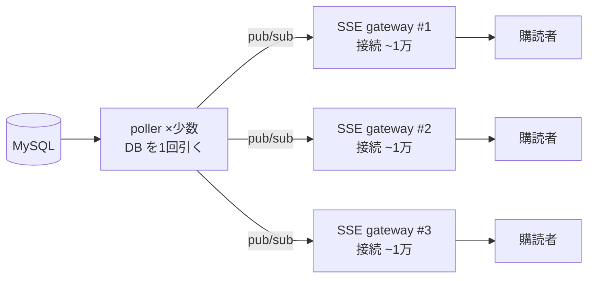

# 多数が同一テナントで SSE 購読するとき（DB ファンインとアプリ側の対応）（EXP-38）

「同じテナントで 300人が SSE 購読しつつ問い合わせる」とき、素朴に作ると **300 接続が各自 DB を
ポーリング＝同じテナントのデータに 300 倍の読み**（ファンイン）。アプリ側でできる対応と、hub の
性能上限、そして「SSE 専用の Web 層は要るのか」を実測で。

実装は [internal/ssehub](../internal/ssehub)、receipt は
[docs/results/exp-38](results/exp-38/exp-38-sse-fan-in.md)。

## アプリ側の対応（4つ）

| 対応 | 実測 |
| --- | --- |
| ① テナントに1つの poller＋hub で全員へ配る | 更新10回で DB 読み **3000 → 10**（接続数でなく更新数に比例） |
| ② 一斉接続の初期取得を singleflight で畳む | 300 同時要求 → **2 回**の DB 読み（in-flight を1つに） |
| ③ 遅い購読者は有界バッファで落とす | 速い購読者は 100/100 受信、遅い方は 96 件ドロップ。**全体は止まらない** |
| ④ SSE に DB 接続を 1:1 で持たせない | （[EXP-31](capacity.md)）接続予算が即枯れるため。push は hub から |

- **①が本命**：接続ごとに DB を引かせない。テナント単位の poller が1回引き、in-memory hub で
  全購読者へ配る。DB 読みは「接続数」でなく「更新回数」に比例。
- **②**：起動直後に全員が初期スナップショットを取りに来る stampede は `singleflight` で畳む
  （同時 in-flight を1つに）。完全に1回ではなく「ごく少数」に減る。
- **③**：1人の遅い購読者が全体を止めないよう、購読チャネルは**有界バッファ＋非ブロッキング送信**。
  溢れたら落とす。「差分」でなく「最新版/スナップショット」を配る設計なら、落としても次で追いつく。

## hub の性能上限（in-memory fan-out）

| 購読者数 | 1配信あたり | 1購読者あたり | 配信/秒 |
| --- | --- | --- | --- |
| 300 | 6.3µs | 21ns | ~159,000 |
| 1,000 | 30µs | 30ns | ~33,000 |
| 5,000 | 132µs | 26ns | ~7,600 |

- **in-memory の fan-out は激安**（1購読者 ~25ns）。300人どころか数千人でも、配信そのものは
  CPU の問題にならない。**hub は 1 プロセスで数千購読者を余裕で捌く**。
- ただしこれは「チャネルに置く」コスト。**実 SSE は各ソケットへの書き込み（TLS＋syscall）が別に
  かかる**（1メッセージ ~µs 級）。本当の上限はそっち＋接続の**メモリ/fd**（[EXP-31](capacity.md)：
  1接続 ~34KB → 1 vCPU/2GB で実用 **1万〜1.5万接続**）。

## SSE 専用の Web 層は要るのか

**300〜数千/1テナント程度なら不要**。1つの Web タスク内に hub を持てば足りる（fan-out は激安）。
専用層が要るのは次のとき：

1. **総接続数が 1 タスクのメモリ/fd を超える**（>~1万〜1.5万）。→ 接続を複数プロセスに分ける。
2. **長寿命接続を request/worker から隔離したい**（デプロイの再起動で全接続が切れるのを避ける・
   リソース分離。[EXP-29](web-worker-split.md) と同じ理屈）。
3. 上記で**複数プロセスに購読者が分かれる**と、in-memory hub はプロセス内だけなので、
   プロセス跨ぎの通知に **pub/sub（Redis/NATS 等）が要る**（MySQL に LISTEN/NOTIFY は無い）。

その構成＝**「少数の poller（DB を読む）＋ 多数の SSE ゲートウェイ（接続を持つ）を pub/sub で繋ぐ」**：

- **DB 読みはゲートウェイ数でなく poller 数に比例**（接続がいくら増えても DB は守られる）。
- ゲートウェイ台数は「接続数 ÷ 1タスクの上限（~1万）」で決める。

## まとめ

- **接続ごとに DB を引かせない**。テナント単位 poller＋hub で「接続数→更新数」に。
- 初期 stampede は **singleflight**、遅い購読者は**有界バッファで落とす**（版/スナップショット配信）。
- SSE に **DB 接続を 1:1 で持たせない**。
- 1タスクの hub で数千購読者は余裕。**専用 SSE 層が要るのは接続がメモリ/fd 上限を超えるか、
  隔離したいとき**。そのときは poller＋SSE ゲートウェイを **pub/sub** で繋ぐ。

## 保証しない範囲・未検証

- fan-out の実測は in-memory コスト。実 SSE のソケット書き込み・TLS・接続メモリは [EXP-31](capacity.md)。
- pub/sub 構成（Redis/NATS）自体は本実験外（ここは 1 プロセス hub の意味論と上限）。
- 落とした更新の許容は「版/スナップショットを配る（差分にしない）」前提。
