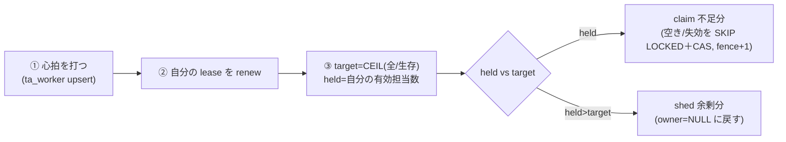
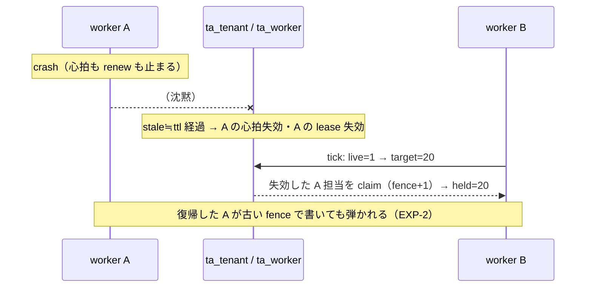

# テナント割り当てを DB の lease で持つ（均等・失敗時全責任・二重所有0・fence 単調・EXP-63）

「どのテナントをどの worker が担当するか」を **DB の1テーブル（1テナント1行の lease）**に持ち、
各 worker が **`target = CEIL(全テナント数 / 生存 worker 数)` まで claim・超えたら shed するだけ**で、
**平常は均等**・**失敗時は survivor が全責任**・**二重所有0**・**fence 単調**を DB が自動で満たす。
「失敗時に全責任を持つ」は if 文でなく **式（live が減れば target が上がる）の結果＝特別コード不要**。

実装 [internal/assignlab](../internal/assignlab)、receipt [docs/results/exp-63](results/exp-63/exp-63-tenant-assignment-lease.md)。
裏づけ：lease/fence [EXP-2](fencing.md)、多重化ワーカーのデプロイ [web-worker-deploy §8](web-worker-deploy.md)、
接続予算 [EXP-60](connection-budget.md)、容量 [tenant-worker-capacity](tenant-worker-capacity.md)。

## テーブル（2つ）

```sql
-- ① テナントごとの担当権（1テナント1行）。owner は claim の結果として入る（固定しない）
CREATE TABLE ta_tenant (
  tenant_id     VARCHAR(64) NOT NULL,
  owner_id      VARCHAR(64) NULL,               -- 今の担当 worker
  fence         BIGINT      NOT NULL DEFAULT 0, -- 取り直すたび +1（単調・古い担当の上書きを弾く）
  lease_expires DATETIME(3) NULL,               -- DB 時計の期限（TTL）
  PRIMARY KEY (tenant_id)                       -- ← 二重所有が構造的に不可能（行がロック）
) ENGINE=InnoDB;

-- ② worker の心拍（生存メンバー数＝target の分母）
CREATE TABLE ta_worker (
  worker_id      VARCHAR(64) NOT NULL,
  last_heartbeat DATETIME(3) NOT NULL,
  PRIMARY KEY (worker_id)
) ENGINE=InnoDB;
```

## 各 worker が回す1ティック



```sql
-- ① 心拍
INSERT INTO ta_worker(worker_id,last_heartbeat) VALUES(:me,NOW(3))
  ON DUPLICATE KEY UPDATE last_heartbeat=NOW(3);
-- ② renew（有効に持つ分だけ延長）
UPDATE ta_tenant SET lease_expires=NOW(3)+INTERVAL :ttl SECOND
  WHERE owner_id=:me AND lease_expires>=NOW(3);
-- ③ live=SELECT COUNT(*) FROM ta_worker WHERE last_heartbeat>NOW(3)-INTERVAL :stale SECOND;
--    target=CEIL(total/live); held=SELECT COUNT(*) ... owner=:me AND lease_expires>=NOW(3);

-- 過少 → claim（空き/失効を、取り合い回避しつつ CAS で奪う）
START TRANSACTION;
SELECT tenant_id FROM ta_tenant
  WHERE owner_id IS NULL OR lease_expires<NOW(3)
  ORDER BY tenant_id LIMIT :need FOR UPDATE SKIP LOCKED;   -- 2台が同じ行を取り合わない
UPDATE ta_tenant SET owner_id=:me, fence=fence+1, lease_expires=NOW(3)+INTERVAL :ttl SECOND
  WHERE tenant_id=:id AND (owner_id IS NULL OR lease_expires<NOW(3));  -- CAS
COMMIT;

-- 過多 → shed（余剰を返す＝均等化のダウン側）
UPDATE ta_tenant SET owner_id=NULL, lease_expires=NULL
  WHERE owner_id=:me AND lease_expires>=NOW(3) ORDER BY tenant_id DESC LIMIT :excess;
```

## 「均等」と「失敗時に全責任」が同じ式から出る（EXP-63 実測・テナント20/worker2）

| フェーズ | live | target=CEIL(20/live) | held_A | held_B | orphan | 意味 |
| --- | --- | --- | --- | --- | --- | --- |
| **① 平常** | 2 | **10** | **10** | **10** | 0 | 動的 claim で均等に収束 |
| **② A 死亡** | 1 | **20** | 0(失効) | **20** | 0 | **B が全責任を自動で背負う**（式の結果） |
| **③ A' 復帰** | 2 | **10** | **10** | **10** | 0 | shed＋claim で 10/10 に再収束 |

- **不変条件も実測**：`double_owned=0`（tenant_id が PK）・`fence_monotone=1`（claim ごと+1・最大 fence=2）・
  `valid_owned_sum=20`（宙に浮くテナント0）。
- **② がこの設計の肝**：「A が死んだら B が全部やる」を書いた if は無い。**`live` が 2→1 になると `target` が 10→20 に上がり、
  B が失効した A 担当を claim する**——だけ。失敗時全責任は**式の副産物**。



## 対照：静的ピンは失敗時に担当が宙に浮く（④ 実測 orphan=10）

**owner を固定（1-10→A、11-20→B のピン）**にすると、A 死亡で **A 担当の10が誰にも拾われず orphan=10**。
B は「自分のピン分」しか見ないから。**動的 claim なら②の通り orphan=0**。

| 方式 | A 死亡後の orphan | 判定 |
| --- | --- | --- |
| **静的ピン（owner 固定）** | **10（宙に浮く）** | ✗ 2台にした意味が消える |
| **動的 claim（fair-share）** | **0（B が全部拾う）** | ○ |

→ **owner は config で固定せず、claim の結果として入れる**。均等は「静的割当」でなく「動的 claim の収束」で得る。

## 効かせどころ（正しさの3点）

- **`tenant_id` が PK**：1テナントに owner は1つ＝**二重所有は構造的に不可能**（行がロック）。
- **SKIP LOCKED**：2台が同じ空き行を取り合わない（claim 衝突を消す）。
- **fence（[EXP-2](fencing.md)）**：claim ごと+1。実作業の書込は `... AND fence=:my_fence` で守り、
  **生き返った旧担当（古い fence）の上書きを弾く**。TTL を短くしても correctness は fence が担保、
  TTL は**可用性（引継ぎの速さ）だけ**に効く。
- **stale ≒ lease_ttl に揃える**：心拍失効と lease 失効を同時にして、A 死亡→B が確実に拾えるように。
  失敗時の空白は約 ttl（=可用性の谷、correctness ではない）。
- **reconcile（backstop）**：どのテナントも生きた owner が居るか定期 sweep（[EXP-30](redundancy.md)）。

## 落とし穴（避ける）

- **owner を静的に埋めない**（config 固定＝静的ピン）→ HA が死ぬ（④）。
- **shed を無条件にしない**（`held>target` のときだけ）→ 相手が居なければ target=全数で誰も返さず全員カバー。
- **claim を read-then-write でやらない** → 並行で二重取得（[EXP-62](event-driven-worker.md)②）。CAS＋SKIP LOCKED。
- **2台は「survivor が全担当を背負う器」でサイズ**（②で B が20を持つ）。20テナントなら接続予算内（[tenant-worker-capacity](tenant-worker-capacity.md)）。

## まとめ

- **割り当ては DB の lease テーブル1つ。各 worker は `target=CEIL(全/生存)` まで claim・超えたら shed するだけ。**
- **均等（①）も失敗時全責任（②）も再収束（③）も、owner を固定せず動的 claim＋fair-share で DB が自動的に満たす。**
- **二重所有0（PK）・fence 単調（古い上書きを弾く）が不変条件として成立。静的ピンは失敗時に担当が宙に浮く（④）。**

## 保証しない範囲・未検証

- 実時間依存（sleep で lease 失効を待つ）。ttl/stale/tick は説明用の短い値。実運用は clock skew に応じ調整（[EXP-2](fencing.md)）。
- 収束は逐次ティックで模擬（テスト内で A/B を順に回す）。実コンテナは独立ループだが SKIP LOCKED で取り合いは裁ける。
- 3台以上・shard 化・実コンテナでの独立ループ挙動は容量計画側（[tenant-worker-capacity](tenant-worker-capacity.md)）／LIVE_ENV は未実測。
