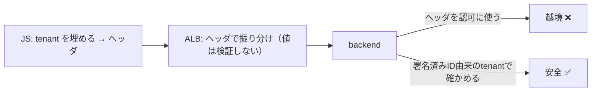

# テナントヘッダ：ルーティングに使ってよいこと / 認可に使ってはいけないこと

JS に埋め込んだ tenant を **HTTP ヘッダ**にして ALB で振り分ける——これは**ルーティング目的なら OK、
認可（データアクセスの根拠）に使うと越境**。両者を混ぜないための整理。

> ひとことで：**ヘッダ＝配送ラベル（client 申告でよい）／認可＝署名済み中身（サーバが確かめる）**。

裏づけ：越境の実測は [tenant-scope](tenant-scope.md)(EXP-58)、共通コンテナの SPOF は
[architecture](architecture.md)/[concern-lifecycle](concern-lifecycle.md)。

---

## 大前提（この構成）

- **署名検証で ID（identity）は確定済み**。誰か（robot_id / user）は信頼できる。
- **tenant ヘッダで ALB が振り分ける**。tenant を JS に埋めてヘッダ送信 → 共通コンテナで tenant を
  引かなくてよい（**圧迫・SPOF が hot path から外れる**）。

---

## ✅ ルーティング目的：やってよいこと

| やること | なぜ OK |
| --- | --- |
| JS に tenant を埋め、ヘッダで送る | 振り分けの**ヒント**。共通コンテナで引かずに済み、圧迫が消える |
| ALB がそのヘッダで backend/ターゲットグループへ振り分け | ルーティングは**セキュリティ境界ではない**。値が偽装されても「配送先を間違えるだけ」 |
| テナントごとにサブドメイン/パスで振り分け | 同上。分散・シャーディングの手段として妥当 |
| ヘッダを**ログ・メトリクスのラベル**に使う（値域は絞る） | 観測のヒント（[observability](observability.md) の cardinality に注意） |

→ **ルーティング＝client 申告でよい。** 共通コンテナを毎回叩かないので、SPOF も圧迫も解消。

## ❌ 認可（データアクセス）目的：やってはいけないこと

| やってはいけない | なぜ NG |
| --- | --- |
| **ヘッダの tenant を信じてクエリを scope する** | client が `tenant=他社` を送れる → 他社データを返す＝**越境**（[EXP-58](tenant-scope.md)） |
| ヘッダの tenant を業務コード/`repo.Scope` にそのまま渡す | 同上。振り分け先が合っていても、backend が信じたら漏れる |
| 「ALB が振り分けたから正しいテナント」とみなす | **振り分け ≠ 分離**。偽装ヘッダでも backend には届く |
| ヘッダの tenant で権限・課金・削除を判断 | 認可の根拠を client に渡している＝なりすまし可能 |

→ **認可＝ヘッダを信じない。** データを出す前に、**署名済み ID に紐づく tenant**で必ず確かめる。

---

## 正しい tenant の出どころ（認可用）

| クライアント | 認可 tenant の出どころ |
| --- | --- |
| **スマホ**（署名 ID トークンに tenant claim あり） | **トークンの claim**を署名検証して採用（ヘッダは routing 用） |
| **ロボット**（トークンに tenant 無し） | 検証済み ID → **registry(キャッシュ) で照合**した tenant。`registry[id].tenant == ヘッダ?` 不一致は拒否 |
| （将来）サーバ署名の内部トークンに tenant を入れる | 署名検証だけで採用（照合も不要・[architecture](architecture.md)） |

いずれも **hot path で共通コンテナを叩かない**（トークン内 or キャッシュ照合）ので、圧迫・SPOF は残らない。

## 崩れる一番の原因（将来の注意）

**「ルーティング用のヘッダ」を、後から誰かが認可にも流用する**——これで一気に越境穴になる。防ぐには：

- **backend の入口で tenant は必ず ctx（署名由来）から取り直す**。ヘッダから読んだ tenant を
  業務コード・`repo.Scope` に**渡さない**（渡す値と検証する値を物理的に分ける）。
- **`repo.Scope` は ctx の tenant を注入**、生 SQL は `sqllint` で禁止（[EXP-58](tenant-scope.md)/[static-analysis](static-analysis.md)）。
- レビュー観点：**「ヘッダの tenant が `WHERE tenant_id=?` に流れていないか」**を1点だけ見る。

## まとめ

- **ルーティング目的：JS 埋め込み tenant をヘッダにして ALB 振り分け → OK**（共通コンテナの圧迫・SPOF 解消）。
- **認可目的：ヘッダを信じない → 署名済み ID 由来の tenant（スマホ=token claim／ロボット=キャッシュ照合）で確かめる。**
- 合言葉：**ヘッダ＝配送ラベル、認可＝署名済み中身**。この2つを混ぜない。

## 保証しない範囲・未検証

- ALB のヘッダ振り分け設定自体はインフラ側（本 doc はアプリの信頼境界の話）。
- ロボットの registry 照合は「robot→tenant が admin マスタ由来」を前提（[architecture](architecture.md) の admission）。
- スマホの token claim が改ざん不可なのは署名検証が前提（検証を必ず通す）。
