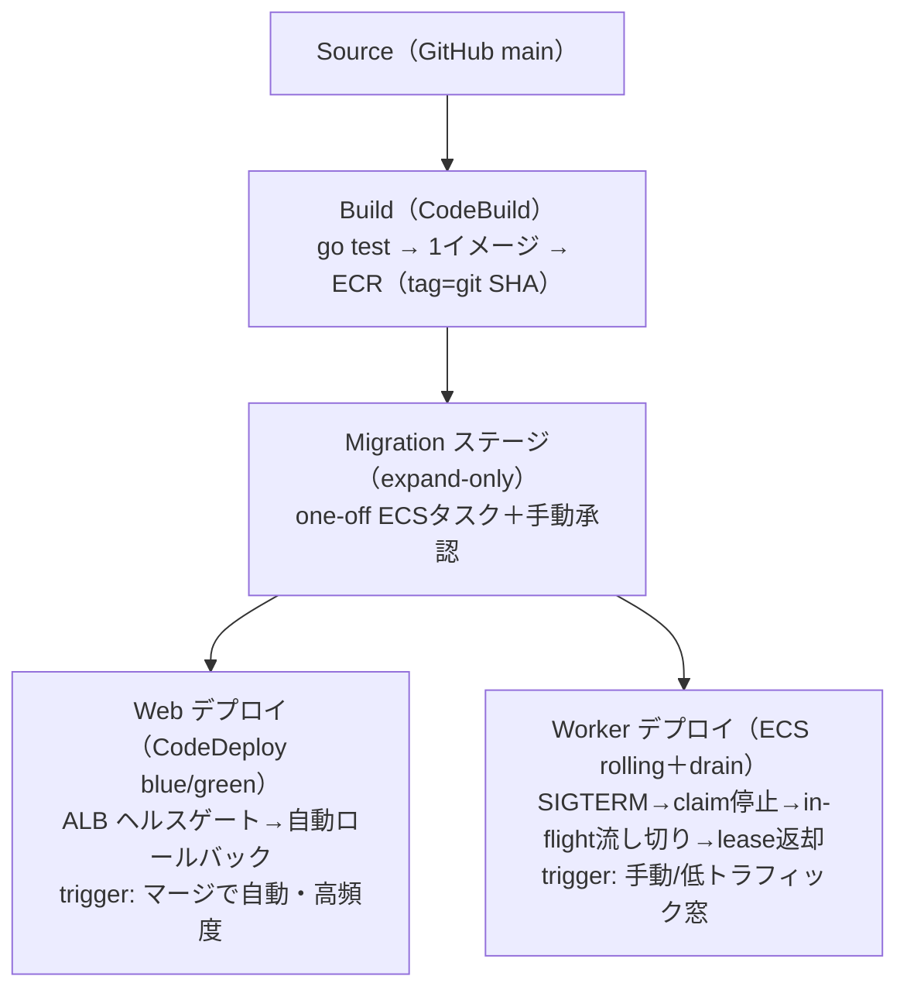
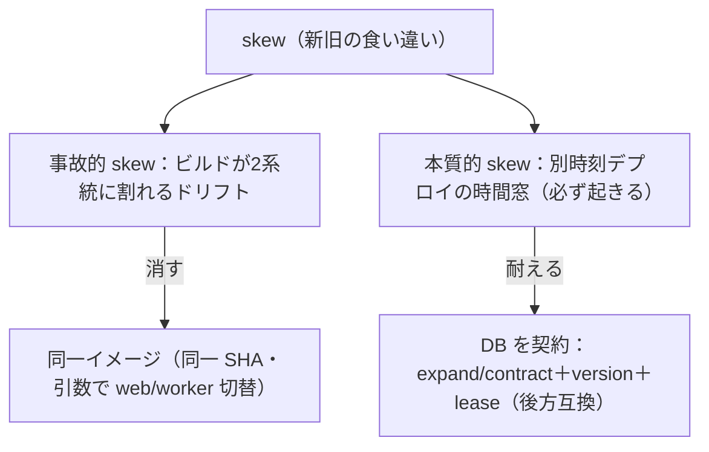
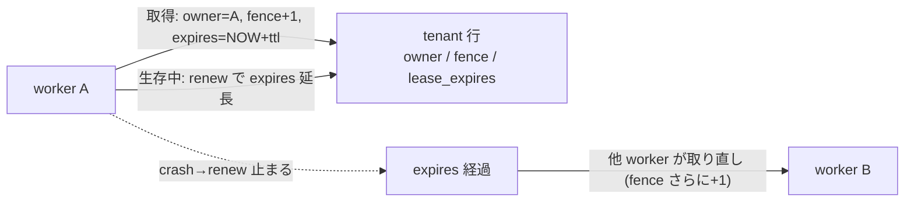
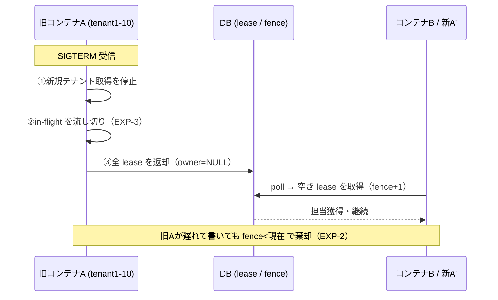
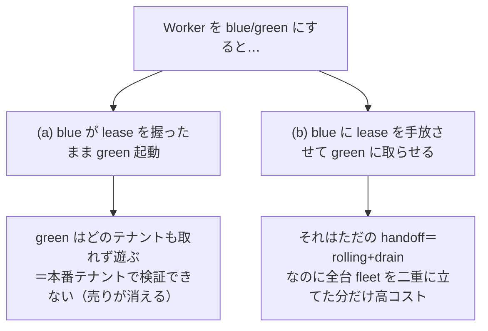

# Web / Worker を分けたときのデプロイ構成（CodePipeline・運用保守）

[web-worker-split](web-worker-split.md) で「なぜプロセス/プールを分けるか（[EXP-29](web-worker-split.md)）」は示した。
ここは **分けた後のデプロイ運用**——**デプロイ時期・タスクスペック・オートスケール**が Web と Worker で違うことを
前提に、**CodePipeline をどう組むと運用保守が楽か**をまとめる。

結論：**同一リポジトリ・同一イメージ（＝バージョン一致を保証）を、2つの独立したデプロイ経路**で流す。
**マイグレーションは expand-only を最初に単独ステージ**で。Web は blue/green で頻繁・自動、Worker は
drain 付き rolling で低トラフィック時・手動。両者が別時刻にデプロイされても壊れないのは、
**Web↔Worker が直接 RPC でなく "DB スキーマ＋行の意味" を契約にしている**から（本リポジトリの根幹）。

> LIVE_ENV_REQUIRED：AWS CodePipeline/CodeDeploy/ECS の実挙動は未実測。ここは設計方針＋公式仕様ベース。
> 裏づけの機構は [EXP-3](shutdown.md)(graceful)/[EXP-2](fencing.md)(lease 引継)/[EXP-32](zero-downtime-migration.md)(expand/contract)/
> [EXP-6](migration-crash.md)(migration crash)/[EXP-60](connection-budget.md)(予算 Guard) がローカル実証済。

---

## 1. Web と Worker はデプロイ要件が別物

| 観点 | **Web**（`cmd/web`） | **Worker**（`cmd/worker`/tenantworker） |
| --- | --- | --- |
| **デプロイ頻度/時期** | 高頻度・随時（機能/修正を即） | 低頻度・低トラフィック窓（lease/in-flight を drain する必要） |
| **デプロイの破壊性** | ステートレス（接続は短命）→ 差し替え容易 | ステートフル（lease・処理中ジョブ・SSE hub）→ **drain と引継が要る** |
| **タスクスペック** | **CPU 寄り**（gqlgen resolver・直列化・TLS）小さめ多数 | **DB 往復＋常駐**寄り（hub/バッファでメモリ）少なめ安定（[EXP-31](capacity.md)） |
| **オートスケール軸** | RPS/CPU/ALB req（急変に速く追従） | **backlog(pending)／固定寄り**。CPU で無闇に増やさない（接続倍化・lease 競合） |
| **スケール上限** | レプリカで横に伸ばす | **接続予算が天井**（[EXP-60](connection-budget.md) の `poolbudget.Guard`）／テナント数で律速 |
| **ロールバック** | 瞬時（blue/green のトラフィック戻し） | 前イメージ再デプロイ（expand-only なので旧も動く） |

→ **別サービス・別タスク定義・別スケーリングポリシー・別デプロイ経路**にする理由がここに全部ある。

## 2. タスクスペックの目安（この規模）

| | Web | Worker |
| --- | --- | --- |
| Fargate | 例：1 vCPU / 2GB × レプリカ多め | 例：0.5–1 vCPU / 2–4GB × 少なめ安定 |
| 律速 | **CPU**（[capacity](capacity.md)/[concern-performance](concern-performance.md)） | **DB 往復＋メモリ**（hub/バッチ・[EXP-31](capacity.md)/[EXP-59](concern-subscription-capacity.md)） |
| プール | 小さめ（[EXP-5](pool-saturation.md) の膝 16–20） | さらに小さく（自テナントだけ 2–4・[tenant-worker-capacity](tenant-worker-capacity.md)） |

## 3. オートスケールの違い（ここが一番の分かれ目）

- **Web**：target tracking（CPU 60% or ALB request-count-per-target）。**上下に速く**。バーストに追従、閑散で縮む。
- **Worker**：**CPU で自由に増やさない**。増やすほど **接続が倍化**（[EXP-60](connection-budget.md) の 1040 拒否）＋**lease 競合**。
  - スケール軸は **backlog（pending 件数）**。かつ **ハード上限＝接続予算**（`poolbudget.Guard` で `Σ(役割×台数×プール) ≤ budget`）。
  - per-tenant なら**ほぼ固定**（テナント数）。floor が要るので **scale-to-zero しない**（最低1台・[event-driven-worker](event-driven-worker.md) §E）。
  - **待機レプリカは接続を張らない/絞る**（掛け算を抑える・[fencing](fencing.md)）。

## 4. 推奨 CodePipeline 構成（同一イメージ・2経路・migration 先頭）



なぜこの形が運用保守上いいか：

- **同一イメージを2つの task def で（Web/Worker）** → **バージョン一致を保証**。「web@v2 × worker@v1」の取り違えバグを避ける
  （エントリポイント引数で `web`/`worker` を切替。ビルドは1回、テストも1回）。
- **別々のデプロイアクション/承認/トリガ** → **時期を独立**にできる（Web は自動高頻度、Worker は窓＋手動）。
  「1本のパイプラインを直列」にすると時期を分けられないので**分ける**。
- **Migration を先頭・単独・expand-only**（[EXP-32](zero-downtime-migration.md)）：**旧コードも新コードも通るスキーマ**にしてから
  アプリを流す。だから Web と Worker が**別時刻**でも、その間の「新旧混在」でスキーマが割れない。列追加・状態追加は
  可、破壊的変更は次リリースの contract 段で（expand → 両対応で運用 → contract）。
- **Web＝blue/green（CodeDeploy）**：新旧を並走させ ALB ヘルスゲートで切替、失敗で**自動ロールバック**。ステートレスだから安全。
- **Worker＝rolling＋drain**：`stopTimeout` を drain に足りる長さにし、**SIGTERM で受付停止→処理中を流し切り→lease 返却**
  （[EXP-3](shutdown.md)）。取りこぼしは新 worker が **lease 失効＋reconcile** で引き継ぐ（[EXP-2](fencing.md)）。**二重処理なし**。
- **接続予算をデプロイゲートに**：デプロイ前に新レプリカ数で `poolbudget.Guard` を検査し、**予算超過なら deploy を落とす**
  （[EXP-60](connection-budget.md)）。オートスケール上限も同じ式で縛る。

## 5. 別時刻デプロイが壊れない理由（DB を契約に）

Web↔Worker は**直接 RPC しない**。両者の契約は **DB スキーマ＋行の意味（status/version/lease）**。だから：

- 片方だけ先にデプロイしても、**共有しているのは後方互換なスキーマ**なので相手は動き続ける。
- 新しい状態値や列は **追加（expand）** で入れ、旧コードは無視できる形に。消すのは全員が新版になった後（contract）。
- これが「デプロイ時期を分けたい」を**安全に**する土台（[db-ecs-complete](db-ecs-complete.md) の DB=真実）。

## 6. 運用チェックリスト

- [ ] Web/Worker は**別 ECS サービス・別 task def・別スケーリングポリシー**か。
- [ ] イメージは**同一 tag（git SHA）**を両方に配っているか（バージョン skew 防止）。
- [ ] Migration は**先頭・expand-only・手動承認**か（[EXP-32](zero-downtime-migration.md)/[EXP-6](migration-crash.md)）。
- [ ] Worker デプロイは **drain（SIGTERM→lease 返却）** を待つ `stopTimeout` か（[EXP-3](shutdown.md)）。
- [ ] オートスケール上限＝**接続予算**を `poolbudget.Guard` で縛っているか（[EXP-60](connection-budget.md)）。
- [ ] Worker のスケール軸は **backlog**で、CPU で無闇に増やしていないか。
- [ ] ロールバック手順（Web=トラフィック戻し / Worker=前イメージ再デプロイ）を決めてあるか。

---

## 7. バージョン skew と「新旧共存は必ず起きる」

**skew（バージョン食い違い）＝同時刻に別バージョンのコードが混在すること。** 3種類ある。

| 種類 | いつ | 例 |
| --- | --- | --- |
| **Web↔Worker skew** | 別時刻デプロイ／別イメージ | web@v2 と worker@v1 が同時稼働 |
| **自分自身の rolling skew** | ローリング切替中 | web の旧pod と新pod が並走 |
| **App↔Schema skew** | migration とコードのズレ | コードが待つ列/状態が DB にまだ無い |

### 新旧共存は「リスク」でなく「無停止デプロイで必ず通る正常な状態」
ゼロダウンタイムを保つ限り、新旧が同時に走る窓は**必ず**できる（複数箇所で）：

```
t0  web=v1  worker=v1
t1  web デプロイ開始 → web は v1/v2 混在（rolling skew）
t2  web=v2  worker=v1   ← 「新web × 旧worker」窓（狙って別時刻にした所）
t3  worker デプロイ（低トラフィック窓）→ worker v1/v2 混在
t4  web=v2  worker=v2
```

| いつ | 共存 | なぜ避けられない |
| --- | --- | --- |
| Web rolling 中 | web v1/v2 | 1台ずつ入替＝途中は必ず混在 |
| Web blue/green 中 | 旧環境/新環境 | 新を検証してから切替＝両方走らせるのが目的 |
| Web と Worker を別時刻 | 新web×旧worker | **時期を分けたい要件そのもの**が窓を作る |
| ロールバック | 片方だけ戻す | 再び混在 |

→ 「全部一斉に止めて入替」なら共存は消えるが、**ダウンタイム＋in-flight 喪失**でむしろ悪い。

### 2つの機構は補完（消すのは片方、耐えるのは片方）



- **同一イメージ** → *事故的 skew（依存/生成コードのドリフト）*を消す。
- **DB を契約＋後方互換** → *本質的 skew（時間窓）*に耐える。Web↔Worker は直接 RPC せず **DB スキーマ＋行の意味**だけで会話するから、後方互換なら混在で割れない。

### skew で壊れる例と防ぎ方

| 壊れ方 | 例 | 防ぎ方 |
| --- | --- | --- |
| 未知の enum | worker@v2 が新 status を書く→web@v1 が parse で落ちる | 追加のみ・**旧は未知を無視** |
| 必須列の追加 | web@v2 が NOT NULL 新列で INSERT→worker@v1 が壊れる | まず nullable/default、必須化は全員新版後 |
| 列の削除 | web@v2 が書くのを止めた列を worker@v1 が読む | **削除(contract)は 100% 新版後** |
| 意味の上書き（最凶・不可視） | 同じ列を新旧が別解釈 | **意味を上書きしない・新列/新version** |
| 順序の乱れ | 遅れた worker の古い書込が上書き | **version 単調ガード**（[EXP-47](event-ordering.md)） |

### 一番大事な原則：正しさを「窓の短さ」に依存させない
ロールバックや障害で窓はいつでも再び開く。だから **短さは最適化・正しさは後方互換**（expand/contract・[EXP-32](zero-downtime-migration.md)）。

---

## 8. 多重化テナントワーカーのデプロイ（1コンテナに複数テナント×lease 排他）

1コンテナが**複数テナントの worker（goroutine）を多重ホスト**し、各テナントを **lease＋fence で排他**する形
（`internal/tenantworker`）。この形はデプロイの正解がはっきりする。**割り当てを DB lease で持ち、均等配分・
失敗時 survivor が全担当・二重所有0・fence 単調を実測で証明したのが [EXP-63](tenant-assignment.md)**
（テーブル定義・claim/shed の SQL・fair-share の式つき）。

> **lease とは**＝期限つきの「担当権」。DB の行に「このテナントは worker X が時刻 T まで担当」と書き、
> **期限内は X だけが触れる**。生存中は renew で延長、落ちたら期限切れで他が取り直す（自動回収・番人不要）。
> **fence**（取り直すたび+1 する単調番号）で、遅れて生き返った旧担当の古い上書きを弾く。詳細 [fencing](fencing.md)（EXP-2）。



### なぜ rolling+drain が自然で、blast radius を意識するか
- 1コンテナ落ちると**中の全テナントが一斉に止まる**（blast radius 大）→ **全台同時入替は不可**、**1台ずつ rolling**。
- **lease は排他であると同時にデプロイの引継ぎ機構**。drain で旧が返し、他コンテナが取り直す。



- テナント単位の「旧返す→新取る」の一瞬の空白は**可用性（レイテンシ）で、correctness ではない**。floor/reconcile が拾う。
- **静的ピン禁止・動的 claim**：テナントをコンテナに固定配置しない。どのコンテナも空き lease を取れるようにすれば、
  デプロイ・スケール・障害で**自動リバランス**（[EXP-30](redundancy.md)）。固定だと担当コンテナ消滅でテナントが宙に浮く。
- **drain が間に合わなくても安全**：`stopTimeout` は最長 in-flight 以上に。強制 kill されても lease 失効→reconcile→
  別コンテナが **CAS で1回だけ**やり直す（[EXP-62](event-driven-worker.md)②）。遅くなるだけで壊れない。

### パッキング（テナント/コンテナ）は blast radius × 接続予算で

| 多重度 | blast radius | 接続 | 判断 |
| --- | --- | --- | --- |
| 多い（20/コンテナ） | 大（1台で20停止） | 少 | 接続は楽・巻き込み大 |
| 少ない（per-tenant 寄り） | 小 | 多（掛け算） | 隔離◎・接続予算が天井（[EXP-60](connection-budget.md)） |

→ **「1台落ちて許容できる停止テナント数」×「接続予算 `poolbudget.Guard`」**でシャード幅を決める（[tenant-worker-capacity](tenant-worker-capacity.md)）。

---

## 9. なぜ Worker に blue/green が合わないのか（primitive のミスマッチ）

blue/green は Web には推奨・Worker には非推奨。理由は**「Worker には切り替える"トラフィック"が無い」**から。

- **blue/green の本質＝2つの並列環境間でトラフィックを切替**（ALB を blue→green に振る）。Web はこれがハマる。
- **Worker はトラフィック駆動でなく DB を pull する lease ループ**。「誰が tenant 5 をやるか」は ALB でなく **DB の lease** が決める
  → **cutover に相当する操作が無い**（切替の主役はすでに lease）。



さらに Worker では副作用が効く：

| 論点 | Web（blue/green 良い） | Worker（blue/green 合わない） |
| --- | --- | --- |
| 切替の primitive | トラフィック（ALB） | **lease（DB）＝もう存在する** |
| 検証中の新環境 | トラフィック0で安全に検証可 | **lease 取れず検証不能** |
| fleet 2倍の重なり | 短く安価 | **接続予算を割る**（[EXP-60](connection-budget.md)） |
| 共存の量 | 短時間 | **全台の新旧が検証窓の間ずっと並走＝最大化**（§7 と逆行） |
| 即ロールバック | flip で本物 | flip 無し＝**旨み無し**（結局前イメージ再デプロイ） |
| drain | 短命リクエストで速い | in-flight/lease の drain は**結局要る**（二重化を足すだけ） |

→ blue/green が悪いのではなく **primitive のミスマッチ**。**Web＝traffic-switched→blue/green、Worker＝lease-switched→rolling+drain**。

## まとめ

- **要件が別物**（時期・スペック・スケール・破壊性）→ **別サービス・別経路・別ポリシー**。
- **CodePipeline は「同一イメージ → migration(expand先頭) → Web(blue/green) と Worker(rolling+drain) の2独立デプロイ」**。
- **別時刻デプロイが安全なのは DB を契約にしているから**（後方互換スキーマ＋version＋lease）。
- **接続予算をデプロイ/スケールのハードゲート**に（[EXP-60](connection-budget.md)）。
- **新旧共存は必ず起きる正常な状態**（§7）。消さず**後方互換で耐える**・正しさを窓の短さに依存させない。
  事故的 skew は**同一イメージ**で消す。
- **多重化テナントワーカー（§8）は lease＝排他＋引継ぎ機構**。rolling+drain・動的 claim・fence・reconcile で、
  シャード幅は blast radius × 接続予算。
- **Worker に blue/green は primitive ミスマッチ（§9）**：切替の主役は lease で、トラフィック切替の出番が無い。

## 保証しない範囲・未検証

- CodePipeline/CodeDeploy/ECS の実挙動（blue/green 切替時間・drain の実測・rollback）は **LIVE_ENV_REQUIRED（未実測）**。
- スペック/レプリカ/プールの具体値は目安（choice）。実機 rps・メモリで詰める（[EXP-31](capacity.md)/[worked-examples](worked-examples.md)）。
- 「同一イメージ1本 vs Web/Worker で別イメージ2本」はトレードオフ（1本＝バージョン一致で簡単／2本＝依存を最小化できるが skew 注意）。ここは1本を既定に推奨。
