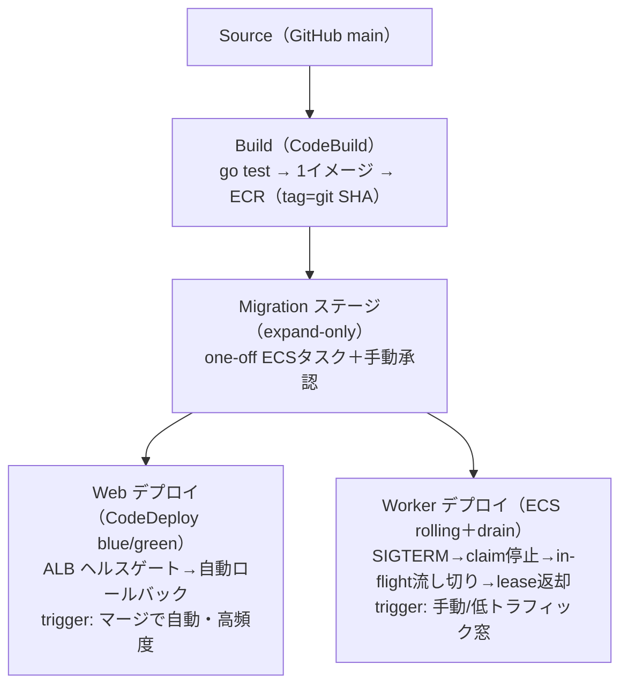

# Web / Worker を分けたときのデプロイ構成（CodePipeline・運用保守）

[web-worker-split](web-worker-split.md) で「なぜプロセス/プールを分けるか（[EXP-29](web-worker-split.md)）」は示した。
ここは **分けた後のデプロイ運用**——**デプロイ時期・タスクスペック・オートスケール**が Web と Worker で違うことを
前提に、**CodePipeline をどう組むと運用保守が楽か**をまとめる。

結論：**同一リポジトリ・同一イメージ（＝バージョン一致を保証）を、2つの独立したデプロイ経路**で流す。
**マイグレーションは expand-only を最初に単独ステージ**で。Web は blue/green で頻繁・自動、Worker は
drain 付き rolling で低トラフィック時・手動。両者が別時刻にデプロイされても壊れないのは、
**Web↔Worker が直接 RPC でなく "DB スキーマ＋行の意味" を契約にしている**から（本リポジトリの根幹）。

> LIVE_ENV_REQUIRED：AWS CodePipeline/CodeDeploy/ECS の実挙動は未実測。ここは設計方針＋公式仕様ベース。
> 裏づけの機構は [EXP-3](shutdown.md)(graceful)/[EXP-2](fencing.md)(lease 引継)/[EXP-32](zero-downtime-migration.md)(expand/contract)/
> [EXP-6](migration-crash.md)(migration crash)/[EXP-60](connection-budget.md)(予算 Guard) がローカル実証済。

---

## 1. Web と Worker はデプロイ要件が別物

| 観点 | **Web**（`cmd/web`） | **Worker**（`cmd/worker`/tenantworker） |
| --- | --- | --- |
| **デプロイ頻度/時期** | 高頻度・随時（機能/修正を即） | 低頻度・低トラフィック窓（lease/in-flight を drain する必要） |
| **デプロイの破壊性** | ステートレス（接続は短命）→ 差し替え容易 | ステートフル（lease・処理中ジョブ・SSE hub）→ **drain と引継が要る** |
| **タスクスペック** | **CPU 寄り**（gqlgen resolver・直列化・TLS）小さめ多数 | **DB 往復＋常駐**寄り（hub/バッファでメモリ）少なめ安定（[EXP-31](capacity.md)） |
| **オートスケール軸** | RPS/CPU/ALB req（急変に速く追従） | **backlog(pending)／固定寄り**。CPU で無闇に増やさない（接続倍化・lease 競合） |
| **スケール上限** | レプリカで横に伸ばす | **接続予算が天井**（[EXP-60](connection-budget.md) の `poolbudget.Guard`）／テナント数で律速 |
| **ロールバック** | 瞬時（blue/green のトラフィック戻し） | 前イメージ再デプロイ（expand-only なので旧も動く） |

→ **別サービス・別タスク定義・別スケーリングポリシー・別デプロイ経路**にする理由がここに全部ある。

## 2. タスクスペックの目安（この規模）

| | Web | Worker |
| --- | --- | --- |
| Fargate | 例：1 vCPU / 2GB × レプリカ多め | 例：0.5–1 vCPU / 2–4GB × 少なめ安定 |
| 律速 | **CPU**（[capacity](capacity.md)/[concern-performance](concern-performance.md)） | **DB 往復＋メモリ**（hub/バッチ・[EXP-31](capacity.md)/[EXP-59](concern-subscription-capacity.md)） |
| プール | 小さめ（[EXP-5](pool-saturation.md) の膝 16–20） | さらに小さく（自テナントだけ 2–4・[tenant-worker-capacity](tenant-worker-capacity.md)） |

## 3. オートスケールの違い（ここが一番の分かれ目）

- **Web**：target tracking（CPU 60% or ALB request-count-per-target）。**上下に速く**。バーストに追従、閑散で縮む。
- **Worker**：**CPU で自由に増やさない**。増やすほど **接続が倍化**（[EXP-60](connection-budget.md) の 1040 拒否）＋**lease 競合**。
  - スケール軸は **backlog（pending 件数）**。かつ **ハード上限＝接続予算**（`poolbudget.Guard` で `Σ(役割×台数×プール) ≤ budget`）。
  - per-tenant なら**ほぼ固定**（テナント数）。floor が要るので **scale-to-zero しない**（最低1台・[event-driven-worker](event-driven-worker.md) §E）。
  - **待機レプリカは接続を張らない/絞る**（掛け算を抑える・[fencing](fencing.md)）。

## 4. 推奨 CodePipeline 構成（同一イメージ・2経路・migration 先頭）

なぜこの形が運用保守上いいか：

- **同一イメージを2つの task def で（Web/Worker）** → **バージョン一致を保証**。「web@v2 × worker@v1」の取り違えバグを避ける
  （エントリポイント引数で `web`/`worker` を切替。ビルドは1回、テストも1回）。
- **別々のデプロイアクション/承認/トリガ** → **時期を独立**にできる（Web は自動高頻度、Worker は窓＋手動）。
  「1本のパイプラインを直列」にすると時期を分けられないので**分ける**。
- **Migration を先頭・単独・expand-only**（[EXP-32](zero-downtime-migration.md)）：**旧コードも新コードも通るスキーマ**にしてから
  アプリを流す。だから Web と Worker が**別時刻**でも、その間の「新旧混在」でスキーマが割れない。列追加・状態追加は
  可、破壊的変更は次リリースの contract 段で（expand → 両対応で運用 → contract）。
- **Web＝blue/green（CodeDeploy）**：新旧を並走させ ALB ヘルスゲートで切替、失敗で**自動ロールバック**。ステートレスだから安全。
- **Worker＝rolling＋drain**：`stopTimeout` を drain に足りる長さにし、**SIGTERM で受付停止→処理中を流し切り→lease 返却**
  （[EXP-3](shutdown.md)）。取りこぼしは新 worker が **lease 失効＋reconcile** で引き継ぐ（[EXP-2](fencing.md)）。**二重処理なし**。
- **接続予算をデプロイゲートに**：デプロイ前に新レプリカ数で `poolbudget.Guard` を検査し、**予算超過なら deploy を落とす**
  （[EXP-60](connection-budget.md)）。オートスケール上限も同じ式で縛る。

## 5. 別時刻デプロイが壊れない理由（DB を契約に）

Web↔Worker は**直接 RPC しない**。両者の契約は **DB スキーマ＋行の意味（status/version/lease）**。だから：

- 片方だけ先にデプロイしても、**共有しているのは後方互換なスキーマ**なので相手は動き続ける。
- 新しい状態値や列は **追加（expand）** で入れ、旧コードは無視できる形に。消すのは全員が新版になった後（contract）。
- これが「デプロイ時期を分けたい」を**安全に**する土台（[db-ecs-complete](db-ecs-complete.md) の DB=真実）。

## 6. 運用チェックリスト

- [ ] Web/Worker は**別 ECS サービス・別 task def・別スケーリングポリシー**か。
- [ ] イメージは**同一 tag（git SHA）**を両方に配っているか（バージョン skew 防止）。
- [ ] Migration は**先頭・expand-only・手動承認**か（[EXP-32](zero-downtime-migration.md)/[EXP-6](migration-crash.md)）。
- [ ] Worker デプロイは **drain（SIGTERM→lease 返却）** を待つ `stopTimeout` か（[EXP-3](shutdown.md)）。
- [ ] オートスケール上限＝**接続予算**を `poolbudget.Guard` で縛っているか（[EXP-60](connection-budget.md)）。
- [ ] Worker のスケール軸は **backlog**で、CPU で無闇に増やしていないか。
- [ ] ロールバック手順（Web=トラフィック戻し / Worker=前イメージ再デプロイ）を決めてあるか。

## まとめ

- **要件が別物**（時期・スペック・スケール・破壊性）→ **別サービス・別経路・別ポリシー**。
- **CodePipeline は「同一イメージ → migration(expand先頭) → Web(blue/green) と Worker(rolling+drain) の2独立デプロイ」**。
- **別時刻デプロイが安全なのは DB を契約にしているから**（後方互換スキーマ＋version＋lease）。
- **接続予算をデプロイ/スケールのハードゲート**に（[EXP-60](connection-budget.md)）。

## 保証しない範囲・未検証

- CodePipeline/CodeDeploy/ECS の実挙動（blue/green 切替時間・drain の実測・rollback）は **LIVE_ENV_REQUIRED（未実測）**。
- スペック/レプリカ/プールの具体値は目安（choice）。実機 rps・メモリで詰める（[EXP-31](capacity.md)/[worked-examples](worked-examples.md)）。
- 「同一イメージ1本 vs Web/Worker で別イメージ2本」はトレードオフ（1本＝バージョン一致で簡単／2本＝依存を最小化できるが skew 注意）。ここは1本を既定に推奨。
