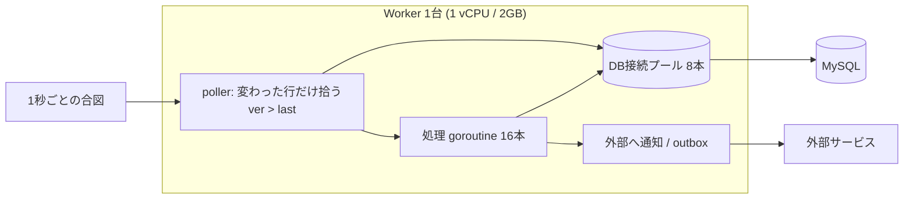
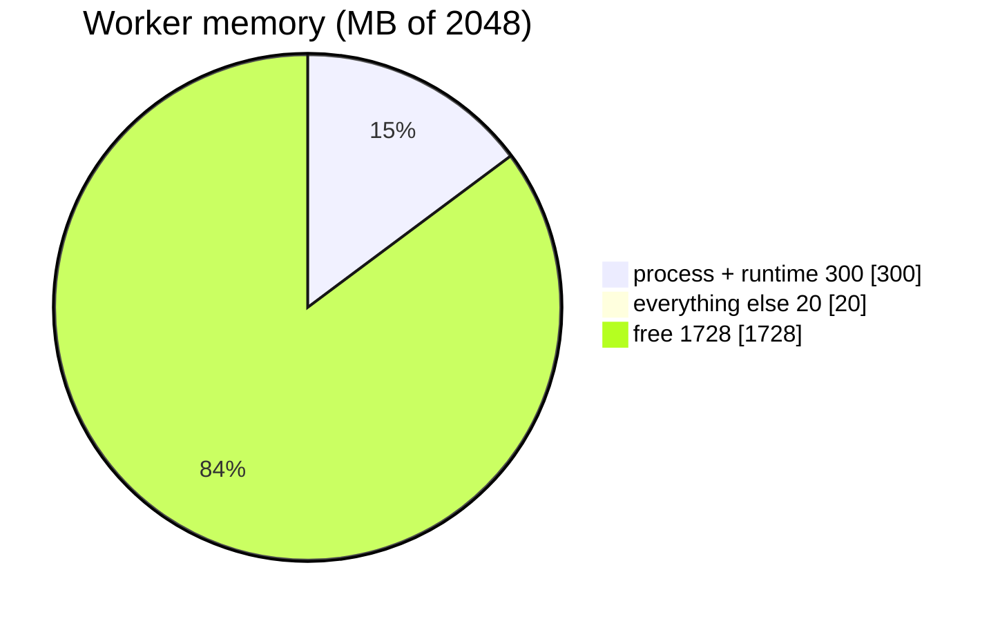
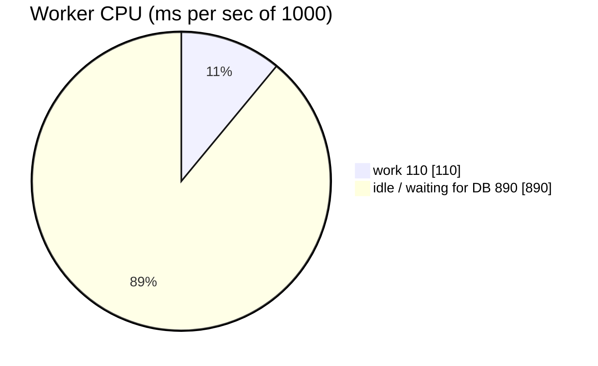
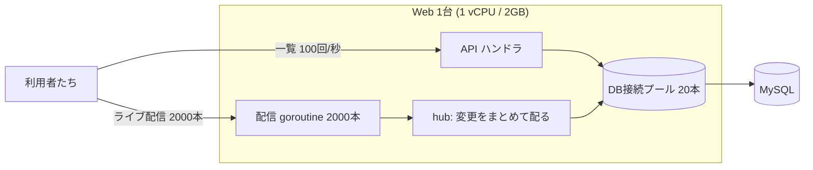
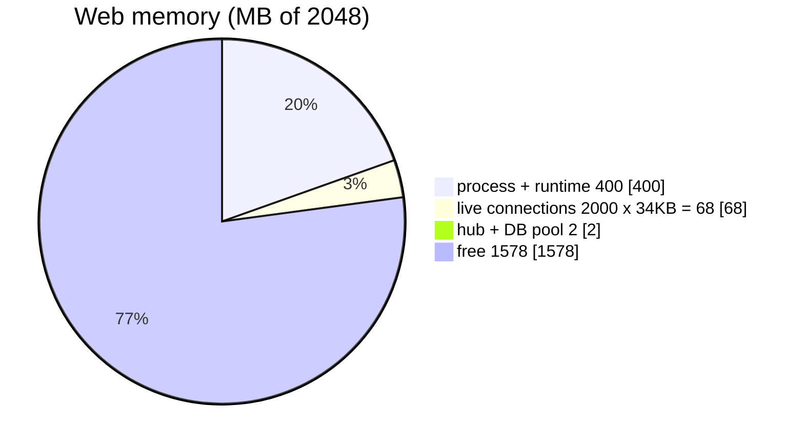
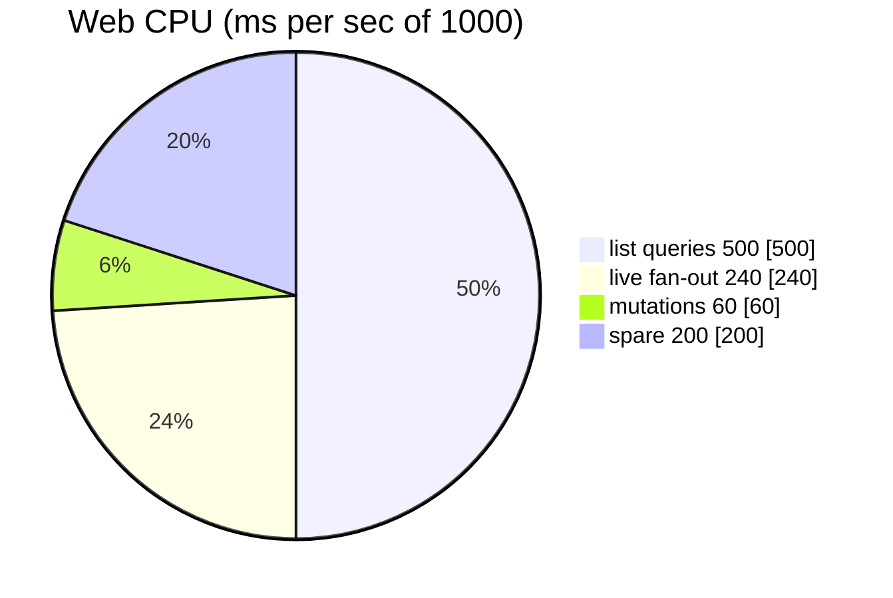
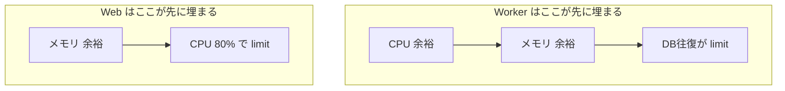

# Worker / Web 単体の実寸サンプル（メモリ・CPU はどこで埋まる？）

[早見表](reference-numbers.md)の数字だけだとイメージしづらいので、**実際に 1 台のサーバー
（1 vCPU / 2GB）に載せたら、メモリと CPU がどこで埋まるか**を、たとえ話つきで見ていく。

先に結論だけ言うと——

- **Worker（裏で回り続ける処理）**は、メモリも CPU もスカスカに余る。詰まるのは **DB との往復**。
- **Web（画面から叩かれる API）**は、メモリは余るが **CPU が先に埋まる**。

同じサーバーでも「先に一杯になる場所」が違う。だから**設計の打ち手も変わる**、という話。

> 用語（律速・fan-out・SSE・hub など）が分からないときは **[用語集](glossary.md)** へ。

### まず2つの「財布」を頭に置く

| 資源 | たとえ | 中身 |
| --- | --- | --- |
| **CPU** | 1秒ごとに配られる **1,000 ミリ秒ぶんの作業枠** | 「JSON を組む」「行を処理する」など**計算**に使う。DB の返事待ちの間は使わない（IO 待ち＝枠が空く） |
| **メモリ** | **2,048 MB の箱** | 常駐プロセス自身・接続・処理中のデータが場所を取る。足すだけ。超えたら OOM |

この2つの財布に、Worker と Web がそれぞれ何を入れていくかを足し算するだけ。単価は
[EXP-50](../internal/memlab)（メモリ）/[EXP-31](capacity.md)（接続・DB往復）から。

> 注: ランタイムの基準メモリや「1リクエスト＝何ミリ秒 CPU」は**仮定**。最後は実機で測って
> 置き換える（[EXP-31](capacity.md)）。ここでは桁と「どこが先に埋まるか」を掴むのが目的。

---

## 1. Worker 単体 — 「1,000 台のロボットを見張る常駐プロセス」

やっていることは単純で、**1秒ごとに「状態が変わったロボットだけ」を DB から拾って処理する**。

| 前提 | 値 |
| --- | --- |
| 見張る台数 | 50 テナント × 20 台 = **1,000 台** |
| 見に行く頻度 | 1 秒ごと（テナント単位にまとめて＝**50 クエリ/秒**・[EXP-14](fanout.md)） |
| 実際に変わる量 | 1 台 5 秒に1回 → **200 台/秒** |
| DB 接続の本数 | **8 本**（プール） |



### メモリの箱（2,048MB）に何が入る？

| 入るもの | 量 | なぜその量か |
| --- | --- | --- |
| プロセス自身（Go ランタイム＋GC 余白） | ~300 MB | 常駐プロセスの土台。ほぼ固定 |
| DB 接続 8 本 | ~0.5 MB | 1 接続あたり数十 KB の読みバッファ程度 |
| 処理 goroutine 16 本 | ~0.03 MB | 1 本 2KB（[EXP-50](reference-numbers.md)）。誤差レベル |
| 処理中の行 200 件 | ~0.05 MB | 1 行 ≒ 250B（構造体48B＋文字列）。誤差レベル |
| 作業用メモリ（まとめ引きの map 等） | ~20 MB | ざっくり見積り |
| **合計** | **≒ 320 MB** | **箱の 16%。残り 1.7GB は空き** |



**読み方**：ほぼ「プロセス自身」だけで、仕事のデータは誤差。**メモリはまったく問題にならない**。

### CPU の財布（1,000ms/秒）はどれくらい使う？

| 使い道 | 計算 | CPU |
| --- | --- | --- |
| 変更を拾うクエリ | 50 回/秒 × 0.2ms | ~10 ms |
| 拾った行の処理 | 200 件/秒 × 0.3ms | ~60 ms |
| 外部通知の組み立て | 200 件/秒 × 0.2ms | ~40 ms |
| **合計** | | **≒ 110 ms（財布の 11%）** |



**読み方**：CPU も1割ほどしか使わない。残りは**「DB の返事待ち」で空いている**。

### では何が limit なのか → **DB との往復**

```
DB 往復の上限 = 接続8本 × (1秒 ÷ 0.5ms) = 16,000 回/秒
今回必要なのは       50 + 200 ≒ 250 回/秒
→ 上限の 1.5% しか使っていない。まだ 60 倍は捌ける
```

> **まとめ（Worker）**: メモリ 16%・CPU 11%・DB 1.5%。**全部スカスカ**。増やしたければ
> サーバーを大きくする（縦）より**台数を増やす（横）**＋ [poolbudget](../internal/poolbudget) で
> DB の総接続だけ確認すればいい（[EXP-30](redundancy.md)）。
> **失敗パターン**: 1 台ずつ個別に見に行くと 1,000台×4表 = **40,000 クエリ/秒**で DB 上限を突破する
> （だから「まとめて拾う」・[EXP-31](capacity.md)）。

---

## 2. Web 単体 — 「画面から叩かれる API ＋ ライブ配信」

3種類の仕事をする：**一覧を返す(Query)・更新する(Mutation)・状態をリアルタイム配信する(SSE)**。

| 前提 | 値 |
| --- | --- |
| ライブ配信の同時接続 | **2,000 本**（SSE・TLS） |
| 一覧の呼ばれ方 | **100 回/秒**（50 件ずつ） |
| 更新の呼ばれ方 | 20 回/秒 |
| DB 接続の本数 | **20 本**（共有） |
| 配信のもと | 200 変更/秒 →（40 人へ配る） |



### メモリの箱（2,048MB）に何が入る？

| 入るもの | 量 | なぜその量か |
| --- | --- | --- |
| プロセス自身（ランタイム＋GC） | ~400 MB | 常駐の土台 |
| ライブ配信 2,000 本 | **~68 MB** | 1 本 ≒ 34KB（TLS のバッファ込み・[EXP-31](capacity.md)）。**ここが接続ぶんの主役** |
| hub（配信をまとめる仕組み） | ~0.4 MB | テナントごとに1つ。誤差 |
| DB 接続 20 本 | ~1.3 MB | 誤差 |
| **合計** | **≒ 470 MB** | **箱の 23%。残り 1.5GB は空き** |



**読み方**：接続を 2,000 本抱えても **68MB**。メモリ的には **1万〜1.5万本まで伸ばせる**（[EXP-40](capacity.md)）。
つまり**メモリはまだ余裕**。

### CPU の財布（1,000ms/秒）はどれくらい使う？

| 使い道 | 計算 | CPU |
| --- | --- | --- |
| 一覧を返す（JSON 整形・TLS・DB scan） | 100 回/秒 × 5ms | **500 ms** |
| ライブ配信の fan-out | 200 変更 × 40 人 = 8,000 送信/秒 × 0.03ms | **240 ms** |
| 更新 | 20 回/秒 × 3ms | 60 ms |
| **合計** | | **≒ 800 ms（財布の 80%）** |



**読み方**：**CPU が 80% まで埋まっている**。メモリはガラガラなのに、**先に音を上げるのは CPU の方**。

### では何が limit なのか → **CPU（と、詰まると DB 接続20本）**

> **まとめ（Web）**: メモリ 23%（余裕）だが CPU 80%（もう一杯に近い）。ピークで振り切れたら
> **1 台で頑張らず横に割る**（例: 5,000 本 × 複数台・[EXP-30](redundancy.md)）。
> **失敗パターン**: ①ライブ配信 1 本に DB 接続を1本ずつ持たせる → 2,000 接続で DB が枯れる
> （だから hub で共有・[EXP-38](sse-fan-in.md)）。②一覧で `SELECT *` して太い列まで取る →
> 50 行 × 24KB × 同時数でメモリが一気に膨らむ（[EXP-21](column-projection.md)）。

---

## まとめ：同じサーバーでも「先に埋まる場所」が逆

| | メモリ | CPU | DB往復 | 先に詰まるのは | 増やし方 |
| --- | --- | --- | --- | --- | --- |
| **Worker** | 16% | 11% | 1.5% | **DB との往復** | 横に台数 ＋ まとめ引き |
| **Web** | 23% | **80%** | — | **CPU** | 横に台数 ＋ 配信は hub |



- **Worker は DB 待ち・Web は CPU 待ち**。埋まる場所が逆だから、**1 台に相乗りさせると
  互いの足を引っ張る**（Web の CPU 消費が Worker のポーリングを遅らせる等）。だから分ける（[EXP-29](web-worker-split.md)）。
- ここの数字は**当たりを付けるため**のもの。実際は**実機で「1リクエスト何ミリ秒 CPU か」を測って
  差し替える**（[EXP-31](capacity.md)）。計算のやり方自体は [reference-numbers.md](reference-numbers.md) の公式に。

## 保証しない範囲・未検証

- プロセスの基準メモリ（300〜400MB）と「1リクエスト＝5ms CPU」などは仮定。実機で要測定。
- 配信の CPU は「変更数 × 配信人数 × 直列化」の概算。実際はデータ量・実装で上下する。
- 1 接続 34KB は TLS バッファ込みの現実値（[EXP-31](capacity.md)）。バッファ設定で変わる。
