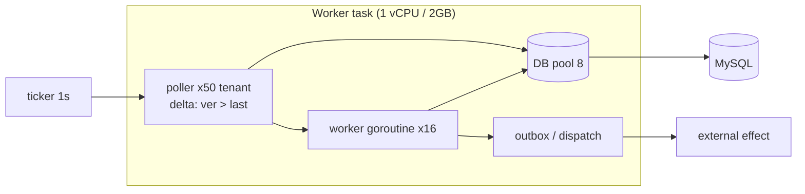
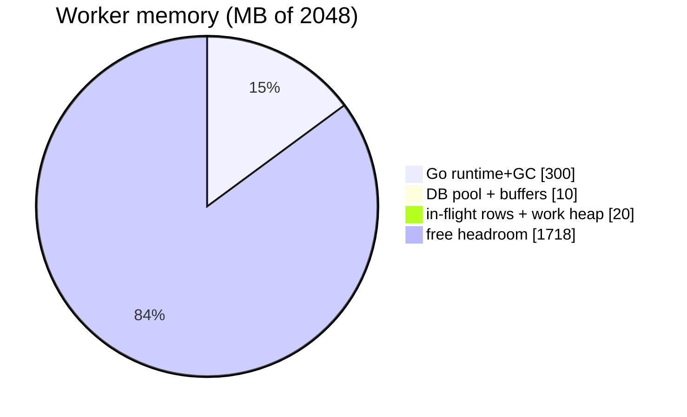
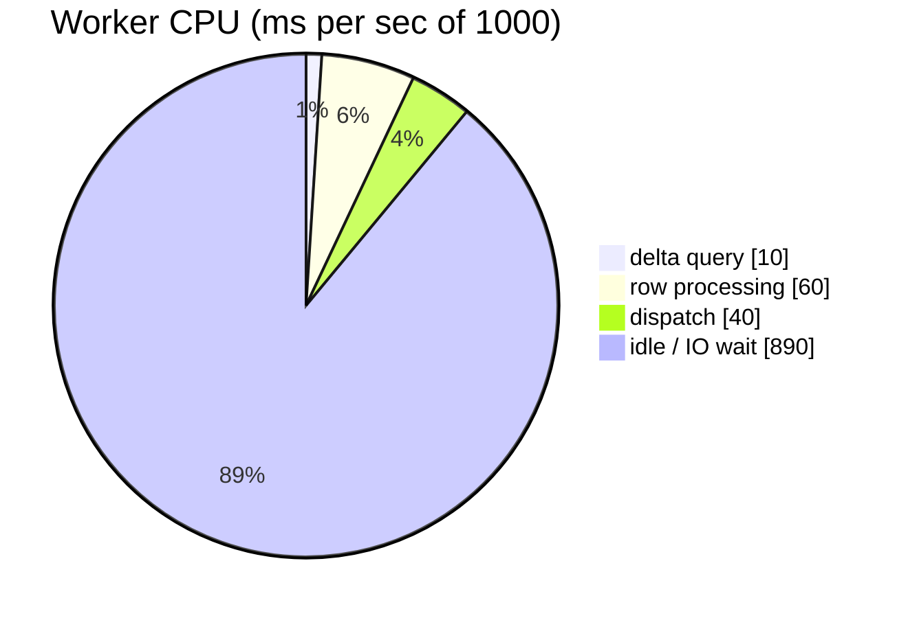
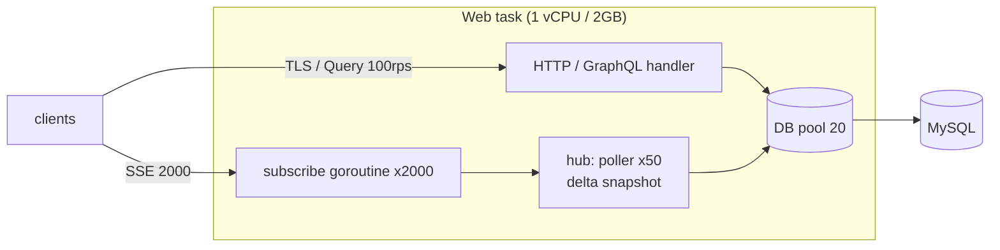
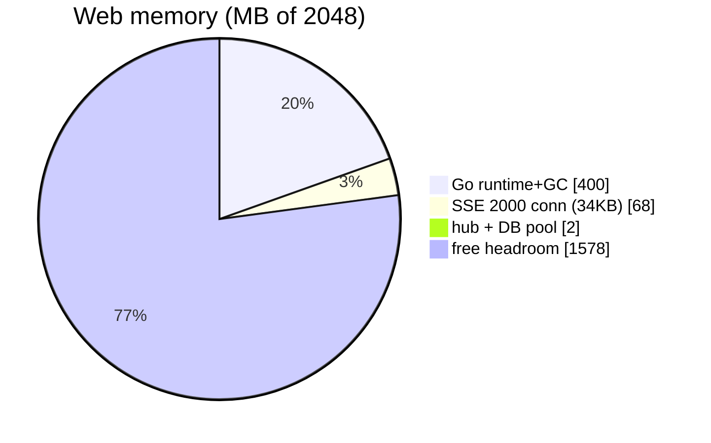
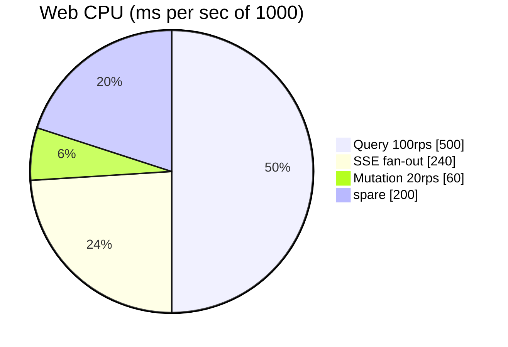
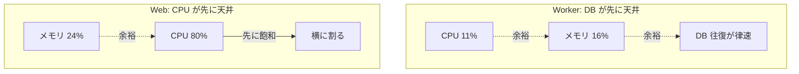

# Worker / Web 単体の実寸サンプル（メモリ・CPU の圧迫）

[早見表](reference-numbers.md)の単価に**具体的な数字を代入**した worked example。
1 vCPU / 2GB のタスクに Worker 単体・Web 単体を載せたとき、メモリと CPU が
どう埋まるかを計算と図で見る。**律速が Worker=DB・Web=CPU** で違うのがポイント（[EXP-31](capacity.md)）。

> CPU の「1 vCPU = 1000ms/秒」は、1秒あたり使える CPU 時間の予算。メモリは 2GB = 2048MB。
> ランタイム基準値と1リクエストの CPU ms は**仮定**（最後は実機で測る）。単価の出典は
> [EXP-50](../internal/memlab)（メモリ）/[EXP-31](capacity.md)（接続・往復）/[EXP-51](../internal/looplab)（確保）。

---

## 1. Worker 単体サンプル

### 構成（具体値）

| 項目 | 値 |
| --- | --- |
| 担当 | 50 テナント × 20 台 = **1,000 台** |
| 関連表 | 4つ（state / task / lease / history） |
| ポーリング | 1 秒ごと・テナント単位に coalesce（[EXP-14](fanout.md)/[EXP-52](subscription-design.md)）→ **50 クエリ/秒** |
| 状態遷移 | 1台 5 秒に1回 → **200 変更/秒** |
| DB プール | **8 本** |
| 処理 goroutine | 16 本 |

### 構造



### メモリ圧迫の計算

```
Go runtime + GC 基準:            ~300 MB        （ヒープ＋GC 余白の仮定）
DB プール 8本 × ~64KB(読みバッファ等): ~0.5 MB
処理 goroutine 16 × 2KB(EXP-50):  ~0.03 MB
処理中の行 200 × (48B + payload ~200B)(EXP-50): ~0.05 MB
作業ヒープ(DataLoader map 等):    ~20 MB         （仮定）
------------------------------------------------
使用 ≒ 320 MB  →  空き headroom ≒ 1,728 MB（84% 空き）
```



### CPU 圧迫の計算

```
delta クエリ 50/秒 × ~0.2ms(パース/scan): ~10 ms/秒
行処理 200/秒 × ~0.3ms:                    ~60 ms/秒
dispatch 200/秒 × ~0.2ms:                  ~40 ms/秒
------------------------------------------------
CPU 使用 ≒ 110 ms/秒 ＝ 1 vCPU の ~11%（残りは DB 往復の IO 待ち）

DB 往復の天井: プール8 × (1 / 0.5ms RTT) = 16,000 ops/秒  ≫ 必要 200/秒
```



> **Worker 単体の結論**: メモリ ~16%・CPU ~11% で**どちらも大きく余る**。律速は
> **DB プール本数 × 往復遅延**（今回は 16,000 ops/秒の天井に対し 200/秒で余裕）。
> 足りなくなったら**縦（vCPU 増）でなく横（Worker レプリカ増）**。ただし合計接続が
> DB 予算を超えないよう [poolbudget](../internal/poolbudget) で確認（[EXP-30](redundancy.md)）。
> **やってはいけない**: 1台ずつポーリング（1,000×4=**40,000 クエリ/秒**で天井超過・[EXP-31](capacity.md)）。

---

## 2. Web 単体サンプル

### 構成（具体値）

| 項目 | 値 |
| --- | --- |
| SSE 購読 | **2,000 接続**（TLS）・50 テナントに分散（40/テナント） |
| Query | **100 rps**（一覧 50 件・keyset） |
| Mutation | 20 rps（冪等） |
| hub | poller **50 本**（アクティブテナント単位・[EXP-38](sse-fan-in.md)） |
| DB プール | **20 本**（共有・小さめ） |
| fan-out 元 | 200 変更/秒 → 各 40 購読者へ配信 |

### 構造



### メモリ圧迫の計算

```
Go runtime + GC 基準:                 ~400 MB
SSE 2,000 接続 × 34KB(TLS込み・EXP-31): ~68 MB
hub poller 50 × (2KB + snapshot 5KB): ~0.35 MB
DB プール 20 × ~64KB:                  ~1.3 MB
リクエスト処理中(100rps×20ms≒2並行):   ~0.03 MB（narrow なら無視）
------------------------------------------------
使用 ≒ 470 MB  →  空き headroom ≒ 1,578 MB（77% 空き）
※ SSE は 1万〜1.5万本まで伸ばせる（EXP-40）。2,000 は余裕
```



### CPU 圧迫の計算

```
Query 100rps × ~5ms(JSON+TLS+scan):     500 ms/秒
SSE fan-out 200変更/秒 × 40購読者 = 8,000 push/秒 × ~0.03ms: 240 ms/秒
Mutation 20rps × ~3ms:                    60 ms/秒
------------------------------------------------
CPU 使用 ≒ 800 ms/秒 ＝ 1 vCPU の ~80%  ← 先に頭打ちになるのはここ
```



> **Web 単体の結論**: メモリ ~24% で**余る**が、**CPU が ~80% で先に頭打ち**（Query の
> JSON/TLS と fan-out が主。[EXP-31](capacity.md) の「Web=CPU 律速」）。ピークで飽和したら
> **横に割る**（5,000 SSE × 複数タスク・[EXP-30](redundancy.md)）。
> DB プール 20 は同時クエリの天井（[EXP-5](pool-saturation.md) の膝）——Query 100rps は
> ~2 並行で収まるが、遅いクエリが増えると 20 で頭打ち。
> **やってはいけない**: SSE 1本に DB 接続を 1:1（2,000 接続で DB 枯渇・[EXP-38](sse-fan-in.md)）／
> 一覧で `SELECT *` の太い列（50 行 × 24KB × 同時数でメモリ膨張・[EXP-21](column-projection.md)）。

---

## まとめ：律速が違う

| | メモリ使用 | CPU 使用 | 律速 | 増やし方 |
| --- | --- | --- | --- | --- |
| **Worker 単体** | ~320MB（16%） | ~110ms/s（11%） | **DB プール × 往復遅延** | 横（レプリカ）＋ batch |
| **Web 単体** | ~470MB（24%） | ~800ms/s（**80%**） | **CPU**（＋DB プール） | 横（レプリカ）・SSE は hub |



- **同じ 1 vCPU/2GB でも、Worker と Web で埋まる資源が逆**。Worker はメモリも CPU も余り DB 待ち、
  Web は CPU が先に埋まる。だから**1タスクに Worker と Web を相乗りさせない**（[EXP-29](web-worker-split.md)）。
- 数字は当たり付け。**ランタイム基準値・1リクエストの CPU ms は実機で測って置き換える**（[EXP-31](capacity.md)）。
- 計算式そのものは [reference-numbers.md](reference-numbers.md) の「スケーリング公式」を使う。

## 保証しない範囲・未検証

- Go runtime+GC の基準値（300〜400MB）と1リクエストの CPU ms（5ms 等）は仮定。実機で要測定。
- fan-out の CPU は「変更×購読者×直列化」の概算。実際はシリアライズ方式・payload で上下。
- SSE 34KB/接続は TLS バッファ込みの現実値（[EXP-31](capacity.md)）。実装・バッファ設定で変わる。
