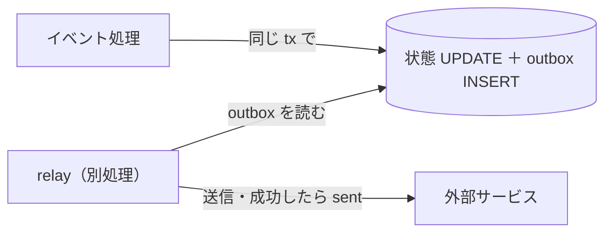
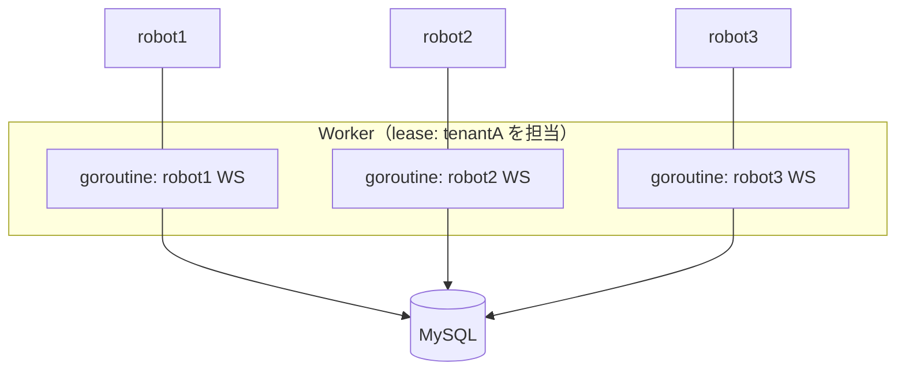
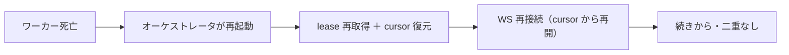

# 常時接続ワーカーの設計（WebSocket 受信・多重化・再接続）

外部（ロボット/ゲートウェイ）と **WebSocket で半永久的につながり、イベントを受けて DB に書く**
ワーカーの、あるべき形。「1コンテナ=1ロボット」で良いか、死んだら再復帰すべきか、を具体的に。
土台: [outbox](outbox.md)/[fencing](fencing.md)/[concern-lifecycle](concern-lifecycle.md)/[worked-examples](worked-examples.md)。

---

## 0. outbox とは（先に用語）

**外部への送信予定を、DB のトランザクションと一緒に `outbox` テーブルに書いておく**パターン。
別プロセス（relay）が後で outbox を読んで実際に送る。狙いは「**DB に書いた**」と「**外部に送った**」が
ズレないこと（exactly-once 相当・[outbox](outbox.md)・EXP-44）。

- 別々にやると、片方だけ成功してクラッシュ → 「送ったのに記録なし／記録したのに送ってない」。
- 同じ tx で **状態更新＋outbox 追記**なら原子的。送信はあとで確実にリトライ（失敗は dead-letter・EXP-45）。

---

## 1. 「1コンテナ = 1ロボット WS」で良いか？→ 見直し推奨

WebSocket は **I/O 待ちが主で CPU もメモリもほとんど食わない**。なのにコンテナ1つの基準メモリ
（~300MB・[worked-examples](worked-examples.md)）を**ロボット1台ごとに払う**のは極端に無駄。

### 密度の比較（ロボット 1,000 台）

| | 1コンテナ=1ロボット | 1コンテナで多重化（推奨） |
| --- | --- | --- |
| メモリ | 300MB × 1000 = **≒300GB（破綻）** | 300MB ＋ 1000×~36KB ≒ **336MB** |
| コンテナ数 | **1000**（デプロイ・監視・スケジューリングが地獄） | 数個 |
| DB 接続 | 各コンテナが持つ → **接続爆発**（[EXP-5](pool-saturation.md)） | 小さい共有プール |
| 障害の分離 | ◎ 1台=1プロセス | ○ goroutine 分離＋lease 境界 |

> WS 1接続 ≒ goroutine 2KB ＋ 受信バッファ 数十KB（[EXP-50](reference-numbers.md)）。**1プロセスで数千〜万接続を
> 多重化できる**のに、1台1コンテナは約900倍のメモリを捨てている。

### あるべき形：テナント担当 × 接続多重化

**1ワーカーが lease でテナント（群）を担当し、その中の全ロボットの WS を1プロセスで多重化**する
（1接続 = 1 goroutine）。テナント分離は **lease 境界**で保て、密度も良い。

- **WS ハンドラは薄く保つ**：受信 → 検証 → 重複排除（`UNIQUE(tenant_id, external_id)`）→ `version++` で DB へ。
  重い処理は WS の goroutine で長く回さない（受信が詰まる）。
- **スケール**：テナントをシャードして複数ワーカーへ（縦より横・[redundancy](redundancy.md)）。
- **例外**：ごく少数の超高感度ロボットだけ専用コンテナ（ブラスト半径を物理的に絞る・[worker-tenancy](worker-tenancy.md)）。
  全台には使わない。

### 補足：push（WS）と poll の使い分け
WS は**イベント駆動の push**で、poll のような空振りが無く低レイテンシ——それ自体は良い。
ただし「接続が生きている前提」に寄りかからず、**取りこぼし対策（下の再接続＋冪等）**を必ず入れる。

---

## 2. ワーカーが死んだら再復帰すべきか？→ はい。ただし「自力で蘇る」ではない

コンテナは ephemeral。**ワーカーが自分を生き返らせる**のではなく、**オーケストレータ（K8s/ECS）が
再起動**する。ワーカーの責務は「**いつ殺されても・再起動されても、続きから安全に**」を満たすこと
（[concern-lifecycle](concern-lifecycle.md)）。

満たすべき4点:

1. **状態は DB に**（メモリに持たない）→ 再起動で **cursor / lease から復元**。
2. **WS 再接続**：起動時に張り直し、`connection.cursor`（最後に処理した位置）から再開。
   - プロバイダが **resume（続きから再送）対応**なら取りこぼしゼロ。
   - **非対応**なら、再接続後に**現在状態を取り直して照合（reconcile）**＋dedup で穴を埋める。
3. **二重稼働の防止**：**lease＋fence**。死んだはずのワーカーが生き返っても、担当が変わっていれば
   **古い fence の書き込みは弾かれる**（[EXP-2](fencing.md) 実測：事故0件）。`GET_LOCK` は接続断で黙って
   外れて二重稼働になるので使わない（[deep-dives](deep-dives.md) §4）。
4. **冪等**：再接続で同じイベントが再送されても `UNIQUE(tenant_id, external_id)` で二度目を弾く
   （[EXP-47](event-ordering.md)）。

### ダウンタイム中のイベントはどうなる？
- プロバイダが**バッファ／replay** を持つ → cursor を送って**取りこぼしを埋める**。
- 持たない → **定期的な全状態の取り直し（reconcile）**で最終的に整合させる（at-least-once＋冪等）。
- どちらでも **「落ちても最終的に正しい状態に収束する」**ことを冪等と version で担保する。

---

## まとめ

- **outbox** = 外部送信を DB tx と一緒に予約し、あとで確実に送る仕組み（送信漏れ・二重送信を防ぐ）。
- **1コンテナ=1ロボットは密度が悪い**。**テナントを lease で担当し、WS を1プロセスで多重化**する
  （goroutine 1本/接続）。分離は lease 境界で保つ。超高感度のごく少数だけ専用コンテナ。
- **死んだら再復帰は必須**。ただし自力でなく**オーケストレータが再起動**し、ワーカーは
  **cursor＋lease＋fence＋冪等**で「続きから・二重なし」に復元できるよう作る。

裏づけ: [outbox](outbox.md)(EXP-44) / [fencing](fencing.md)(EXP-2) / [event-ordering](event-ordering.md)(EXP-47) /
[worked-examples](worked-examples.md) / [worker-tenancy](worker-tenancy.md) / [concern-lifecycle](concern-lifecycle.md)。
