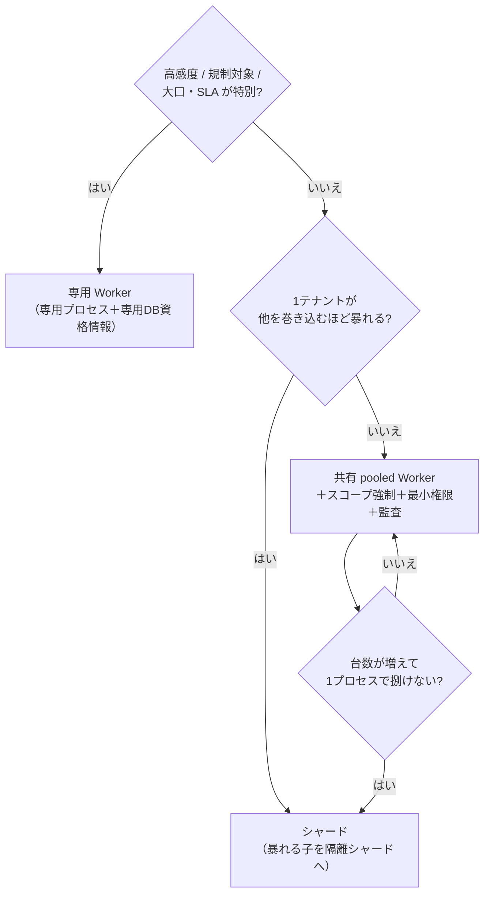

# Worker をテナント単位にすべきか、まとめるべきか（セキュリティ重視）

常時稼働 Worker を **テナントごとに分ける（専用）** か **1つにまとめる（共有）** か。
結論を先に: **多数の小テナントは「共有＋コードでの厳格な分離」が現実解。分離（＝セキュリティ）は
プロセスを分けることでなく、スコープ強制・最小権限・監査で担保する。**そのうえで
**高感度／大口／暴れるテナントだけ専用 Worker に切り出す**（ハイブリッド）。

用語は [glossary](glossary.md)、容量の数字は [worked-examples](worked-examples.md)。

---

## 3つの形

| 形 | 中身 |
| --- | --- |
| **専用（per-tenant）** | 1テナント＝1プロセス（＋専用 DB 資格情報）。プロセス境界で隔離 |
| **共有（pooled）** | 1プロセスが全テナントを回す。行データの `tenant_id` で区別 |
| **シャード（中間）** | N テナントを1 Worker が担当し、複数 Worker で分担（lease で割当） |

## なぜ「全部を専用プロセス」にできないか（まず容量で棄却）

[worked-examples](worked-examples.md) の通り、**プロセス自身の基準メモリは ~300MB**。

```
専用プロセスを 1,000 テナントぶん = 300MB × 1,000 = 300GB  → 非現実的
共有 1 プロセスなら              = ~320MB で 1,000 テナントを回せる（DB 律速で余裕）
```

→ **小テナントが多いほど「テナントごとにプロセス」は破綻**する。だから既定は共有。
専用は「数を絞れる高価値テナント」にだけ使う。

## トレードオフ（軸 × 形）

| 軸 | 専用（per-tenant） | 共有（pooled） | シャード（中間） |
| --- | --- | --- | --- |
| **分離／ブラスト半径** | ◎ プロセス＋資格情報の境界。事故は1テナント | △ コードのミスで越境しうる（全テナントが射程） | ○ 事故は同一シャード内に限定 |
| **コスト／密度** | ✕ 基準メモリ×テナント数で破綻 | ◎ 1プロセスで多数 | ○ プロセス数＝シャード数 |
| **公平性（noisy neighbor）** | ◎ 物理的に独立 | △ 明示的な公平制御が要る | ○ シャード内のみ影響 |
| **運用（デプロイ／監視）** | ✕ プロセスが増えるほど大変 | ◎ 1つ | ○ 数個〜数十個 |
| **接続予算** | ✕ テナント×プール＝接続爆発 | ◎ 小さい共有プール | ○ シャードごとに小プール |
| **スケール** | ✕ | ○（担当を分けにくい） | ◎ 担当割当で横に伸ばす |
| **二重稼働防止** | 各プロセスの単一性を別途保証 | claim/lease で自然に | lease で割当＝自然に |

- 関連実測: 公平性 [tenant-fairness](tenant-fairness.md)、担当上限 [owned-tenant-limit](owned-tenant-limit.md)、
  二重稼働 [fencing](fencing.md)、接続予算 [pool-saturation](pool-saturation.md) / [redundancy](redundancy.md)、
  Web/Worker 分離 [web-worker-split](web-worker-split.md)。

## セキュリティの視点（今回とくに重視）

「テナント単位にすればセキュア」ではない。**共有でもセキュリティは作れるし、専用でも作り込みが要る。**
効くのは次の順で、**プロセス分割は最後の砦**：

1. **スコープ強制（最重要・共有の生命線）**：全クエリが `repo.Scope` で `:tenant` を強制し、
   テナントは **ctx から**取る（クライアント入力を信じない）。1本でも生 SQL が混じると越境しうるので、
   `sqllint`（rawdb/layerimport）で**機械的に禁止**する。→ [security-layers](security-layers.md) / [static-analysis](static-analysis.md)
2. **最小権限の DB 資格情報**：Worker の権限を必要な表・操作に絞る。可能なら**テナント群ごとに別資格情報**。
   定期ローテーション。→ [credential-rotation](credential-rotation.md) / [secrets](secrets.md)
3. **共有状態の非混線**：hub・キャッシュにテナントを跨ぐデータを載せない（cross-leak=0 を検証）。
   → [sse-fan-in](sse-fan-in.md)
4. **二重稼働の遮断**：lease＋fence で「今の担当は1つ」を保証（乗っ取り・多重処理を防ぐ）。→ [fencing](fencing.md)
5. **監査**：どのテナントに何をしたかを追える記録。
6. **ブラスト半径＝プロセス／資格情報の境界（最後の砦）**：それでも越境コードが混じったとき、
   **被害を1テナントに閉じ込める**のがプロセス分離。ここで初めて「専用 Worker」の価値が出る。

> つまり **1〜5 を全テナントに効かせ、6（専用プロセス）は高感度テナントに限定**するのが、
> コストを壊さずセキュリティを最大化する形。

## 判断フロー



## セキュリティ重視の推奨（この案件）

| 対象 | 形 | 理由 |
| --- | --- | --- |
| 一般の多数テナント | **共有 pooled**＋スコープ強制＋最小権限＋監査＋lease | コストが壊れず、1〜5 で越境を塞げる |
| 台数が増えたら | **シャード**（lease で担当割当） | 横に伸ばしつつ事故をシャード内に限定（[owned-tenant-limit](owned-tenant-limit.md)） |
| 高感度・規制・大口 | **専用 Worker**（専用プロセス＋専用 DB 資格情報） | ブラスト半径をプロセス境界で物理的に限定 |

- **やってはいけない**: 「テナントごとにプロセス」を全テナントに適用（容量破綻）／共有なのに
  スコープ強制を省く（越境が全テナントに波及）／専用にしたからとコード側の分離を手を抜く。
- **最初の一手**: 共有 pooled ＋ `repo.Scope`＋`sqllint` で越境を機械的に禁止し、資格情報を最小化。
  そのうえで「専用に切り出すべきテナント」を運用しながら見極める。

## 保証しない範囲・未検証

- ブラスト半径の「1テナントに閉じる」は、専用プロセス＋専用資格情報＋データ物理分離まで
  やって初めて成立する（共有では 1〜5 の作り込みが前提）。
- テナントごとの DB スキーマ物理分離（schema-per-tenant / DB-per-tenant）はコスト・運用が別次元
  （本 repo では行レベル分離＋スコープ強制を主軸に検証）。
- 「暴れる/高感度」の閾値は業務要件依存。ここは判断軸の提示にとどめる。
