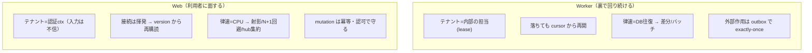

# 関心ごと × Worker / Web 対応表

同じ関心でも **Worker（裏で回り続ける）と Web（利用者から叩かれる）でやることが違う**。
理由は2つ——資源プロファイルが逆（Worker=DB律速 / Web=CPU律速・[worked-examples](worked-examples.md)）で、
信頼境界も違う（Worker=内部・人間の入力なし / Web=利用者に面し入力は untrusted）。
4つの関心を Worker/Web に分けて洗い出す。各行に根拠記事。用語は [glossary](glossary.md)。

- 各表: **項目 / Worker のやること / Web のやること / 根拠**。`—` はその側は該当が薄い。

---

> 各関心の**詳細記事**（大きな目的・前提・対応・意味と効果・図）:
> [セキュリティ](concern-security.md) / [lifecycle](concern-lifecycle.md) /
> [パフォーマンス](concern-performance.md) / [マイグレーション](concern-migration.md)。

## 1. セキュリティ（マルチテナント・越境禁止）　→ 詳細: [concern-security](concern-security.md)

| 項目 | Worker | Web | 根拠 |
| --- | --- | --- | --- |
| テナントの取得元 | **担当割当（lease）と処理対象の行の `tenant_id`** から | **ctx（認証トークン）** から。クライアント入力を信じない | [tenant-scope](tenant-scope.md) |
| スコープ強制 | バッチ取得も必ず `WHERE tenant_id=?`。担当外テナントを掴まない | 全 resolver が `repo.Scope` 経由。生 SQL は lint 禁止 | [EXP-58](tenant-scope.md)/[static-analysis](static-analysis.md) |
| 認可 | 人の認可は無い。**lease 境界＝触ってよいテナント** | フィールド/行レベル認可（`@auth`・canOperate） | [security-layers](security-layers.md)(EXP-25/28) |
| DB 資格情報 | **最小権限＋テナント群ごとに分離＋ローテーション** | 最小権限（読み多め） | [credential-rotation](credential-rotation.md) |
| 秘密の扱い | 外部接続の秘密を**テナント分離・期限つき**で保持 | ほぼ触らない（トークン検証のみ） | [secrets](secrets.md) |
| 出力/配信の分離 | outbox・hub に**他テナントのデータを載せない** | SSE topic=テナント／レスポンスに他テナント混入させない | [sse-fan-in](sse-fan-in.md)(EXP-42) |
| 入力の信頼 | **外部 payload を検証・重複排除**（`UNIQUE(tenant_id, external_id)`） | 複雑度上限・allowlist・レート制限 | [event-ordering](event-ordering.md)/[graphql](graphql.md)(EXP-24/26/47) |
| 監査 | actor=`worker:xxx` で記録 | actor=`user:xxx` で記録 | [domain-themes](domain-themes.md) |
| ブラスト半径 | 高感度テナントは**専用ワーカー＋専用資格情報** | プロセス分離より認可・スコープで守る | [worker-tenancy](worker-tenancy.md) |

> **一言**: Worker はテナントを「内部の担当割当」から得る（越境は lease 境界とスコープで防ぐ）、
> Web はテナントを「認証 ctx」から得る（越境は認可とスコープで防ぐ）。共通の生命線は
> **全クエリの `tenant_id` 強制＋生 SQL 禁止**。

---

## 2. 長く継続する・コンテナの生き死に（lifecycle）　→ 詳細: [concern-lifecycle](concern-lifecycle.md)

コンテナは ephemeral（いつでも落ちる・再取得される）。**重要な状態はメモリでなく DB に**が大前提。

| 項目 | Worker | Web | 根拠 |
| --- | --- | --- | --- |
| 起動時 | lease 取得・**cursor 復元**・外部接続の確立 | プール準備・hub 起動・ヘルスチェック公開 | [fencing](fencing.md)/[capacity](capacity.md) |
| 常駐中の生存 | **heartbeat で lease 延長**・切断を検知して張り直し | SSE の **heartbeat＋idle timeout** で死んだ接続を掃除 | [db-resilience](db-resilience.md)/[sse-fan-in](sse-fan-in.md)(EXP-33/39) |
| クラッシュ→再起動 | 途中の外部作用は **OUTCOME_UNKNOWN**→冪等再実行。fence で二重稼働遮断 | in-flight はクライアント再試行前提。**冪等 mutation** で二重を弾く | [crash-effects](crash-effects.md)/[fencing](fencing.md)(EXP-1/2/27) |
| graceful shutdown | 受付停止→**現バッチ完了→lease 解放** | 新規受付停止→in-flight 完了→**SSE に close 通知**→drain | [shutdown](shutdown.md)(EXP-3) |
| デプロイ/スケールイン | **lease を手放す**→次担当へ引き継ぎ（二重稼働ゼロ） | LB から外す→**SSE 再接続を促す**（cursor/Last-Event-ID で継続） | [fencing](fencing.md)/[subscription-design](subscription-design.md) |
| コンテナ再取得 | cursor＋lease で**どこから再開するか**を DB から復元 | hub は揮発。**再購読時に version から復元**（差分再送） | [subscription-design](subscription-design.md)(EXP-52) |
| DB 切断/フェイルオーバ | 検知して**張り直し・retry**（一時エラー） | 同上＋プール再取得 | [db-resilience](db-resilience.md)(EXP-33) |
| 状態の置き場 | **接続が生きている間だけのメモリに重要状態を置かない**（lease/cursor は DB） | hub のスナップショットは揮発でよい（DB の version が真） | [deep-dives](deep-dives.md) |
| 時計・期限 | lease は **DB 時計＋fence**（自己申告時刻で奪わせない） | — | [fencing](fencing.md)(EXP-2) |

> **一言**: Worker は「**担当と進捗（lease・cursor）を DB に置き、落ちても続きから**」。
> Web は「**接続は揮発でよい・切れたら version から再購読**、書き込みは冪等で二重を弾く」。

---

## 3. パフォーマンス　→ 詳細: [concern-performance](concern-performance.md)

| 項目 | Worker | Web | 根拠 |
| --- | --- | --- | --- |
| 律速（先に埋まる所） | **DB 往復**（プール×RTT）。CPU・メモリは余る | **CPU**（JSON/TLS/fan-out）。メモリは余る | [capacity](capacity.md)/[worked-examples](worked-examples.md)(EXP-31) |
| データの動かし方 | **version 差分をバッチ**で（per-row 禁止・coalesce） | keyset ページング・射影・**N+1 は DataLoader** | [fanout](fanout.md)/[graphql](graphql.md)(EXP-14/18/23) |
| 書き込み | **multi-row＋1 tx**（往復・コミットを減らす） | 冪等 mutation・**小さい tx** | [bulk-insert](bulk-insert.md)(EXP-56) |
| 接続プール | 小さめ（数〜数十）＋合計を予算内に | 共有・**SSE に DB 接続を 1:1 で持たせない** | [pool-saturation](pool-saturation.md)/[sse-fan-in](sse-fan-in.md)(EXP-5/38) |
| リアルタイム | **version++ を書くだけ**（配信は hub 任せ） | hub で fan-out・**差分配信**（丸ごと再読しない・400x） | [subscription-design](subscription-design.md)(EXP-52) |
| キャッシュ | ほぼ不要（DB が真） | TTL＋イベント失効・**stampede は singleflight** | [cache](cache.md)(EXP-46) |
| 索引 | `tenant_id` 先頭・covering で走査を絞る | 同上（一覧は保持内・射影で） | [deep-dives](deep-dives.md)/[date-search](date-search.md) |
| 肥大対策 | 履歴を書く側 → **日パーティションで保持**前提 | 一覧は保持内だけ見る | [retention](retention.md)(EXP-48) |
| スケール | **テナントをシャードして横に**（縦より横） | **SSE 5k×複数タスク**で横に | [redundancy](redundancy.md)/[capacity](capacity.md)(EXP-30/40) |

> **一言**: Worker は「**往復を減らす**（差分・バッチ・multi-row）」、Web は「**CPU を減らす**
> （射影・N+1回避・fan-out を hub に集約）」。両方とも増やすときは**縦より横**。

---

## 4. マイグレーション（スキーマ変更）　→ 詳細: [concern-migration](concern-migration.md)

**Worker と Web はデプロイ中に新旧が同時に動く**。だから両方が**新旧スキーマ互換**である必要がある。

| 項目 | Worker | Web | 根拠 |
| --- | --- | --- | --- |
| 実行主体 | **起動時に流さない**（別 init/job で1回） | **起動時に流さない**（同上） | [locking](locking.md) |
| 排他（1回だけ流す） | GET_LOCK（接続固定）or **insert-first**（先に記録） | 同上（どちらの起動でも走らせない） | [locking](locking.md) |
| 互換の作り方 | **expand/contract**：列追加→両対応→切替→列削除 | 同上（新旧コードが両スキーマで動く） | [zero-downtime-migration](zero-downtime-migration.md)(EXP-32) |
| ロールアウト順 | ①列追加(expand) → ②新旧稼働 → ③コード切替 → ④旧削除(contract) | 同左（Worker/Web の切替タイミングを合わせる） | [zero-downtime-migration](zero-downtime-migration.md) |
| 途中クラッシュ | マイグレーションは**冪等・再実行可能**に | — | [migration-crash](migration-crash.md)(EXP-6) |
| 大表の DDL | **ロック時間に注意**（INSTANT/INPLACE・pt-osc/gh-ost） | 同上（オンライン中に読み書きが走る） | [migration-crash](migration-crash.md) |
| パーティション運用 | 保持の DDL は**暗黙コミット**・日次ジョブでロールフォワード | — | [retention](retention.md)(EXP-48) |
| デプロイ中の注意 | 旧 Worker が**新列を知らなくても壊れない**こと | 旧 Web が**新列を返さなくても壊れない**こと | [zero-downtime-migration](zero-downtime-migration.md) |

> **一言**: マイグレーションは「**アプリ起動時に流さない・expand/contract で常に前後互換・
> Worker と Web の切替を合わせる**」。列の削除(contract)は全プロセスが新スキーマに移ってから。

---

## まとめ：Worker と Web の性格の違い

- **共通の生命線**（両方に効く）: 全クエリの `tenant_id` 強制＋生 SQL 禁止（[EXP-58](tenant-scope.md)）／
  重要状態は DB に（コンテナは ephemeral）／expand/contract で前後互換／縦より横。
- **分かれるところ**: テナントの出所（lease か ctx か）、落ちたときの復帰（cursor か再購読か）、
  律速（DB か CPU か）、外部作用の担保（outbox か 冪等 mutation か）。

全体像は [design-principles](design-principles.md)、作る/レビュー手順は [checklist](checklist.md)。
